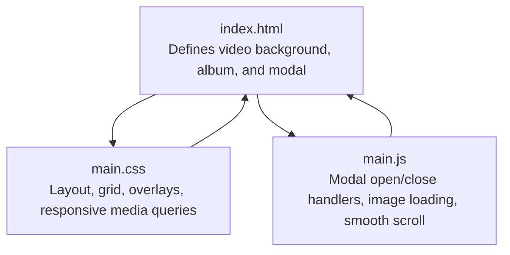
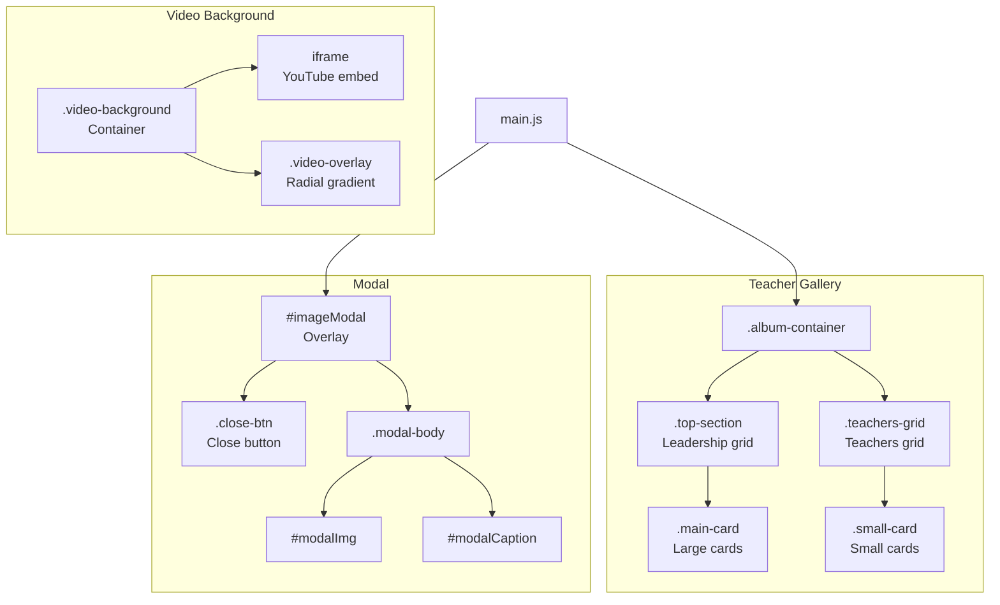
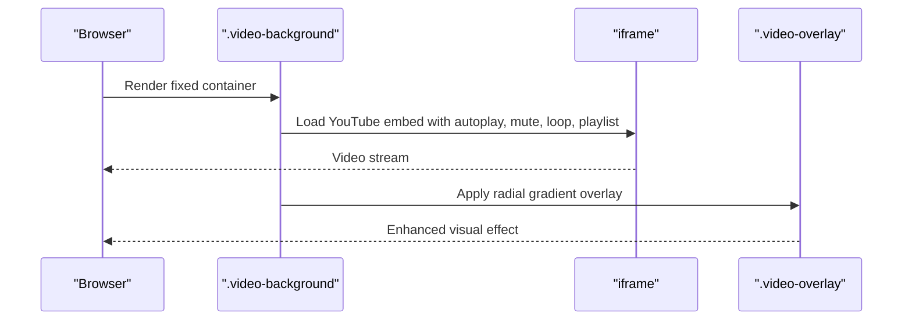
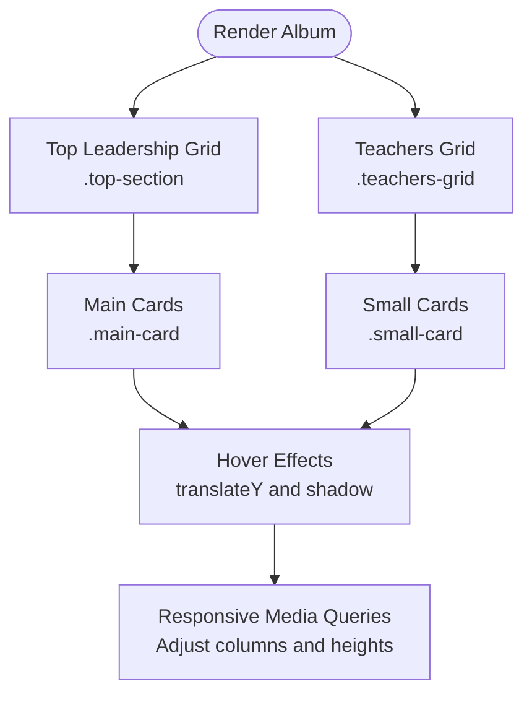
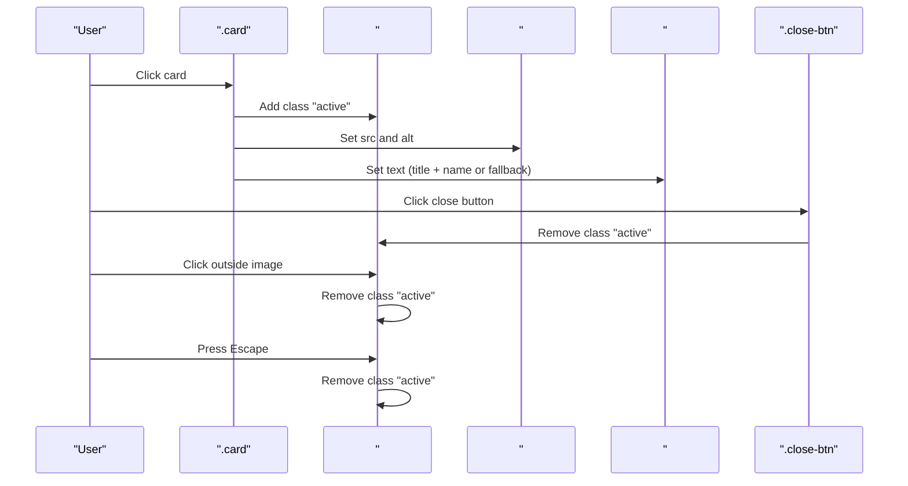
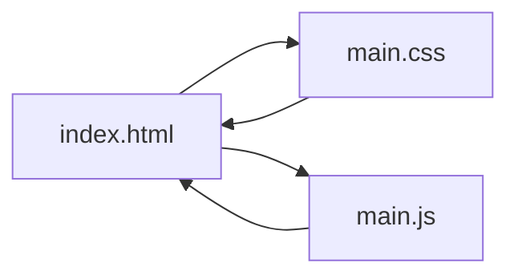

# Core Features

<cite>
**Referenced Files in This Document**
- [index.html](file://index.html)
- [main.css](file://main.css)
- [main.js](file://main.js)
</cite>

## Table of Contents
1. [Introduction](#introduction)
2. [Project Structure](#project-structure)
3. [Core Components](#core-components)
4. [Architecture Overview](#architecture-overview)
5. [Detailed Component Analysis](#detailed-component-analysis)
6. [Dependency Analysis](#dependency-analysis)
7. [Performance Considerations](#performance-considerations)
8. [Troubleshooting Guide](#troubleshooting-guide)
9. [Conclusion](#conclusion)

## Introduction
This document focuses on the three primary systems of the teacher directory:
- Video background system: a YouTube embed integrated with autoplay, mute, loop, and playlist controls, plus a vignette overlay for visual enhancement.
- Teacher gallery: a responsive layout built with CSS Grid, separating a top leadership section and a general teachers section with distinct card designs.
- Modal functionality: image preview with dynamic captions, multiple close mechanisms (button, click-outside, Escape key), and smooth transitions.

The content balances beginner-friendly explanations with technical details for developers, including configuration options, customization possibilities, and responsive adaptations.

## Project Structure
The project consists of a single HTML page, a stylesheet, and a script. The HTML defines the video background container, the teacher album content, and the modal. The CSS handles layout, responsiveness, and visual effects. The JavaScript manages modal behavior, image loading, and smooth scrolling.

**Diagram sources**
- [index.html:1-106](file://index.html#L1-L106)
- [main.css:1-517](file://main.css#L1-L517)
- [main.js:1-83](file://main.js#L1-L83)

**Section sources**
- [index.html:1-106](file://index.html#L1-L106)
- [main.css:1-517](file://main.css#L1-L517)
- [main.js:1-83](file://main.js#L1-L83)

## Core Components
- Video background system: Fixed-position iframe with autoplay, mute, loop, and playlist parameters; a dark radial gradient overlay for contrast and focus.
- Teacher gallery: Two grid-based sections:
  - Top leadership section with larger cards and descriptive info blocks.
  - General teachers section with smaller cards and name labels.
- Modal functionality: Fullscreen overlay with image and caption, multiple close triggers, and smooth transitions.

**Section sources**
- [index.html:10-19](file://index.html#L10-L19)
- [index.html:25-92](file://index.html#L25-L92)
- [index.html:95-101](file://index.html#L95-L101)
- [main.css:8-41](file://main.css#L8-L41)
- [main.css:105-147](file://main.css#L105-L147)
- [main.css:149-205](file://main.css#L149-L205)
- [main.js:1-83](file://main.js#L1-L83)

## Architecture Overview
The system integrates three subsystems:
- Video background: iframe positioned behind content with a vignette overlay.
- Gallery: two CSS Grid sections with hover and transition effects.
- Modal: JavaScript-driven overlay with multiple close mechanisms and image loading support.

**Diagram sources**
- [index.html:10-19](file://index.html#L10-L19)
- [index.html:25-92](file://index.html#L25-L92)
- [index.html:95-101](file://index.html#L95-L101)
- [main.css:8-41](file://main.css#L8-L41)
- [main.css:105-147](file://main.css#L105-L147)
- [main.css:149-205](file://main.css#L149-L205)
- [main.js:1-83](file://main.js#L1-L83)

## Detailed Component Analysis

### Video Background System
- Purpose: Provide an immersive, looping background video synchronized with the page content while maintaining readability.
- Implementation:
  - Fixed-position container with negative z-index to stay behind content.
  - Iframe configured with autoplay, mute, loop, and playlist parameters to ensure seamless playback.
  - Controls disabled and branding minimized for a clean visual.
  - Dark radial gradient overlay enhances text legibility and adds depth.
- Configuration options:
  - Video ID: change the YouTube video ID in the iframe src attribute.
  - Autoplay/mute/loop: controlled via URL parameters; remove or adjust as needed.
  - Playlist parameter: required when enabling loop for the same video.
  - Controls/show info/rel/modest branding: toggled via URL parameters.
- Customization possibilities:
  - Adjust overlay opacity or gradient stops for different moods.
  - Change aspect ratio or fit behavior by modifying iframe sizing rules.
  - Swap to a local video source by replacing the iframe with a video element and updating styles accordingly.
- Responsive behavior:
  - The iframe scales to cover the viewport and centers itself using transforms.
  - Pointer events are disabled so the video does not interfere with page interactions.
- Practical examples:
  - Replace the video ID to showcase a school promotional clip.
  - Disable autoplay for mobile devices by adding device detection logic in JavaScript.

**Diagram sources**
- [index.html:10-19](file://index.html#L10-L19)
- [main.css:8-41](file://main.css#L8-L41)

**Section sources**
- [index.html:10-19](file://index.html#L10-L19)
- [main.css:8-41](file://main.css#L8-L41)

### Teacher Gallery Implementation
- Purpose: Display leadership and teachers in a visually appealing, responsive grid layout.
- Implementation:
  - Album container with decorative borders and backdrop blur for content readability.
  - Top leadership section with larger cards and descriptive info blocks.
  - General teachers section with smaller cards and centered name labels.
  - Hover animations and transitions for interactive feedback.
- Layout details:
  - Top section uses auto-fit grid with a minimum item width to distribute items evenly.
  - Teachers grid uses auto-fill with a minimum width to maximize density.
  - Both sections apply consistent card styling, borders, and background effects.
- Card designs:
  - Main cards: larger images with descriptive info blocks.
  - Small cards: compact images with name labels beneath.
- Responsive adaptations:
  - Media queries adjust grid column counts, gaps, and image heights across breakpoints.
  - Special handling for landscape orientation on small screens to optimize modal layout.
- Practical examples:
  - Add new leadership members by duplicating a main card structure.
  - Include additional teachers by appending small cards to the teachers grid.
  - Customize card sizes by adjusting minmax values in grid-template-columns.

**Diagram sources**
- [index.html:25-92](file://index.html#L25-L92)
- [main.css:105-147](file://main.css#L105-L147)

**Section sources**
- [index.html:25-92](file://index.html#L25-L92)
- [main.css:51-60](file://main.css#L51-L60)
- [main.css:105-147](file://main.css#L105-L147)
- [main.css:207-491](file://main.css#L207-L491)

### Modal Functionality
- Purpose: Provide a focused, full-screen view of teacher images with dynamic captions and multiple close mechanisms.
- Implementation:
  - Modal overlay with backdrop blur and fullscreen coverage.
  - Image and caption dynamically populated from the clicked card.
  - Multiple close mechanisms: close button, click outside the image area, and Escape key.
  - Smooth transitions and overflow prevention during modal activation.
- Event handling:
  - Click on any card opens the modal and sets the image source and caption.
  - Click on the close button closes the modal.
  - Click outside the image area closes the modal.
  - Pressing Escape closes the modal when active.
  - Smooth scroll anchors are handled separately for navigation.
- Image loading:
  - Images fade in upon load for a polished UX.
  - Initial opacity is set to zero and transition duration is applied.
- Practical examples:
  - Change the caption logic to include additional metadata by adjusting caption generation.
  - Add keyboard navigation between images by extending event listeners.
  - Integrate with a lightbox library for advanced features like zoom or swipe gestures.

**Diagram sources**
- [index.html:95-101](file://index.html#L95-L101)
- [main.js:9-58](file://main.js#L9-L58)

**Section sources**
- [index.html:95-101](file://index.html#L95-L101)
- [main.js:1-83](file://main.js#L1-L83)
- [main.css:149-205](file://main.css#L149-L205)

## Dependency Analysis
- HTML depends on CSS for styling and on JavaScript for interactivity.
- CSS defines the visual hierarchy and responsive behavior for all components.
- JavaScript orchestrates modal interactions and image loading, relying on DOM elements defined in HTML.

**Diagram sources**
- [index.html:1-106](file://index.html#L1-L106)
- [main.css:1-517](file://main.css#L1-L517)
- [main.js:1-83](file://main.js#L1-L83)

**Section sources**
- [index.html:1-106](file://index.html#L1-L106)
- [main.css:1-517](file://main.css#L1-L517)
- [main.js:1-83](file://main.js#L1-L83)

## Performance Considerations
- Video background:
  - Autoplay with muted audio is essential for modern browser policies; ensure the video remains muted to avoid blocking.
  - Consider lazy-loading the iframe or deferring initialization until the user interacts with the page to reduce initial load impact.
- Gallery:
  - CSS Grid is efficient for layout; keep image sizes optimized to minimize render cost.
  - Use object-fit to prevent layout shifts and maintain consistent card heights.
- Modal:
  - Avoid unnecessary reflows by batching DOM updates (already handled via class toggling).
  - Debounce resize handlers if adding dynamic adjustments to modal layout.
- Accessibility:
  - Ensure the modal is keyboard accessible and focus trapped when open.
  - Provide skip links for fast navigation to the main content.

[No sources needed since this section provides general guidance]

## Troubleshooting Guide
- Video does not autoplay:
  - Verify the iframe includes autoplay=1 and mute=1 parameters.
  - Confirm the video is muted; unmuted autoplay is often blocked by browsers.
- Video controls appear:
  - Ensure controls=0 is present in the iframe src and pointer-events are disabled on the iframe.
- Modal does not open:
  - Confirm the card selector targets the correct elements and that event listeners are attached after DOMContentLoaded.
  - Check that the modal container has the active class applied and body overflow is hidden.
- Modal does not close:
  - Verify close button and click-outside handlers are attached.
  - Ensure the Escape key handler checks for the active class before closing.
- Images do not fade in:
  - Confirm the image load event is firing and opacity is set to 1 on load.
  - Ensure initial opacity and transition styles are applied to images.

**Section sources**
- [index.html:10-19](file://index.html#L10-L19)
- [index.html:95-101](file://index.html#L95-L101)
- [main.js:9-58](file://main.js#L9-L58)
- [main.css:19-30](file://main.css#L19-L30)

## Conclusion
The teacher directory integrates a YouTube video background, a responsive teacher gallery, and a robust modal system. The video background uses autoplay, mute, and loop with a vignette overlay for visual enhancement. The gallery employs CSS Grid to adapt across screen sizes, with distinct designs for leadership and general teachers. The modal provides a smooth, accessible preview experience with multiple close mechanisms and image loading enhancements. Together, these systems deliver a cohesive, user-friendly interface suitable for showcasing educators effectively.

[No sources needed since this section summarizes without analyzing specific files]