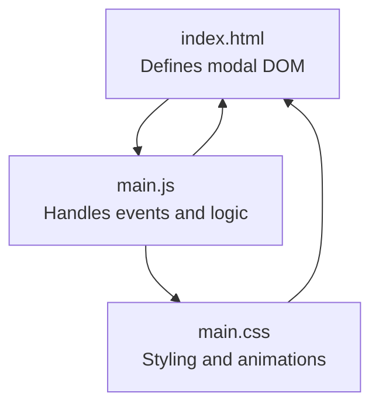
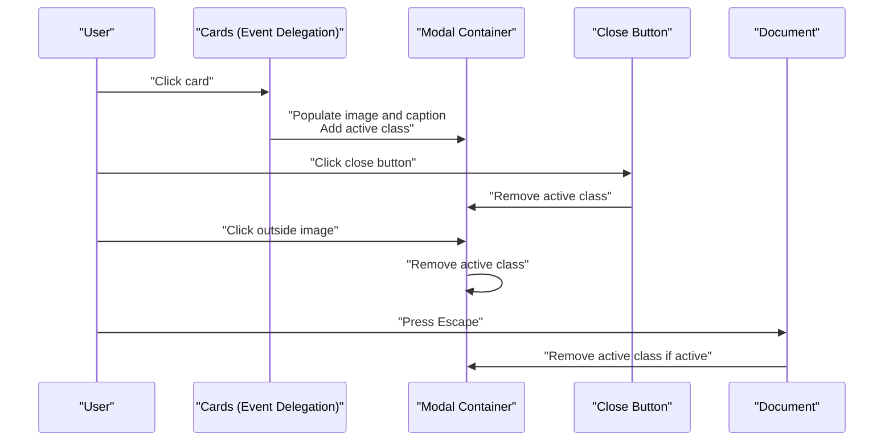
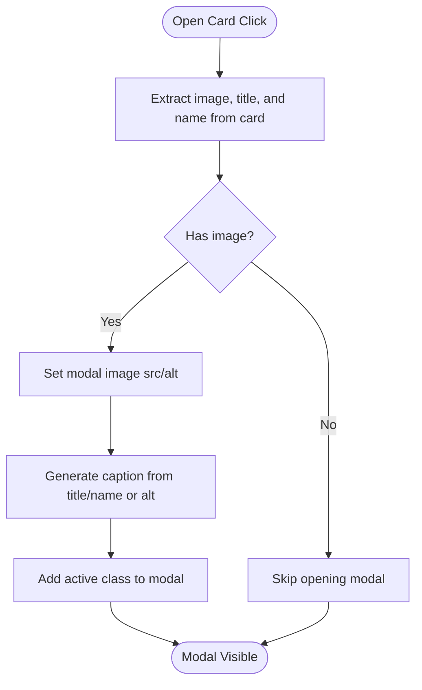
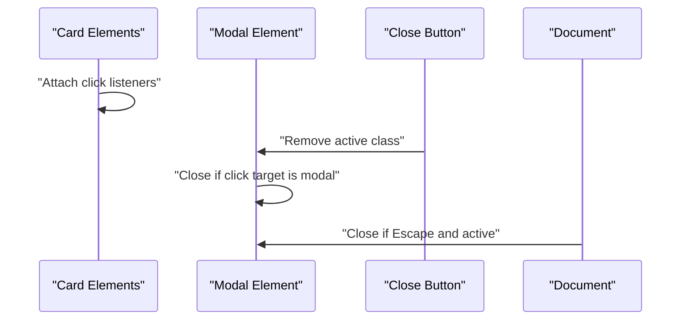
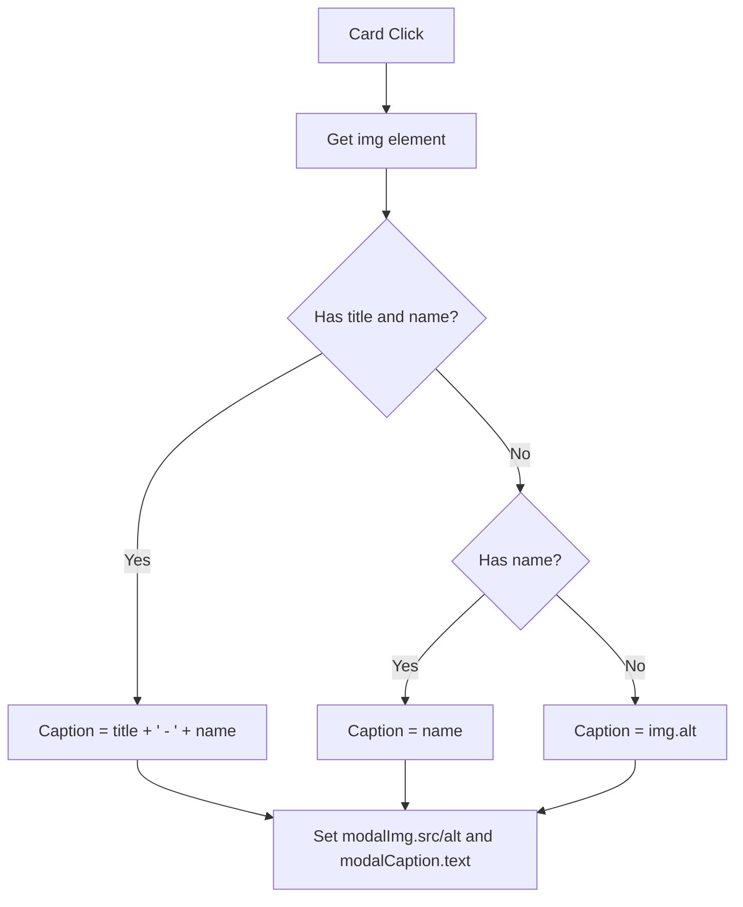
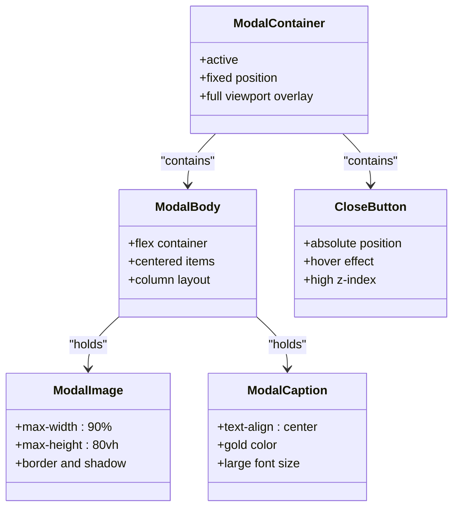
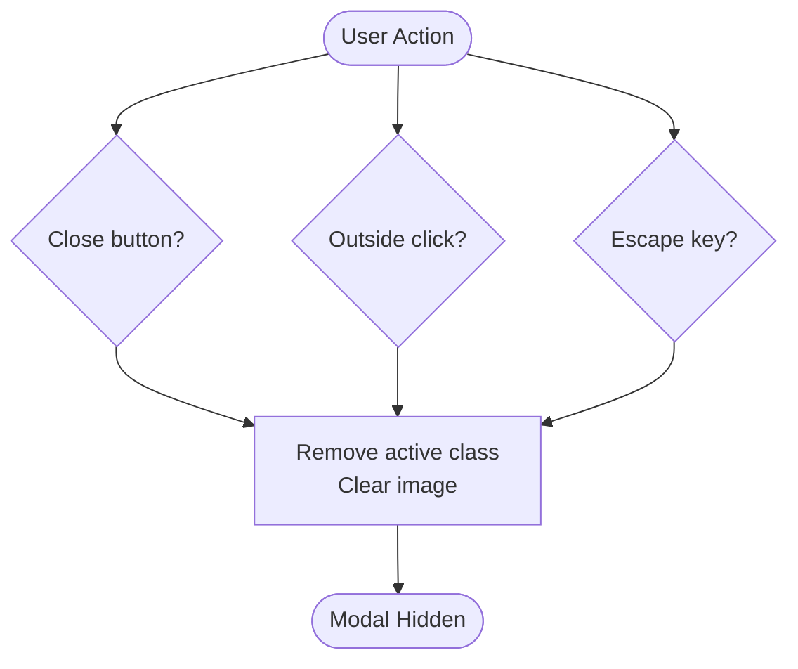
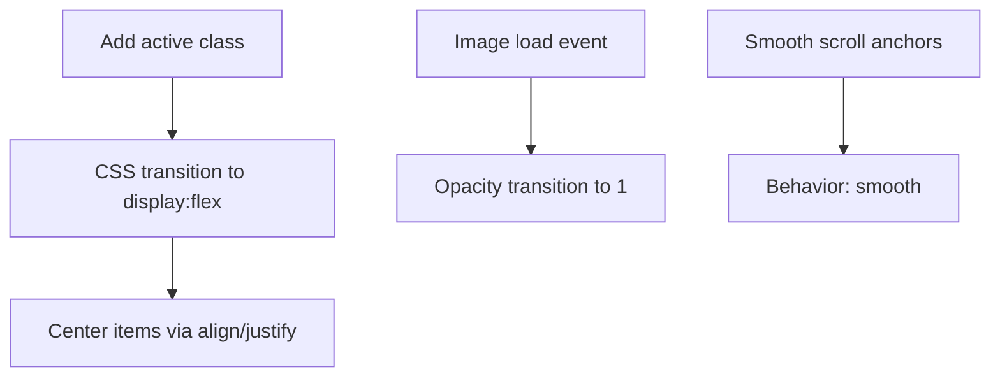
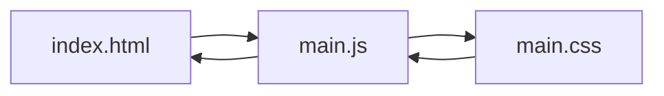

# Modal Functionality

<cite>
**Referenced Files in This Document**
- [index.html](file://index.html)
- [main.js](file://main.js)
- [main.css](file://main.css)
</cite>

## Table of Contents
1. [Introduction](#introduction)
2. [Project Structure](#project-structure)
3. [Core Components](#core-components)
4. [Architecture Overview](#architecture-overview)
5. [Detailed Component Analysis](#detailed-component-analysis)
6. [Dependency Analysis](#dependency-analysis)
7. [Performance Considerations](#performance-considerations)
8. [Accessibility Considerations](#accessibility-considerations)
9. [Troubleshooting Guide](#troubleshooting-guide)
10. [Conclusion](#conclusion)

## Introduction
This document explains the modal functionality implemented for the teacher album page. It covers how the modal opens when users click cards, how images and captions are loaded dynamically, and how users can close the modal through multiple mechanisms. It also documents the modal’s DOM structure, CSS styling, and JavaScript event handling, including the event delegation pattern used for efficient click management. Practical customization tips, animation timing, and accessibility considerations are included to help developers extend and improve the modal system.

## Project Structure
The modal system spans three files:
- index.html defines the modal container, close button, and modal body elements.
- main.js implements the modal open/close logic, caption generation, and event handlers.
- main.css styles the modal, modal body, close button, and responsive layout.

**Diagram sources**
- [index.html:96-102](file://index.html#L96-L102)
- [main.js:2-82](file://main.js#L2-L82)
- [main.css:149-205](file://main.css#L149-L205)

**Section sources**
- [index.html:96-102](file://index.html#L96-L102)
- [main.js:2-82](file://main.js#L2-L82)
- [main.css:149-205](file://main.css#L149-L205)

## Core Components
- Modal container: A fixed-position overlay that becomes visible when the active class is applied.
- Close button: An element inside the modal used to trigger closure.
- Modal body: A flex container holding the full-size image and the caption.
- Image element: Dynamically populated with the clicked card’s image source and alt text.
- Caption element: Populated with contextual text derived from the card’s title and name.

Key behaviors:
- Opening: Clicking any card triggers image/caption population and adds the active class to the modal.
- Closing: Clicking the close button, clicking outside the image area, or pressing the Escape key closes the modal.
- Scrolling prevention: When the modal is active, body scrolling is disabled to keep focus on the modal.

**Section sources**
- [index.html:96-102](file://index.html#L96-L102)
- [main.js:9-58](file://main.js#L9-L58)
- [main.css:149-205](file://main.css#L149-L205)

## Architecture Overview
The modal system follows a straightforward event-driven architecture:
- Event listeners are attached to cards, the close button, the modal itself, and the document.
- On card click, the modal updates its content and becomes visible.
- Multiple close mechanisms are handled through targeted event listeners.
- The modal’s visibility is controlled by toggling a CSS class.

**Diagram sources**
- [main.js:9-58](file://main.js#L9-L58)
- [index.html:96-102](file://index.html#L96-L102)

## Detailed Component Analysis

### Modal DOM Structure
The modal consists of:
- A container with an ID used to select it in JavaScript.
- A close button element inside the modal.
- A modal body containing:
  - An image element whose source and alt text are set dynamically.
  - A heading element for the caption.

**Diagram sources**
- [main.js:10-32](file://main.js#L10-L32)
- [index.html:96-102](file://index.html#L96-L102)

**Section sources**
- [index.html:96-102](file://index.html#L96-L102)
- [main.js:10-32](file://main.js#L10-L32)

### Event Handling and Delegation
- Event delegation: The script attaches a single click listener to each card. This pattern scales efficiently as new cards are added without re-binding listeners.
- Close button: A dedicated click listener removes the active class.
- Outside click: A click listener on the modal checks if the click target is the modal itself (not the image or caption), then closes the modal.
- Escape key: A keydown listener on the document closes the modal when Escape is pressed and the modal is active.

**Diagram sources**
- [main.js:9-58](file://main.js#L9-L58)

**Section sources**
- [main.js:9-58](file://main.js#L9-L58)

### Image Loading and Caption Generation
- Image loading: The modal sets the image source from the clicked card’s image element. A small opacity transition is applied to images across the page to improve perceived load performance.
- Caption generation: The caption combines the card’s title and name when both are available; otherwise it falls back to the name or the image alt text.

**Diagram sources**
- [main.js:10-32](file://main.js#L10-L32)

**Section sources**
- [main.js:10-32](file://main.js#L10-L32)
- [main.js:73-81](file://main.js#L73-L81)

### Modal Body Structure
- The modal body is a flex container centered vertically and horizontally.
- The image is constrained by max-width and max-height to fit within the viewport while preserving aspect ratio.
- The caption is styled with gold color and centered text.

**Diagram sources**
- [index.html:96-102](file://index.html#L96-L102)
- [main.css:168-190](file://main.css#L168-L190)
- [main.css:192-205](file://main.css#L192-L205)

**Section sources**
- [index.html:96-102](file://index.html#L96-L102)
- [main.css:168-190](file://main.css#L168-L190)
- [main.css:192-205](file://main.css#L192-L205)

### Multiple Close Mechanisms
- Close button click: Removes the active class and clears the image source.
- Click outside the image: Closes when the click target equals the modal element.
- Escape key press: Closes when the modal is active.
- Programmatic closing: Exposed via a reusable function that removes the active class, restores scrolling, and clears the image source.

**Diagram sources**
- [main.js:35-58](file://main.js#L35-L58)

**Section sources**
- [main.js:35-58](file://main.js#L35-L58)

### Smooth Transitions and Animation Timing
- Modal visibility: Controlled by adding/removing the active class, which triggers CSS transitions for display and alignment.
- Image fade-in: Images across the page fade in smoothly when they finish loading, improving perceived performance.
- Scroll behavior: Smooth scrolling is enabled for internal links elsewhere on the page.

**Diagram sources**
- [main.js:29](file://main.js#L29)
- [main.js:79](file://main.js#L79)
- [main.js:61-71](file://main.js#L61-L71)

**Section sources**
- [main.js:29](file://main.js#L29)
- [main.js:79](file://main.js#L79)
- [main.js:61-71](file://main.js#L61-L71)

## Dependency Analysis
The modal system depends on:
- index.html for the modal DOM structure.
- main.js for event handling, content population, and close logic.
- main.css for modal styling, responsive behavior, and transitions.

**Diagram sources**
- [index.html:96-102](file://index.html#L96-L102)
- [main.js:2-82](file://main.js#L2-L82)
- [main.css:149-205](file://main.css#L149-L205)

**Section sources**
- [index.html:96-102](file://index.html#L96-L102)
- [main.js:2-82](file://main.js#L2-L82)
- [main.css:149-205](file://main.css#L149-L205)

## Performance Considerations
- Efficient click handling: Using event delegation on cards avoids binding multiple listeners and improves scalability.
- Image loading: Applying a short opacity transition on load reduces perceived flicker during image rendering.
- Scrolling prevention: Temporarily disabling body scrolling prevents layout shifts when the modal is open.
- Responsive sizing: Max-width and max-height constraints ensure images remain usable across devices without excessive memory usage.

Practical tips:
- Lazy-load large images in cards to reduce initial payload.
- Preload key images to minimize perceived latency.
- Consider using modern image formats and compression for faster delivery.

**Section sources**
- [main.js:9-32](file://main.js#L9-L32)
- [main.js:73-81](file://main.js#L73-L81)
- [main.css:178-183](file://main.css#L178-L183)

## Accessibility Considerations
Current implementation highlights:
- Focus management: The modal does not programmatically manage focus. When the modal is active, the close button remains the primary interactive element.
- Keyboard navigation: Escape key support allows keyboard-only closure.
- Screen reader compatibility: The modal image has an alt attribute; ensure captions are concise and descriptive for assistive technologies.

Recommendations:
- Manage focus: On open, move focus to the modal container or close button; on close, return focus to the triggering element.
- ARIA attributes: Add role and aria-label/aria-describedby attributes to enhance semantics for assistive technologies.
- Keyboard trap: Ensure tab order stays within the modal while it is open.

Note: These recommendations are provided for improvement and are not part of the current implementation.

**Section sources**
- [main.js:47-52](file://main.js#L47-L52)
- [index.html:99](file://index.html#L99)

## Troubleshooting Guide
Common issues and resolutions:
- Modal not closing on outside click:
  - Verify the modal click handler targets the modal element itself and not child nodes.
  - Confirm the click event is not being stopped by child elements.
  - Check that the active class is removed when the modal is closed.

- Escape key not working:
  - Ensure the keydown listener is attached to the document and checks for the Escape key.
  - Confirm the modal is active before closing.

- Images not appearing:
  - Confirm the image source is set correctly from the clicked card.
  - Check that the modal image element is visible and not hidden by CSS.

- Positioning problems on mobile:
  - Review responsive media queries affecting modal body layout and image constraints.
  - Adjust max-height and flex direction for landscape orientation if needed.

- Performance with large images:
  - Use lazy-loading and compressed images.
  - Consider preloading key images to reduce perceived latency.

**Section sources**
- [main.js:35-58](file://main.js#L35-L58)
- [main.js:47-52](file://main.js#L47-L52)
- [main.css:508-516](file://main.css#L508-L516)

## Conclusion
The modal system provides a clean, efficient way to display teacher photos with dynamic captions and multiple close mechanisms. Its event delegation pattern ensures scalability, while CSS-driven transitions and responsive constraints deliver a polished user experience. By following the customization tips, accessibility recommendations, and troubleshooting guidance, developers can extend the modal to meet evolving needs while maintaining performance and usability.