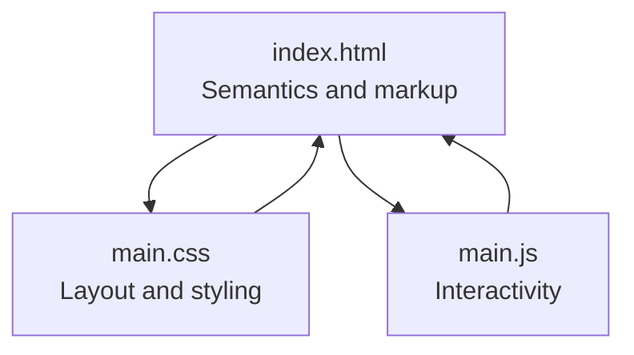
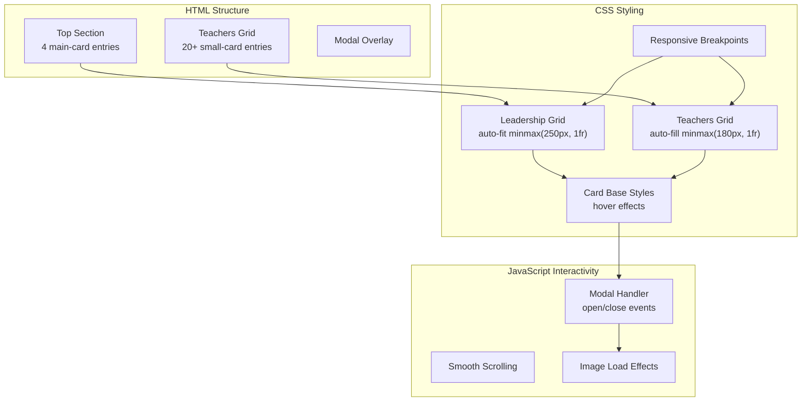
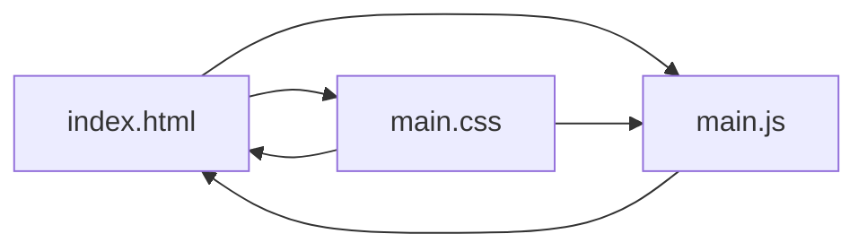

# Teacher Gallery Implementation

<cite>
**Referenced Files in This Document**
- [index.html](file://index.html)
- [main.css](file://main.css)
- [main.js](file://main.js)
</cite>

## Table of Contents
1. [Introduction](#introduction)
2. [Project Structure](#project-structure)
3. [Core Components](#core-components)
4. [Architecture Overview](#architecture-overview)
5. [Detailed Component Analysis](#detailed-component-analysis)
6. [Dependency Analysis](#dependency-analysis)
7. [Performance Considerations](#performance-considerations)
8. [Troubleshooting Guide](#troubleshooting-guide)
9. [Conclusion](#conclusion)

## Introduction
This document provides a comprehensive guide to the teacher gallery implementation, focusing on the CSS Grid-based responsive layout system. It covers both the top leadership section (four main cards) and the teachers grid (twenty-plus small cards), detailing card design patterns, responsive behavior across breakpoints, accessibility considerations, visual feedback mechanisms, and performance optimization strategies.

## Project Structure
The project consists of three primary files:
- index.html: Contains the semantic HTML structure for the teacher gallery, including leadership cards and the teachers grid.
- main.css: Implements the CSS Grid layout, responsive breakpoints, card styling, hover effects, and modal presentation.
- main.js: Provides interactive functionality for opening/closing the modal, smooth scrolling, and image loading transitions.

**Diagram sources**
- [index.html:16-87](file://index.html#L16-L87)
- [main.css:105-147](file://main.css#L105-L147)
- [main.js:1-83](file://main.js#L1-L83)

**Section sources**
- [index.html:16-87](file://index.html#L16-L87)
- [main.css:105-147](file://main.css#L105-L147)
- [main.js:1-83](file://main.js#L1-L83)

## Core Components
- Leadership section container with four main cards using the main-card class.
- Teachers grid container with multiple small-card entries.
- Shared card styling with hover effects and transitions.
- Responsive grid configurations for various screen sizes.
- Modal overlay for enlarged image viewing with accessibility features.

Key implementation references:
- Top leadership section: [index.html:20-49](file://index.html#L20-L49)
- Teachers grid: [index.html:53-87](file://index.html#L53-L87)
- Card base styles: [main.css:86-97](file://main.css#L86-L97)
- Main card image sizing: [main.css:112-114](file://main.css#L112-L114)
- Small card image sizing: [main.css:137-139](file://main.css#L137-L139)
- Leadership grid: [main.css:106-110](file://main.css#L106-L110)
- Teachers grid: [main.css:131-135](file://main.css#L131-L135)

**Section sources**
- [index.html:20-87](file://index.html#L20-L87)
- [main.css:86-147](file://main.css#L86-L147)

## Architecture Overview
The gallery architecture combines semantic HTML with CSS Grid for layout and JavaScript for interactivity. The leadership section and teachers grid share common card styling while maintaining distinct visual treatments.

**Diagram sources**
- [index.html:20-87](file://index.html#L20-L87)
- [main.css:106-147](file://main.css#L106-L147)
- [main.js:1-83](file://main.js#L1-L83)

## Detailed Component Analysis

### Card Design Patterns
Both main-card and small-card inherit shared card styles but differ in image sizing and content presentation:
- Shared card properties include borders, background, overflow handling, transitions, and hover transforms.
- Main cards feature larger portrait images suitable for leadership profiles.
- Small cards use compact images with name badges for teacher listings.

Implementation references:
- Base card styles: [main.css:86-97](file://main.css#L86-L97)
- Main card image sizing: [main.css:112-114](file://main.css#L112-L114)
- Small card image sizing: [main.css:137-139](file://main.css#L137-L139)
- Info section styling: [main.css:116-128](file://main.css#L116-L128)
- Name badge styling: [main.css:141-147](file://main.css#L141-L147)

**Section sources**
- [main.css:86-147](file://main.css#L86-L147)

### Responsive Grid Behavior
The layout adapts using CSS Grid with flexible column counts and minmax constraints:
- Leadership section uses auto-fit with a minimum width threshold to distribute up to four columns on large screens.
- Teachers grid uses auto-fill to create a dense arrangement of small cards.
- Breakpoint-specific adjustments modify column counts, gaps, and image heights.

Breakpoint configurations:
- Large desktop (1920px+): Fixed 4-column layout for both sections with increased spacing and image heights.
- Desktop (1200–1919px): 4-column leadership grid.
- Laptop (992–1199px): 2-column leadership grid with adjusted spacing and image heights.
- Tablet (768–991px): 2-column leadership grid, 3-column teachers grid with reduced spacing.
- Mobile large (576–767px): 2-column grids with smaller images and compact typography.
- Mobile small (≤575px): Single-column leadership grid, 2-column teachers grid.
- Extra small mobile (≤375px): Reduced image heights for very small screens.
- Landscape orientation (≤500px height): Compact images and horizontal modal layout.

Implementation references:
- Leadership grid: [main.css:106-110](file://main.css#L106-L110)
- Teachers grid: [main.css:131-135](file://main.css#L131-L135)
- Large desktop: [main.css:209-241](file://main.css#L209-L241)
- Desktop: [main.css:244-248](file://main.css#L244-L248)
- Laptop: [main.css:250-275](file://main.css#L250-L275)
- Tablet: [main.css:277-325](file://main.css#L277-L325)
- Mobile large: [main.css:327-396](file://main.css#L327-L396)
- Mobile small: [main.css:398-472](file://main.css#L398-L472)
- Extra small mobile: [main.css:474-491](file://main.css#L474-L491)
- Landscape orientation: [main.css:493-516](file://main.css#L493-L516)

**Section sources**
- [main.css:106-147](file://main.css#L106-L147)
- [main.css:209-516](file://main.css#L209-L516)

### Semantic HTML Structure and Accessibility
The HTML structure uses semantic elements and proper alt attributes:
- Top section contains four main-card entries with descriptive alt text for leadership roles.
- Teachers grid contains small-card entries with alt attributes and name badges.
- Modal overlay includes accessible close controls and focus management.

Accessibility considerations:
- Alt attributes on all images provide meaningful descriptions.
- Modal includes escape key support and click-outside-to-close functionality.
- Focus management prevents scrolling when modal is open.

Implementation references:
- Leadership cards: [index.html:21-48](file://index.html#L21-L48)
- Teachers cards: [index.html:54-87](file://index.html#L54-L87)
- Modal structure: [index.html:90-96](file://index.html#L90-L96)
- Image loading transitions: [main.js:73-81](file://main.js#L73-L81)

**Section sources**
- [index.html:21-96](file://index.html#L21-L96)
- [main.js:73-81](file://main.js#L73-L81)

### Hover Effects, Animations, and Visual Feedback
Visual feedback mechanisms enhance user interaction:
- Cards lift slightly on hover with shadow enhancement.
- Smooth transitions apply to transform and box-shadow properties.
- Image opacity transitions improve perceived loading performance.
- Modal overlay provides immersive viewing with backdrop blur.

Implementation references:
- Card hover effects: [main.css:94-97](file://main.css#L94-L97)
- Transition timing: [main.css:90](file://main.css#L90)
- Image opacity transitions: [main.js:73-81](file://main.js#L73-L81)
- Modal styling: [main.css:150-205](file://main.css#L150-L205)

**Section sources**
- [main.css:90-97](file://main.css#L90-L97)
- [main.js:73-81](file://main.js#L73-L81)
- [main.css:150-205](file://main.css#L150-L205)

### Grid Item Sizing, Spacing, and Alignment
Grid behavior ensures optimal content distribution:
- Leadership section uses auto-fit with minmax(250px, 1fr) to maintain readable card widths.
- Teachers grid uses auto-fill with minmax(180px, 1fr) for dense, responsive arrangements.
- Consistent gap values provide uniform spacing across breakpoints.
- Alignment strategies center content within cards and modal overlays.

Implementation references:
- Leadership sizing: [main.css:108](file://main.css#L108)
- Teachers sizing: [main.css:133](file://main.css#L133)
- Gap values: [main.css:109](file://main.css#L109), [main.css:134](file://main.css#L134)
- Alignment in modal: [main.css:168-176](file://main.css#L168-L176)

**Section sources**
- [main.css:106-135](file://main.css#L106-L135)
- [main.css:168-176](file://main.css#L168-L176)

### Practical Examples

#### Adding a New Teacher Card
Steps to add a new teacher to the grid:
1. Insert a new small-card element within the teachers-grid container.
2. Include an image with an appropriate alt attribute.
3. Add a name paragraph with the class name.
4. Reference: [index.html:53-87](file://index.html#L53-L87)

#### Modifying Card Styles
To customize card appearance:
1. Adjust base card styles in the card selector.
2. Modify hover effects and transitions.
3. Update image sizing for specific card types.
4. Reference: [main.css:86-97](file://main.css#L86-L97), [main.css:112-114](file://main.css#L112-L114), [main.css:137-139](file://main.css#L137-L139)

#### Adjusting Grid Layouts
To change grid behavior:
1. Modify grid-template-columns values in the relevant section selectors.
2. Adjust gap values for spacing changes.
3. Update minmax constraints for responsive sizing.
4. Reference: [main.css:106-110](file://main.css#L106-L110), [main.css:131-135](file://main.css#L131-L135)

**Section sources**
- [index.html:53-87](file://index.html#L53-L87)
- [main.css:86-139](file://main.css#L86-L139)

### Interactive Modal System
The modal provides an immersive viewing experience:
- Clicking any card opens the modal with the selected image and caption.
- Supports closing via close button, escape key, or clicking outside the image.
- Prevents page scrolling while modal is active.
- Smooth transitions enhance perceived performance during image loading.

Implementation references:
- Modal initialization and event handlers: [main.js:2-33](file://main.js#L2-L33)
- Close functionality: [main.js:35-58](file://main.js#L35-L58)
- Escape key handling: [main.js:47-52](file://main.js#L47-L52)
- Smooth scrolling anchors: [main.js:60-71](file://main.js#L60-L71)
- Image load effects: [main.js:73-81](file://main.js#L73-L81)

**Section sources**
- [main.js:2-83](file://main.js#L2-L83)

## Dependency Analysis
The gallery implementation demonstrates clear separation of concerns:
- HTML provides semantic structure and content.
- CSS manages layout, responsiveness, and visual styling.
- JavaScript handles interactivity and user experience enhancements.

**Diagram sources**
- [index.html:16-87](file://index.html#L16-L87)
- [main.css:105-147](file://main.css#L105-L147)
- [main.js:1-83](file://main.js#L1-L83)

**Section sources**
- [index.html:16-87](file://index.html#L16-L87)
- [main.css:105-147](file://main.css#L105-L147)
- [main.js:1-83](file://main.js#L1-L83)

## Performance Considerations
Optimization strategies for the teacher gallery:
- Lazy loading: Implement native loading="lazy" on images to defer offscreen resource loading.
- Responsive images: Use srcset and sizes attributes to serve appropriately sized images for different viewport widths.
- CSS containment: Apply contain: paint to grid containers to limit repaint scope.
- Reduce repaints: Minimize layout thrashing by batching DOM reads/writes.
- Optimize images: Compress images and use modern formats (WebP) where supported.
- Virtualization: For very large teacher lists, consider virtualized rendering to limit DOM nodes.

[No sources needed since this section provides general guidance]

## Troubleshooting Guide
Common issues and solutions:
- Cards not aligning properly: Verify grid-template-columns and gap values match intended breakpoint.
- Hover effects not appearing: Ensure transition properties are set on the card selector and hover pseudo-class is defined.
- Modal not closing: Check event listeners for close button and escape key are attached after DOMContentLoaded.
- Images not loading smoothly: Confirm opacity transition is applied and image load event handler is registered.
- Accessibility issues: Verify alt attributes are present on all images and modal includes keyboard navigation support.

**Section sources**
- [main.css:86-97](file://main.css#L86-L97)
- [main.js:2-33](file://main.js#L2-L33)
- [main.js:35-58](file://main.js#L35-L58)

## Conclusion
The teacher gallery implementation demonstrates a robust, responsive design system built on CSS Grid and semantic HTML. The dual-layout approach accommodates both leadership prominence and extensive teacher listings while maintaining excellent user experience across devices. The modular structure allows for easy maintenance and extension, with clear pathways for customization and performance optimization.