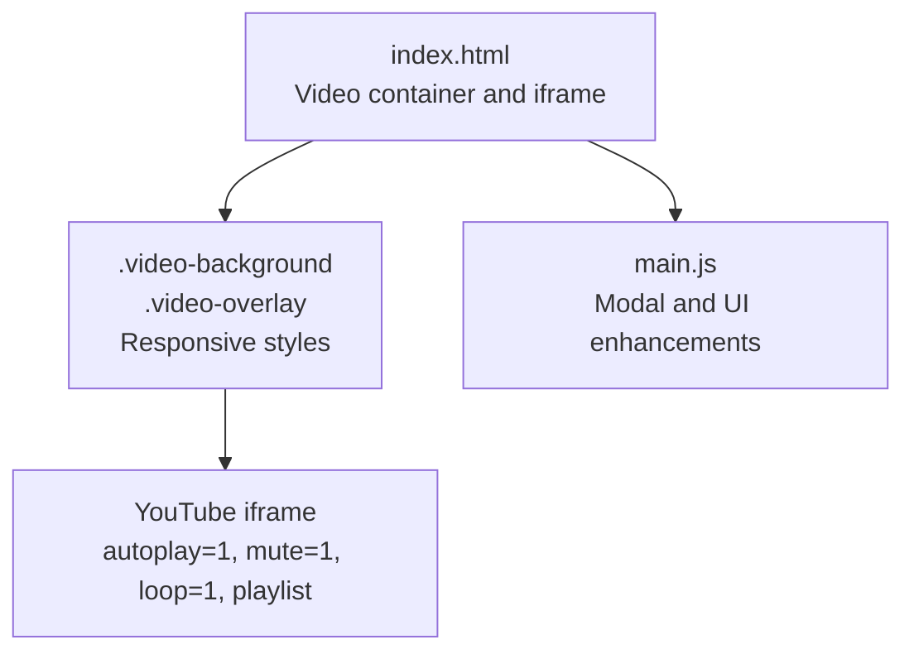
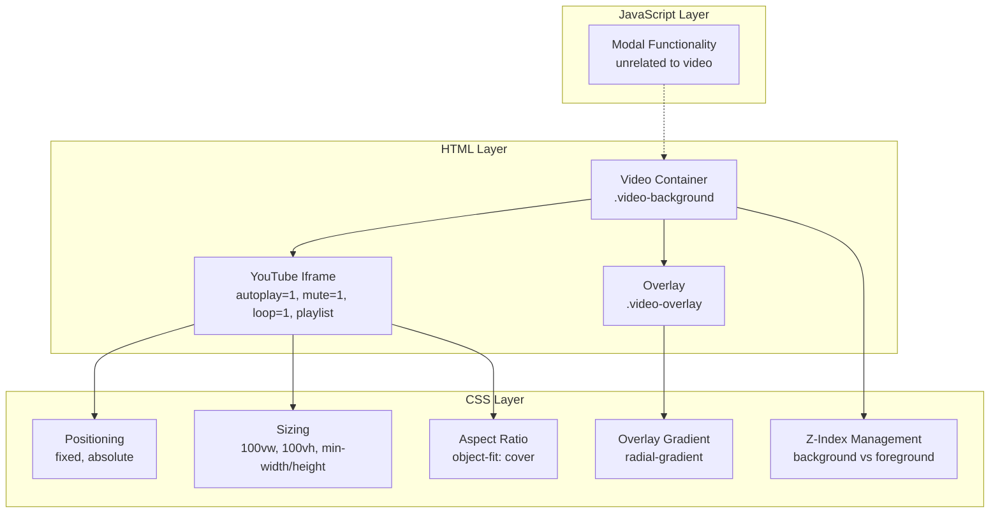
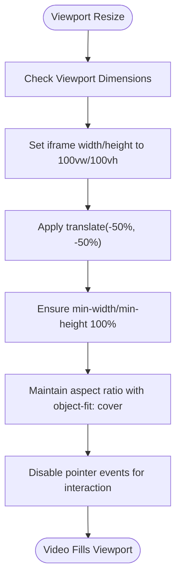
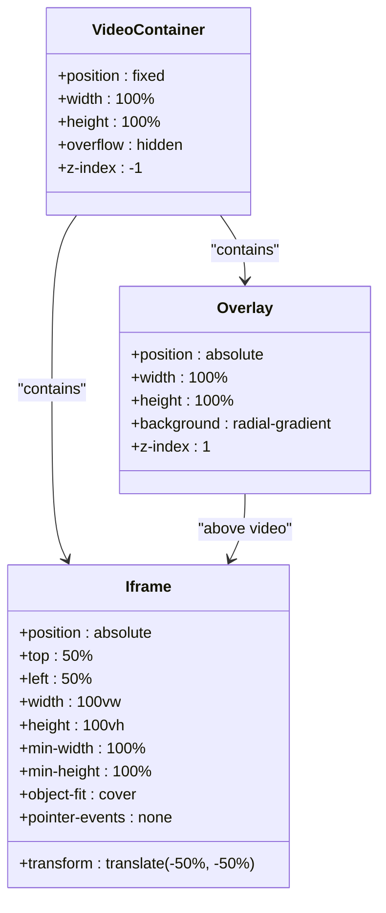
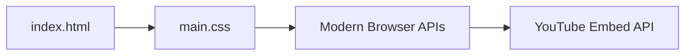
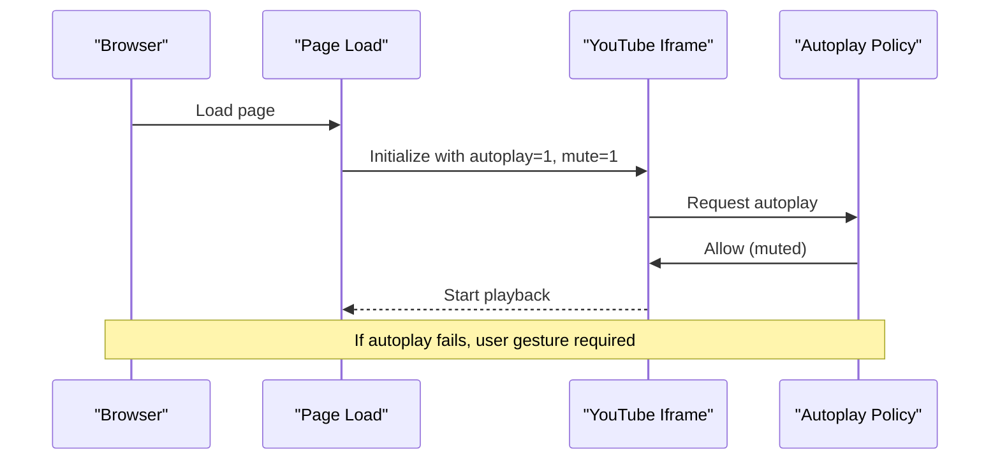

# Video Background System

<cite>
**Referenced Files in This Document**
- [index.html](file://index.html)
- [main.css](file://main.css)
- [main.js](file://main.js)
</cite>

## Table of Contents
1. [Introduction](#introduction)
2. [Project Structure](#project-structure)
3. [Core Components](#core-components)
4. [Architecture Overview](#architecture-overview)
5. [Detailed Component Analysis](#detailed-component-analysis)
6. [Dependency Analysis](#dependency-analysis)
7. [Performance Considerations](#performance-considerations)
8. [Troubleshooting Guide](#troubleshooting-guide)
9. [Conclusion](#conclusion)

## Introduction
This document provides comprehensive technical documentation for the video background system implemented in the project. It focuses on the YouTube embed integration, iframe configuration, overlay styling, responsive video container behavior, and practical customization examples. It also addresses common autoplay policy challenges, mobile device restrictions, and fallback strategies for users who cannot autoplay videos.

## Project Structure
The video background system is implemented using a minimal HTML structure with two primary CSS components and a lightweight JavaScript module for unrelated UI enhancements. The system consists of:
- A fixed-position video container that holds the YouTube iframe and an overlay
- A CSS-defined radial gradient overlay for visual enhancement
- Responsive styles that ensure the video maintains aspect ratio and fills the viewport
- A JavaScript module that handles modal interactions and does not affect video playback

**Diagram sources**
- [index.html:10-19](file://index.html#L10-L19)
- [main.css:8-41](file://main.css#L8-L41)
- [main.js:1-83](file://main.js#L1-L83)

**Section sources**
- [index.html:10-19](file://index.html#L10-L19)
- [main.css:8-41](file://main.css#L8-L41)
- [main.js:1-83](file://main.js#L1-L83)

## Core Components
The video background system comprises three core elements:
- Video container: A fixed-position element that ensures the video stays behind all page content
- Overlay: A radial gradient that darkens the video and improves text readability
- Iframe: A YouTube embed configured for seamless looping playback

Key implementation characteristics:
- The container uses negative z-index to place the video behind content while maintaining click-through behavior
- The overlay uses a radial gradient to create a vignette effect
- The iframe is configured with autoplay, mute, loop, and playlist parameters for continuous playback
- Pointer events are disabled on the iframe to allow interaction with page elements beneath

**Section sources**
- [index.html:10-19](file://index.html#L10-L19)
- [main.css:8-41](file://main.css#L8-L41)

## Architecture Overview
The video background architecture follows a layered approach:
- HTML provides the structural foundation with the video container and iframe
- CSS manages positioning, sizing, and visual effects
- JavaScript provides unrelated UI enhancements

**Diagram sources**
- [index.html:10-19](file://index.html#L10-L19)
- [main.css:8-41](file://main.css#L8-L41)
- [main.js:1-83](file://main.js#L1-L83)

## Detailed Component Analysis

### YouTube Embed Integration
The YouTube iframe is configured with parameters designed for seamless background playback:
- Autoplay: Enabled to start playback automatically when the page loads
- Mute: Enabled to satisfy browser autoplay policies
- Loop: Enabled to continuously repeat the video
- Playlist: Configured with the same video ID to enable seamless looping
- Additional parameters: Controls, info, related videos, and branding are disabled to minimize distractions

The iframe is embedded within the video container and styled to fill the viewport while maintaining aspect ratio.

**Section sources**
- [index.html:13-17](file://index.html#L13-L17)
- [main.css:19-30](file://main.css#L19-L30)

### Video Overlay Styling
The overlay creates a radial gradient effect that:
- Darkens the center of the video to improve text readability
- Creates a vignette effect that draws focus to the center of the screen
- Uses layered transparency to achieve depth and visual appeal
- Maintains full viewport coverage with absolute positioning

The overlay sits above the video but below the main content due to z-index management.

**Section sources**
- [main.css:32-41](file://main.css#L32-L41)

### Responsive Video Container Implementation
The video container ensures the video maintains aspect ratio and fills the viewport across devices:
- Fixed positioning keeps the video in the background regardless of scrolling
- Absolute positioning and transforms center the iframe within the viewport
- Min-width and min-height ensure the video covers the entire viewport
- Object-fit: cover maintains aspect ratio while filling the container
- Pointer-events: none allows interaction with page elements beneath the video

**Diagram sources**
- [main.css:19-30](file://main.css#L19-L30)

**Section sources**
- [main.css:8-41](file://main.css#L8-L41)

### Z-Index Management
The z-index system ensures proper layering:
- Video container uses z-index: -1 to place video behind all content
- Overlay uses z-index: 1 to appear above the video but below content
- Album container uses z-index: 2 to ensure content remains above the overlay
- Modal uses z-index: 2000+ to guarantee visibility above all other elements

**Section sources**
- [main.css:15](file://main.css#L15)
- [main.css:40](file://main.css#L40)
- [main.css:59](file://main.css#L59)
- [main.css:150](file://main.css#L150)

### Relationship Between Elements
The video container, overlay, and iframe form a cohesive system:
- The container establishes the video layer
- The overlay enhances visual appeal and readability
- The iframe provides the actual video content
- All elements share the same viewport dimensions for consistent behavior

**Diagram sources**
- [index.html:10-19](file://index.html#L10-L19)
- [main.css:8-41](file://main.css#L8-L41)

## Dependency Analysis
The video background system has minimal external dependencies and relies on standard web technologies:
- HTML structure depends on CSS positioning and sizing
- CSS styling depends on viewport units and modern layout properties
- No JavaScript dependency exists for video functionality

**Diagram sources**
- [index.html:10-19](file://index.html#L10-L19)
- [main.css:8-41](file://main.css#L8-L41)

**Section sources**
- [index.html:10-19](file://index.html#L10-L19)
- [main.css:8-41](file://main.css#L8-L41)

## Performance Considerations
The video background system is optimized for performance:
- The iframe is muted to comply with autoplay policies and reduce CPU usage
- Pointer-events: none prevents unnecessary event handling on the video layer
- Minimal CSS rules reduce rendering overhead
- Responsive design avoids expensive calculations during resize events

Optimization recommendations:
- Consider lazy-loading the iframe until user interaction occurs
- Monitor video bandwidth usage for mobile users
- Test performance impact on older devices
- Consider using WebP or AVIF formats for static backgrounds as alternatives

## Troubleshooting Guide

### Autoplay Policy Issues
Common autoplay policy violations and solutions:
- **Muted requirement**: The iframe must be muted for autoplay to work on most browsers
- **User gesture requirement**: Some browsers require explicit user interaction before autoplay
- **Cross-origin restrictions**: YouTube embeds may be blocked in certain environments

**Diagram sources**
- [index.html:13-17](file://index.html#L13-L17)

### Mobile Device Restrictions
Mobile devices often restrict autoplay for battery life and data usage:
- **iOS Safari**: Requires user interaction for media playback
- **Android Chrome**: May block autoplay based on user preferences
- **Data saver modes**: Can disable embedded content

Mitigation strategies:
- Detect autoplay failure and provide manual play controls
- Offer a static image fallback for autoplay-disabled scenarios
- Implement user preference detection for autoplay behavior

### Video Loading Problems
Symptoms and solutions:
- **Black screen**: Verify the video ID is correct and the video is public
- **Playback errors**: Check network connectivity and browser permissions
- **Performance issues**: Reduce video quality or implement lazy loading

### Fallback Strategies
Implement graceful degradation:
- Static background image when autoplay fails
- Manual play button overlay for user-initiated playback
- Reduced video quality settings for low-bandwidth connections

**Section sources**
- [index.html:13-17](file://index.html#L13-L17)
- [main.css:19-30](file://main.css#L19-L30)

## Practical Customization Examples

### Modifying the Video Source
To change the background video:
1. Update the iframe src attribute with a new YouTube video ID
2. Ensure the playlist parameter matches the new video ID
3. Verify the video is public and embeddable

Example modification path:
- Change the src attribute in the iframe element
- Update the playlist parameter to match the new video ID

### Changing Overlay Colors
To customize the overlay appearance:
1. Modify the radial-gradient values in the overlay background property
2. Adjust the color stops to achieve desired darkness levels
3. Test readability of overlaid content

Example modification path:
- Edit the background property in the overlay selector

### Adjusting Video Positioning
To fine-tune video positioning:
1. Modify the iframe positioning properties
2. Adjust the transform values for centering
3. Test across different viewport sizes

Example modification path:
- Adjust the iframe positioning and transform properties

**Section sources**
- [index.html:13-17](file://index.html#L13-L17)
- [main.css:32-41](file://main.css#L32-L41)
- [main.css:19-30](file://main.css#L19-L30)

## Conclusion
The video background system provides a robust, responsive solution for embedding YouTube videos as page backgrounds. Its implementation balances visual appeal with performance considerations while adhering to modern autoplay policies. The system's modular design allows for easy customization while maintaining cross-device compatibility. For production deployments, consider implementing fallback strategies and monitoring autoplay policy compliance across different browsers and devices.