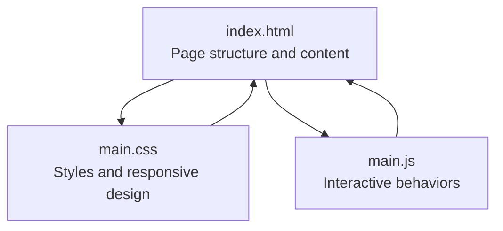
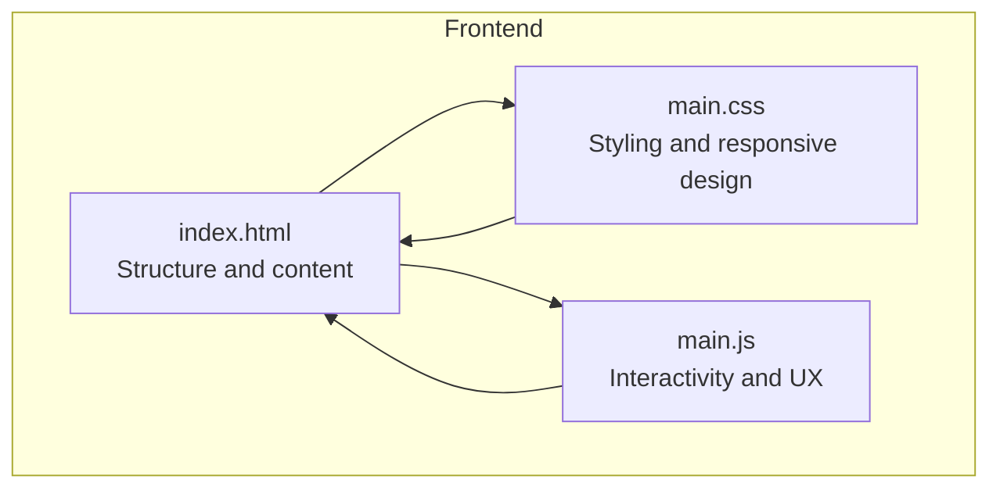
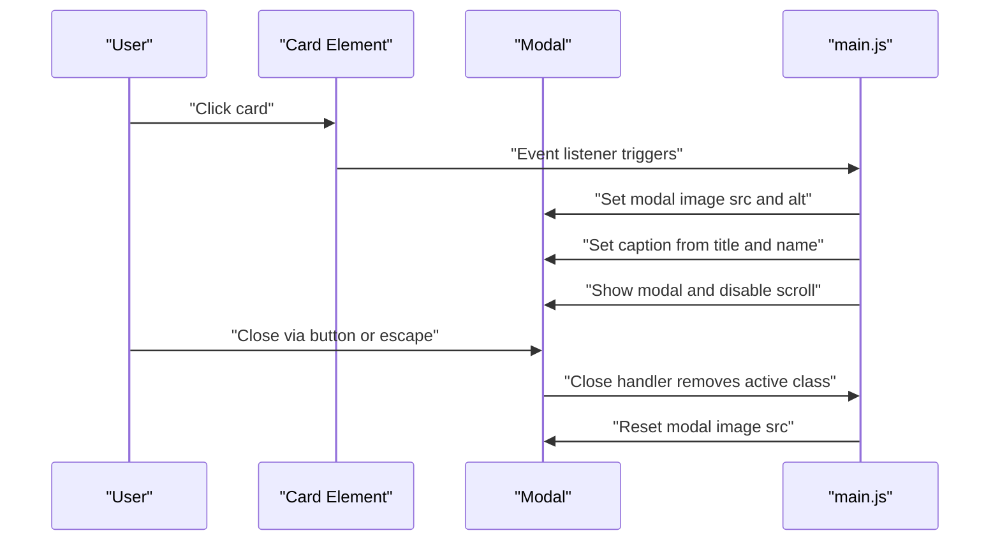
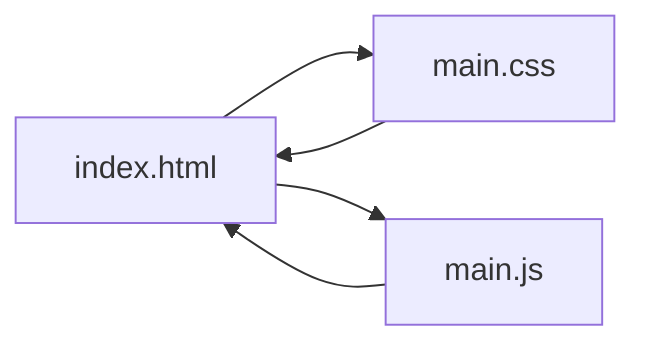

# Content Addition

<cite>
**Referenced Files in This Document**
- [index.html](file://index.html)
- [main.css](file://main.css)
- [main.js](file://main.js)
</cite>

## Table of Contents
1. [Introduction](#introduction)
2. [Project Structure](#project-structure)
3. [Core Components](#core-components)
4. [Architecture Overview](#architecture-overview)
5. [Detailed Component Analysis](#detailed-component-analysis)
6. [Dependency Analysis](#dependency-analysis)
7. [Performance Considerations](#performance-considerations)
8. [Troubleshooting Guide](#troubleshooting-guide)
9. [Conclusion](#conclusion)
10. [Appendices](#appendices)

## Introduction
This document explains how to add new teacher profiles to the directory system. It focuses on modifying the HTML structure to insert new teacher cards in two areas:
- Top leadership section (lines 25-54)
- General teachers grid (lines 58-92)

It also documents card structure requirements, image attributes, alt text formatting, and accessibility guidelines. Step-by-step instructions cover HTML markup patterns, image upload requirements, and responsive behavior. Guidance is included for choosing between card types (main-card and small-card), image sizing recommendations, file formats, and grid layout considerations.

## Project Structure
The project consists of a single-page application with three core files:
- index.html: Contains the page structure, including the top leadership section and the general teachers grid.
- main.css: Defines styles for cards, grids, modal behavior, and responsive breakpoints.
- main.js: Implements interactive features such as modal preview, smooth scrolling, and image loading effects.

**Diagram sources**
- [index.html:1-106](file://index.html#L1-L106)
- [main.css:1-517](file://main.css#L1-L517)
- [main.js:1-83](file://main.js#L1-L83)

**Section sources**
- [index.html:1-106](file://index.html#L1-L106)
- [main.css:1-517](file://main.css#L1-L517)
- [main.js:1-83](file://main.js#L1-L83)

## Core Components
- Top leadership section: A responsive grid containing four main-card entries with profile images, roles, and names.
- General teachers grid: A responsive grid of small-card entries with profile images and names.
- Card types:
  - main-card: Used for leadership cards with larger images and role/name blocks.
  - small-card: Used for general teacher cards with compact image and name label.
- Modal preview: Clicking any card opens a full-screen modal with the image and caption.

Key HTML and CSS references:
- Top leadership section container and card structure: [index.html:25-54](file://index.html#L25-L54), [main.css:106-129](file://main.css#L106-L129)
- Teachers grid container and card structure: [index.html:58-92](file://index.html#L58-L92), [main.css:131-147](file://main.css#L131-L147)
- Card hover and image behavior: [main.css:86-103](file://main.css#L86-L103)
- Modal implementation: [index.html:95-101](file://index.html#L95-L101), [main.js:1-83](file://main.js#L1-L83)

**Section sources**
- [index.html:25-54](file://index.html#L25-L54)
- [index.html:58-92](file://index.html#L58-L92)
- [main.css:86-147](file://main.css#L86-L147)
- [main.js:1-83](file://main.js#L1-L83)

## Architecture Overview
The teacher directory is structured as a static HTML page enhanced by CSS and JavaScript:
- index.html defines the content and layout.
- main.css controls visual presentation, grid layouts, and responsiveness.
- main.js adds interactivity (modal, smooth scroll, image load effect).

**Diagram sources**
- [index.html:1-106](file://index.html#L1-L106)
- [main.css:1-517](file://main.css#L1-L517)
- [main.js:1-83](file://main.js#L1-L83)

## Detailed Component Analysis

### Adding New Teacher Cards in the Top Leadership Section
The top leadership section uses a responsive grid with four columns on large screens and fewer columns on smaller screens. Each card is a main-card with an image, role heading, and full name paragraph.

Card structure requirements:
- Container: A div with class card and main-card.
- Image: An img element with src pointing to the uploaded image file and alt text describing the role.
- Info block: A div with class info containing:
  - Heading h3 with the role title.
  - Paragraph p with the teacher’s full name.

Example markup pattern (use this structure for each new leader):
- Container: [index.html:26-32](file://index.html#L26-L32)
- Image and alt: [index.html:27](file://index.html#L27)
- Info block: [index.html:28-32](file://index.html#L28-L32)

Step-by-step instructions:
1. Prepare the image:
   - Upload the image to your server or site media folder.
   - Choose a high-quality, square or portrait aspect ratio suitable for desktop and mobile.
   - Recommended image sizes:
     - Desktop: approximately 450px height for main-card images.
     - Mobile: approximately 240–280px height depending on viewport.
   - File format: modern web formats such as JPEG or PNG.
2. Insert a new main-card:
   - Copy the structure from [index.html:26-32](file://index.html#L26-L32).
   - Replace the image src with the path to your uploaded image.
   - Update alt text to reflect the role (e.g., “Director”, “Deputy Director”).
   - Update h3 role text and p name accordingly.
3. Place the new card inside the top-section container [index.html:25](file://index.html#L25).
4. Test responsiveness:
   - Resize the browser window to verify the grid adjusts correctly.
   - On large screens, up to four cards fit per row; on smaller screens, fewer cards per row adjust automatically.

Accessibility and alt text best practices:
- Alt text should describe the person’s role or title for screen readers.
- Example alt patterns: “Director”, “Deputy Director”, “Grade Head”, “Lead Teacher”.

Responsive considerations:
- The grid uses auto-fit with minmax constraints. On large screens, the grid enforces four columns [main.css:224-227](file://main.css#L224-L227).
- On tablets and below, the number of columns reduces automatically [main.css:298-301](file://main.css#L298-L301).

**Section sources**
- [index.html:25-54](file://index.html#L25-L54)
- [main.css:106-129](file://main.css#L106-L129)
- [main.css:209-241](file://main.css#L209-L241)
- [main.css:298-301](file://main.css#L298-L301)

### Adding New Teacher Cards in the General Teachers Grid
The general teachers grid displays small-card entries. Each card contains an image and a name label.

Card structure requirements:
- Container: A div with class card and small-card.
- Image: An img element with src pointing to the uploaded image file and alt text describing the role.
- Name: A paragraph p with class name displaying the teacher’s full name.

Example markup pattern (use this structure for each new teacher):
- Container: [index.html:59](file://index.html#L59)
- Image and alt: [index.html:60](file://index.html#L60)
- Name: [index.html:61](file://index.html#L61)

Step-by-step instructions:
1. Prepare the image:
   - Upload the image to your server or site media folder.
   - Recommended image sizes:
     - Desktop: approximately 280px height for small-card images.
     - Mobile: approximately 120–160px height depending on viewport.
   - File format: modern web formats such as JPEG or PNG.
2. Insert a new small-card:
   - Copy the structure from [index.html:59](file://index.html#L59) or another existing small-card entry [index.html:63](file://index.html#L63).
   - Replace the image src with the path to your uploaded image.
   - Update alt text to reflect the role (e.g., “Teacher”).
   - Update the name text accordingly.
3. Place the new card inside the teachers-grid container [index.html:58](file://index.html#L58).
4. Test responsiveness:
   - The grid uses auto-fill with minmax constraints [main.css:131-135](file://main.css#L131-L135).
   - On large screens, the grid fits more columns; on smaller screens, fewer columns adjust automatically.

Accessibility and alt text best practices:
- Alt text should describe the person’s role or title for screen readers.
- Example alt patterns: “Teacher”, “Subject Teacher”.

Grid layout considerations:
- The grid adapts to viewport width. On tablets, the grid switches to three columns [main.css:307-310](file://main.css#L307-L310).
- On mobile, the grid uses two columns [main.css:349-351](file://main.css#L349-L351).

**Section sources**
- [index.html:58-92](file://index.html#L58-L92)
- [main.css:131-147](file://main.css#L131-L147)
- [main.css:307-310](file://main.css#L307-L310)
- [main.css:349-351](file://main.css#L349-L351)

### Choosing Between main-card and small-card
- Use main-card for leadership or prominent roles in the top leadership section. These cards have larger images and include a role heading and full name.
- Use small-card for general teacher listings in the teachers grid. These cards have compact images and a simple name label.

Reference examples:
- main-card example: [index.html:26-32](file://index.html#L26-L32)
- small-card example: [index.html:59](file://index.html#L59)

**Section sources**
- [index.html:26-32](file://index.html#L26-L32)
- [index.html:59](file://index.html#L59)

### Image Sizing Recommendations and Best Practices
Image sizing:
- main-card images:
  - Desktop: approximately 450px height.
  - Mobile: approximately 240–280px height depending on viewport.
- small-card images:
  - Desktop: approximately 280px height.
  - Mobile: approximately 120–160px height depending on viewport.

File format:
- Use modern web formats such as JPEG or PNG.

Alt text accessibility:
- Alt text should describe the person’s role or title for screen readers.
- Examples: “Director”, “Deputy Director”, “Grade Head”, “Lead Teacher”, “Teacher”.

Object-fit behavior:
- Images are styled to cover the card area while maintaining aspect ratio [main.css:99-103](file://main.css#L99-L103).

**Section sources**
- [main.css:112-114](file://main.css#L112-L114)
- [main.css:137-139](file://main.css#L137-L139)
- [main.css:99-103](file://main.css#L99-L103)

### Responsive Behavior and Grid Layout
Responsive grid behavior:
- Top leadership section:
  - Large screens enforce four columns [main.css:224-227](file://main.css#L224-L227).
  - Tablets and below reduce columns based on viewport [main.css:298-301](file://main.css#L298-L301).
- General teachers grid:
  - Uses auto-fill with minmax constraints [main.css:131-135](file://main.css#L131-L135).
  - On tablets, three columns [main.css:307-310](file://main.css#L307-L310).
  - On mobile, two columns [main.css:349-351](file://main.css#L349-L351).

Breakpoints:
- Desktop and above: [main.css:209-241](file://main.css#L209-L241)
- Laptop: [main.css:250-275](file://main.css#L250-L275)
- Tablet: [main.css:277-325](file://main.css#L277-L325)
- Mobile large: [main.css:327-396](file://main.css#L327-L396)
- Mobile small: [main.css:398-472](file://main.css#L398-L472)
- Extra small mobile: [main.css:474-491](file://main.css#L474-L491)
- Landscape mobile: [main.css:493-516](file://main.css#L493-L516)

**Section sources**
- [main.css:106-129](file://main.css#L106-L129)
- [main.css:131-147](file://main.css#L131-L147)
- [main.css:209-241](file://main.css#L209-L241)
- [main.css:250-275](file://main.css#L250-L275)
- [main.css:277-325](file://main.css#L277-L325)
- [main.css:327-396](file://main.css#L327-L396)
- [main.css:398-472](file://main.css#L398-L472)
- [main.css:474-491](file://main.css#L474-L491)
- [main.css:493-516](file://main.css#L493-L516)

### Modal Preview Workflow
Clicking any card opens a modal with the image and caption. The modal caption combines role and name when available, otherwise falls back to name or alt text.

**Diagram sources**
- [index.html:95-101](file://index.html#L95-L101)
- [main.js:1-83](file://main.js#L1-L83)

**Section sources**
- [index.html:95-101](file://index.html#L95-L101)
- [main.js:1-83](file://main.js#L1-L83)

## Dependency Analysis
The HTML depends on CSS for layout and styling, and on JavaScript for interactive behaviors. The JavaScript relies on DOM elements defined in HTML.

**Diagram sources**
- [index.html:1-106](file://index.html#L1-L106)
- [main.css:1-517](file://main.css#L1-L517)
- [main.js:1-83](file://main.js#L1-L83)

**Section sources**
- [index.html:1-106](file://index.html#L1-L106)
- [main.css:1-517](file://main.css#L1-L517)
- [main.js:1-83](file://main.js#L1-L83)

## Performance Considerations
- Lazy loading and opacity transitions:
  - Images fade in upon load to improve perceived performance [main.js:74-81](file://main.js#L74-L81).
- Efficient grid layouts:
  - CSS Grid with auto-fit/auto-fill minimizes reflows during resize [main.css:106-135](file://main.css#L106-L135).
- Modal rendering:
  - Modal is hidden by default and only activated on demand [main.css:150-166](file://main.css#L150-L166).

Best practices:
- Compress images to reduce bandwidth.
- Use modern formats (JPEG/PNG) and appropriate resolutions for each card type.
- Keep alt texts concise yet descriptive.

**Section sources**
- [main.js:74-81](file://main.js#L74-L81)
- [main.css:106-135](file://main.css#L106-L135)
- [main.css:150-166](file://main.css#L150-L166)

## Troubleshooting Guide
Common issues and resolutions:
- Images not appearing:
  - Verify the image src path is correct and the file exists [index.html:27](file://index.html#L27), [index.html:60](file://index.html#L60).
  - Ensure alt text is present for accessibility [index.html:27](file://index.html#L27), [index.html:60](file://index.html#L60).
- Modal does not open:
  - Confirm the card has an img element and the modal selectors match [index.html:95-101](file://index.html#L95-L101), [main.js:2-33](file://main.js#L2-L33).
- Cards misaligned or overlapping:
  - Check that each card uses the correct class (main-card or small-card) [index.html:26](file://index.html#L26), [index.html:59](file://index.html#L59).
  - Adjust image heights to match recommended sizes [main.css:112-114](file://main.css#L112-L114), [main.css:137-139](file://main.css#L137-L139).
- Responsiveness concerns:
  - Review the relevant media queries for your target device [main.css:209-241](file://main.css#L209-L241), [main.css:250-275](file://main.css#L250-L275), [main.css:277-325](file://main.css#L277-L325), [main.css:327-396](file://main.css#L327-L396), [main.css:398-472](file://main.css#L398-L472), [main.css:474-491](file://main.css#L474-L491), [main.css:493-516](file://main.css#L493-L516).

**Section sources**
- [index.html:27](file://index.html#L27)
- [index.html:60](file://index.html#L60)
- [index.html:95-101](file://index.html#L95-L101)
- [main.js:2-33](file://main.js#L2-L33)
- [main.css:112-114](file://main.css#L112-L114)
- [main.css:137-139](file://main.css#L137-L139)
- [main.css:209-241](file://main.css#L209-L241)
- [main.css:250-275](file://main.css#L250-L275)
- [main.css:277-325](file://main.css#L277-L325)
- [main.css:327-396](file://main.css#L327-L396)
- [main.css:398-472](file://main.css#L398-L472)
- [main.css:474-491](file://main.css#L474-L491)
- [main.css:493-516](file://main.css#L493-L516)

## Conclusion
Adding new teacher profiles involves inserting properly structured cards into either the top leadership section or the general teachers grid. Follow the card markup patterns, ensure correct image paths and alt texts, and adhere to recommended image heights for each card type. The responsive CSS ensures optimal display across devices, while the JavaScript enhances usability with modal previews and smooth interactions.

## Appendices
- Quick reference for card insertion:
  - Top leadership (main-card): [index.html:26-32](file://index.html#L26-L32)
  - General teachers (small-card): [index.html:59](file://index.html#L59)
- Style references:
  - Card hover and image behavior: [main.css:86-103](file://main.css#L86-L103)
  - Top leadership grid: [main.css:106-129](file://main.css#L106-L129)
  - Teachers grid: [main.css:131-147](file://main.css#L131-L147)
- Interactive features:
  - Modal and image loading: [main.js:1-83](file://main.js#L1-L83)