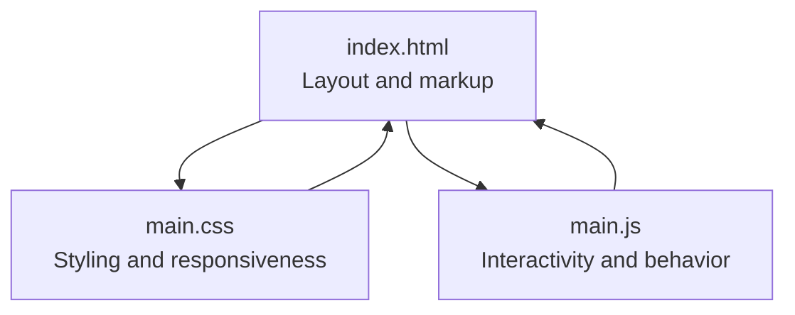
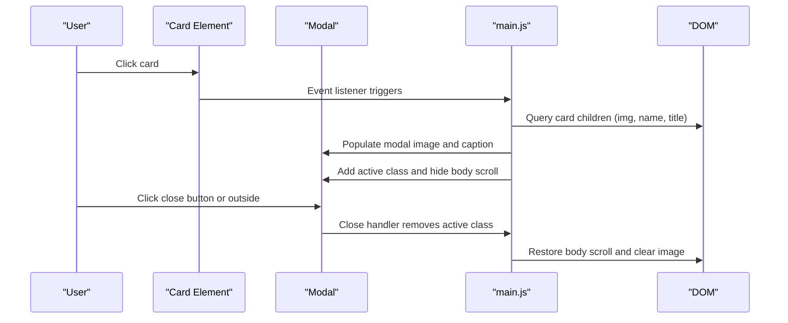
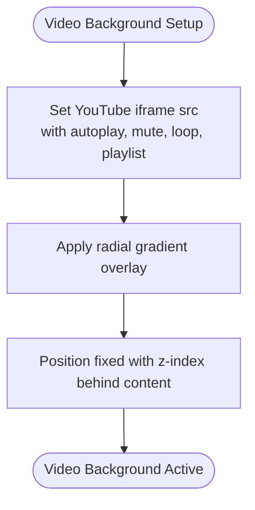
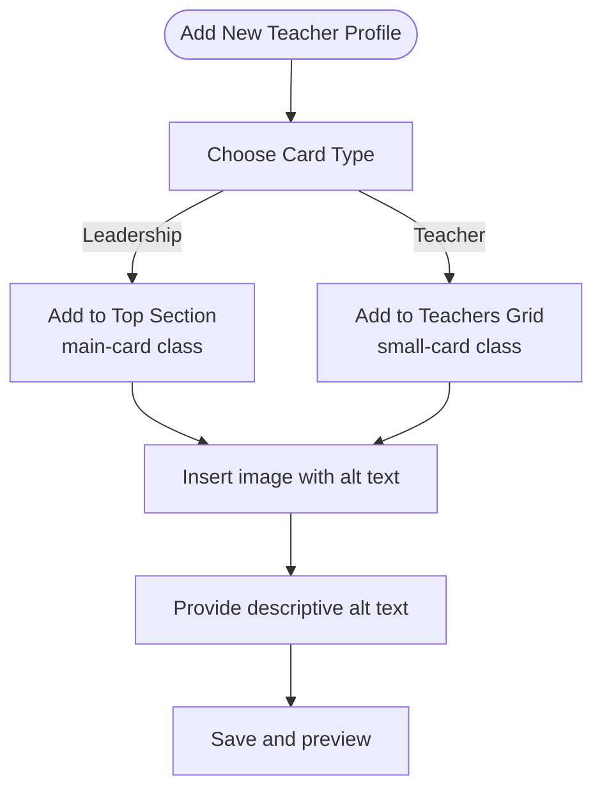
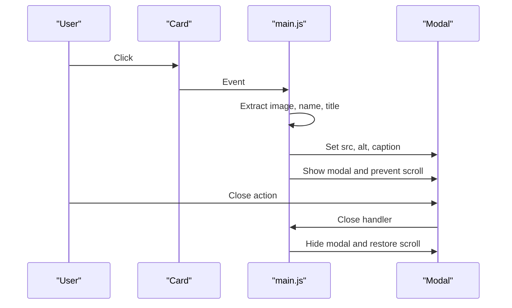
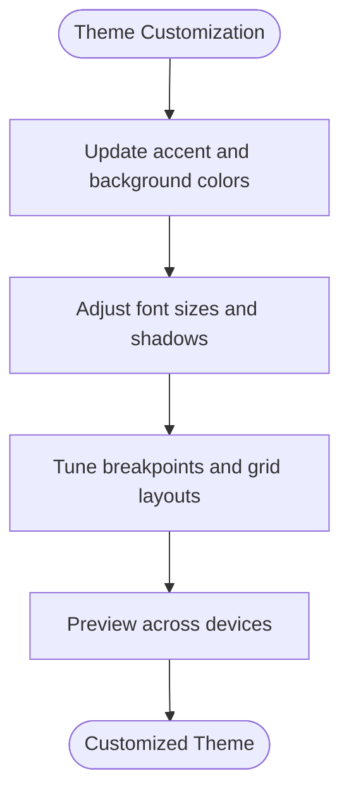
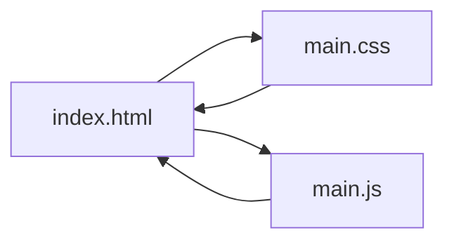

# Customization Guide

<cite>
**Referenced Files in This Document**
- [index.html](file://index.html)
- [main.css](file://main.css)
- [main.js](file://main.js)
</cite>

## Table of Contents
1. [Introduction](#introduction)
2. [Project Structure](#project-structure)
3. [Core Components](#core-components)
4. [Architecture Overview](#architecture-overview)
5. [Detailed Component Analysis](#detailed-component-analysis)
6. [Dependency Analysis](#dependency-analysis)
7. [Performance Considerations](#performance-considerations)
8. [Troubleshooting Guide](#troubleshooting-guide)
9. [Conclusion](#conclusion)
10. [Appendices](#appendices)

## Introduction
This guide explains how to customize and extend the teacher directory system. It covers:
- Adding new teacher profiles by editing the HTML structure and adjusting CSS grid layouts
- Image upload requirements and alt text best practices
- Styling and theme customization via CSS variables, color schemes, and responsive breakpoints
- Video background customization including YouTube video ID changes, overlay effects, and autoplay/mute configuration
- Extending JavaScript functionality such as modal behaviors, gallery filtering, and external API integration
- Step-by-step tutorials for common customization scenarios
- Performance considerations for large teacher directories
- Troubleshooting tips for common customization issues

## Project Structure
The project consists of three core files:
- index.html: Contains the page layout, teacher cards, and modal markup
- main.css: Defines styles, responsive breakpoints, and visual themes
- main.js: Implements modal behavior, smooth scrolling, and image loading animations

**Diagram sources**
- [index.html:1-106](file://index.html#L1-L106)
- [main.css:1-517](file://main.css#L1-L517)
- [main.js:1-83](file://main.js#L1-L83)

**Section sources**
- [index.html:1-106](file://index.html#L1-L106)
- [main.css:1-517](file://main.css#L1-L517)
- [main.js:1-83](file://main.js#L1-L83)

## Core Components
- Video background: A YouTube embed with overlay vignette effect and autoplay/mute configuration
- Album container: Central content area with decorative borders and backdrop blur
- Top section: Grid of leadership cards with larger images and informational overlays
- Teachers grid: Responsive grid of teacher thumbnails with names
- Modal: Fullscreen image viewer with caption and close controls

Key customization touchpoints:
- HTML structure for adding/removing teacher cards
- CSS grid templates for layout adjustments
- CSS variables for theme and color customization
- JavaScript event handlers for modal and gallery interactions

**Section sources**
- [index.html:10-93](file://index.html#L10-L93)
- [main.css:8-517](file://main.css#L8-L517)
- [main.js:1-83](file://main.js#L1-L83)

## Architecture Overview
The system follows a static HTML/CSS/JavaScript architecture with minimal runtime logic. The modal relies on DOM traversal to populate content dynamically from clicked cards.

**Diagram sources**
- [main.js:9-58](file://main.js#L9-L58)
- [index.html:95-101](file://index.html#L95-L101)

## Detailed Component Analysis

### Video Background Customization
The video background is implemented as a fixed-position container with an iframe and a radial gradient overlay. The iframe is configured for autoplay, mute, loop, and minimal UI.

Customization steps:
- Change YouTube video ID: Modify the iframe src parameter to a new video ID
- Adjust overlay effect: Edit the radial gradient in the overlay element
- Configure autoplay/mute: Update the iframe src parameters for autoplay, mute, loop, and playlist

**Diagram sources**
- [index.html:10-19](file://index.html#L10-L19)
- [main.css:9-41](file://main.css#L9-L41)

**Section sources**
- [index.html:10-19](file://index.html#L10-L19)
- [main.css:9-41](file://main.css#L9-L41)

### Teacher Cards and Grid Layouts
The teacher directory uses two distinct grids:
- Top section: Leadership cards with larger images and informational overlays
- Teachers grid: Thumbnail cards with names beneath images

Grid customization:
- Leadership grid: Adjust grid-template-columns and gaps in the top section
- Teachers grid: Modify grid-template-columns and minmax constraints
- Card sizing: Update image heights for responsive breakpoints

Image requirements and alt text best practices:
- Use descriptive alt attributes for accessibility and SEO
- Prefer JPG/PNG formats optimized for web
- Ensure consistent aspect ratios for uniform grid appearance

**Diagram sources**
- [index.html:25-92](file://index.html#L25-L92)
- [main.css:106-147](file://main.css#L106-L147)

**Section sources**
- [index.html:25-92](file://index.html#L25-L92)
- [main.css:106-147](file://main.css#L106-L147)

### Modal Behavior Extension
The modal system supports:
- Opening on card click with dynamic caption population
- Closing via close button, outside click, or Escape key
- Smooth body scroll prevention during modal open

Extending modal behavior:
- Add new triggers by selecting additional elements and binding click listeners
- Extend caption logic to support additional metadata
- Integrate with external APIs by fetching profile data and populating modal content

**Diagram sources**
- [main.js:9-58](file://main.js#L9-L58)
- [index.html:95-101](file://index.html#L95-L101)

**Section sources**
- [main.js:1-83](file://main.js#L1-L83)
- [index.html:95-101](file://index.html#L95-L101)

### Styling and Theme Customization
Theme customization is achieved through:
- Color scheme changes: Modify gold accents and background colors
- Typography adjustments: Update font family and sizes
- Responsive breakpoint tuning: Adjust media queries for device-specific layouts

CSS variables for theme customization:
- Accent colors: Update gold and background color tokens
- Typography: Adjust font sizes and shadows
- Spacing: Modify padding and gaps in grids

Responsive breakpoint adjustments:
- Desktop/laptop/tablet/mobile breakpoints are defined with min/max widths
- Adjust grid column counts and image heights per breakpoint
- Fine-tune typography and spacing for each viewport

**Diagram sources**
- [main.css:43-517](file://main.css#L43-L517)

**Section sources**
- [main.css:43-517](file://main.css#L43-L517)

### JavaScript Extensions
Current JavaScript functionality includes:
- Modal open/close handlers
- Smooth scrolling for anchor links
- Image opacity fade-in on load

Extension ideas:
- Gallery filters: Add category filters to show/hide specific teacher groups
- External API integration: Fetch teacher data from an API and render cards dynamically
- Enhanced modal: Add navigation arrows, keyboard shortcuts, or zoom capabilities

Implementation approach:
- Bind events to new UI elements
- Update DOM manipulation logic to handle dynamic content
- Maintain accessibility by preserving alt text and keyboard navigation

**Section sources**
- [main.js:1-83](file://main.js#L1-L83)

## Dependency Analysis
The system has minimal runtime dependencies:
- HTML provides structure and content
- CSS defines presentation and responsiveness
- JavaScript adds interactivity and behavior

**Diagram sources**
- [index.html:1-106](file://index.html#L1-L106)
- [main.css:1-517](file://main.css#L1-L517)
- [main.js:1-83](file://main.js#L1-L83)

**Section sources**
- [index.html:1-106](file://index.html#L1-L106)
- [main.css:1-517](file://main.css#L1-L517)
- [main.js:1-83](file://main.js#L1-L83)

## Performance Considerations
When adding large numbers of teacher profiles:
- Optimize images: Compress and resize images to reduce bandwidth and improve loading speed
- Lazy loading: Consider lazy-loading images to defer off-screen content
- Minimize DOM: Batch updates when rendering many cards
- Virtualization: For very large lists, consider virtualizing visible items
- CSS efficiency: Use efficient selectors and avoid heavy animations on mobile devices
- CDN: Host images on a CDN for improved global delivery

Best practices:
- Use modern image formats (WebP/JPEG-XL) where supported
- Implement responsive images with srcset for varied screen densities
- Defer non-critical JavaScript until after initial paint
- Monitor Largest Contentful Paint (LCP) and First Input Delay (FID)

[No sources needed since this section provides general guidance]

## Troubleshooting Guide
Common customization issues and resolutions:
- Images not displaying:
  - Verify image paths are correct and files exist
  - Ensure alt attributes are present for accessibility
  - Check image compression and format compatibility
- Modal not opening/closing:
  - Confirm event listeners are attached after DOMContentLoaded
  - Verify modal and card selectors match the HTML structure
  - Ensure z-index stacking order allows interaction
- Video background not playing:
  - Confirm autoplay policy compliance (muted autoplay required)
  - Verify YouTube video ID is valid and public
  - Check iframe parameters for correct configuration
- Grid layout issues:
  - Review CSS grid-template-columns and minmax constraints
  - Ensure responsive breakpoints align with intended device targets
  - Validate card classes match CSS selectors

**Section sources**
- [index.html:10-93](file://index.html#L10-L93)
- [main.js:1-83](file://main.js#L1-L83)
- [main.css:106-517](file://main.css#L106-L517)

## Conclusion
This customization guide provides a comprehensive foundation for extending the teacher directory system. By understanding the HTML structure, CSS grid layouts, and JavaScript behavior, you can add new profiles, adjust themes, and integrate advanced features while maintaining performance and accessibility.

[No sources needed since this section summarizes without analyzing specific files]

## Appendices

### Step-by-Step Tutorials

#### Tutorial 1: Add a New Teacher Profile
1. Decide card type: Use a leadership card for administrators or a thumbnail card for teachers
2. Insert HTML: Add a new card element inside the appropriate section with an image and name
3. Set alt text: Provide descriptive alt text for accessibility
4. Preview: Load the page and verify the card appears correctly across devices

Reference paths:
- [index.html:25-92](file://index.html#L25-L92)

**Section sources**
- [index.html:25-92](file://index.html#L25-L92)

#### Tutorial 2: Change the Video Background
1. Obtain a new YouTube video ID
2. Update iframe src parameter with the new video ID
3. Adjust autoplay/mute/loop parameters as desired
4. Customize overlay gradient for visual effect
5. Test autoplay behavior and mute state

Reference paths:
- [index.html:10-19](file://index.html#L10-L19)
- [main.css:32-41](file://main.css#L32-L41)

**Section sources**
- [index.html:10-19](file://index.html#L10-L19)
- [main.css:32-41](file://main.css#L32-L41)

#### Tutorial 3: Customize the Color Scheme
1. Identify accent color tokens in CSS
2. Replace gold accents with preferred brand colors
3. Adjust background opacity and blur for contrast
4. Preview across breakpoints to ensure readability
5. Test with reduced motion preferences

Reference paths:
- [main.css:43-60](file://main.css#L43-L60)
- [main.css:116-128](file://main.css#L116-L128)

**Section sources**
- [main.css:43-60](file://main.css#L43-L60)
- [main.css:116-128](file://main.css#L116-L128)

#### Tutorial 4: Add a Gallery Filter
1. Create filter controls (buttons or dropdown)
2. Add event listeners to capture filter selections
3. Implement visibility toggles for matching cards
4. Preserve modal behavior for filtered views
5. Test filter interactions and accessibility

Reference paths:
- [main.js:60-71](file://main.js#L60-L71)

**Section sources**
- [main.js:60-71](file://main.js#L60-L71)

#### Tutorial 5: Integrate with an External API
1. Design API endpoint for teacher data
2. Fetch data on page load and parse JSON
3. Dynamically generate card HTML for each teacher
4. Populate modal content with API-provided metadata
5. Handle loading states and error conditions

Reference paths:
- [main.js:1-83](file://main.js#L1-L83)

**Section sources**
- [main.js:1-83](file://main.js#L1-L83)

### Code Example References
- Video background configuration: [index.html:10-19](file://index.html#L10-L19)
- Leaderboard grid layout: [index.html:25-54](file://index.html#L25-L54)
- Teachers grid layout: [index.html:58-92](file://index.html#L58-L92)
- Modal initialization and handlers: [main.js:2-58](file://main.js#L2-L58)
- Responsive breakpoints: [main.css:207-517](file://main.css#L207-L517)

**Section sources**
- [index.html:10-19](file://index.html#L10-L19)
- [index.html:25-92](file://index.html#L25-L92)
- [main.js:2-58](file://main.js#L2-L58)
- [main.css:207-517](file://main.css#L207-L517)