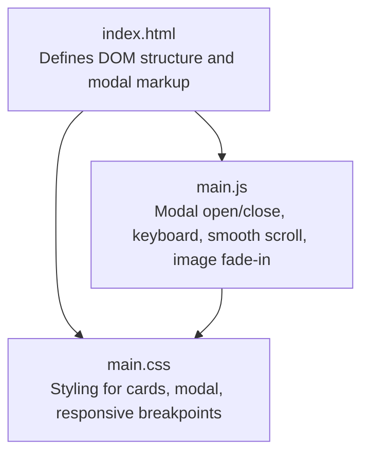
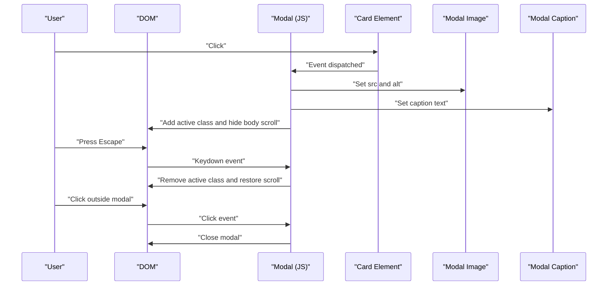
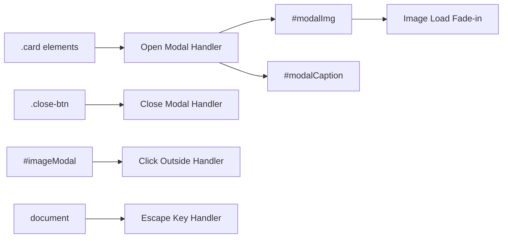
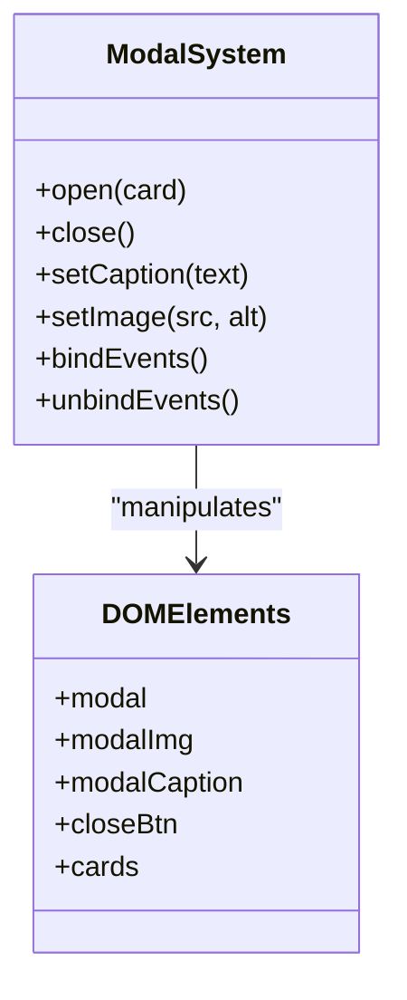
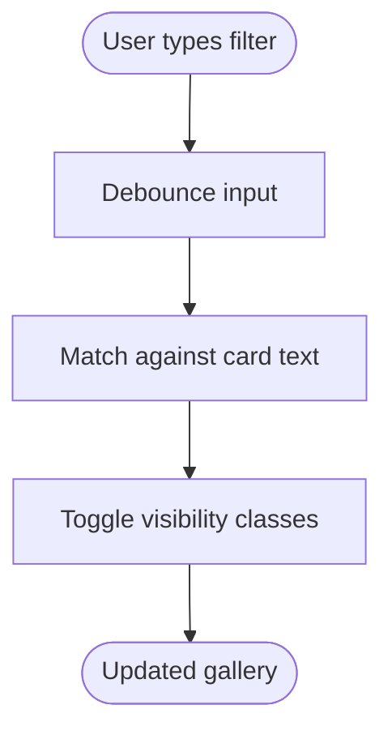

# JavaScript Extensions

<cite>
**Referenced Files in This Document**
- [index.html](file://index.html)
- [main.js](file://main.js)
- [main.css](file://main.css)
</cite>

## Table of Contents
1. [Introduction](#introduction)
2. [Project Structure](#project-structure)
3. [Core Components](#core-components)
4. [Architecture Overview](#architecture-overview)
5. [Detailed Component Analysis](#detailed-component-analysis)
6. [Dependency Analysis](#dependency-analysis)
7. [Performance Considerations](#performance-considerations)
8. [Troubleshooting Guide](#troubleshooting-guide)
9. [Conclusion](#conclusion)
10. [Appendices](#appendices)

## Introduction
This document explains the existing JavaScript modal system and how to extend it to support advanced gallery behaviors such as zoom controls, navigation arrows, and caption enhancements. It also covers event delegation patterns for efficient click handling, and outlines practical strategies for adding interactive elements, filtering, sorting, and integrating external APIs for dynamic content. Debugging techniques and performance optimization strategies for handling large numbers of teacher profiles are included to help you build scalable and maintainable extensions.

## Project Structure
The project consists of a minimal HTML page, a single JavaScript module, and a stylesheet. The modal behavior is implemented in the JavaScript module and styled via CSS. The gallery is represented by a grid of teacher profile cards.

**Diagram sources**
- [index.html:96-102](file://index.html#L96-L102)
- [main.js:1-82](file://main.js#L1-L82)
- [main.css:85-190](file://main.css#L85-L190)

**Section sources**
- [index.html:1-107](file://index.html#L1-L107)
- [main.js:1-82](file://main.js#L1-L82)
- [main.css:1-517](file://main.css#L1-L517)

## Core Components
- Modal container and trigger: The modal element and the set of clickable cards that open it.
- Caption and image content: Dynamic content updates for the modal image and caption.
- Close mechanisms: Close button, click-outside, and Escape key handling.
- Smooth scroll: Anchor links smoothly scroll to targets.
- Image loading animation: Fade-in effect on card images.

Key implementation references:
- Modal initialization and event listeners: [main.js:2-L58]
- Click-to-open handler: [main.js:10-L32]
- Close handlers: [main.js:35-L45], [main.js:47-L52]
- Smooth scroll anchors: [main.js:61-L71]
- Image opacity fade-in: [main.js:73-L81]

**Section sources**
- [main.js:2-58](file://main.js#L2-L58)
- [main.js:61-71](file://main.js#L61-L71)
- [main.js:73-81](file://main.js#L73-L81)

## Architecture Overview
The modal system is a self-contained module that:
- Listens for DOMContentLoaded to bind events.
- Uses event delegation patterns to attach a single listener to each card.
- Updates modal content dynamically based on the clicked card.
- Provides multiple close mechanisms and accessibility-friendly behavior.

**Diagram sources**
- [main.js:2-58](file://main.js#L2-L58)
- [index.html:96-102](file://index.html#L96-L102)

## Detailed Component Analysis

### Modal Behavior and Content Management
- Triggering: Each card registers a click listener that extracts the image source and caption text from the card’s children and sets them into the modal.
- Content selection logic: Chooses a combined title and name when available, otherwise falls back to the name or image alt text.
- State management: Adds/removes the active class and toggles body scroll to prevent background movement.

Extension points:
- Zoom controls: Add pinch-to-zoom or mousewheel zoom on the modal image.
- Navigation arrows: Add previous/next buttons to cycle through images.
- Caption enhancements: Add metadata, social sharing, or copy-to-clipboard actions.

References:
- Click-to-open: [main.js:10-L32]
- Caption composition: [main.js:20-L27]
- Active state toggle: [main.js:28-L31]
- Close handlers: [main.js:35-L45], [main.js:47-L52]

**Section sources**
- [main.js:10-32](file://main.js#L10-L32)
- [main.js:20-27](file://main.js#L20-L27)
- [main.js:28-31](file://main.js#L28-L31)
- [main.js:35-45](file://main.js#L35-L45)
- [main.js:47-52](file://main.js#L47-L52)

### Event Delegation Patterns
- Single listener per card: Attaches a click listener to each card to handle opening the modal.
- Delegated close: A single click listener on the modal handles closing when clicking outside the image area.
- Keyboard delegation: A single keydown listener on the document handles Escape key closure.

Best practices:
- Prefer event delegation to minimize memory and improve scalability.
- Use capture/bubble phases carefully to avoid conflicts.
- Avoid attaching multiple listeners to the same element.

References:
- Card click listeners: [main.js:10-L32]
- Click-outside close: [main.js:40-L45]
- Escape key close: [main.js:47-L52]

**Section sources**
- [main.js:10-32](file://main.js#L10-L32)
- [main.js:40-45](file://main.js#L40-L45)
- [main.js:47-52](file://main.js#L47-L52)

### Gallery Filtering and Sorting
Current gallery:
- Static grid of teacher cards rendered in HTML.

Proposed extensions:
- Search filters: Add an input field to filter by name or role. Filter logic can toggle visibility of cards based on text match.
- Category sorting: Add dropdowns or buttons to sort by role or alphabetically.
- Debounced search: Throttle input events to reduce reflows during typing.

Implementation outline:
- Add a filter input and sort controls near the gallery.
- On input change, iterate visible cards and show/hide based on criteria.
- For sorting, reorder DOM nodes or apply CSS ordering with a class toggle.

[No sources needed since this section proposes conceptual extensions]

### Social Sharing and Dynamic Content Integration
- Social sharing: Add share buttons inside the modal to share the current image or profile details.
- External API integration: Fetch teacher profiles dynamically from an endpoint and populate the gallery.

Implementation outline:
- Fetch API: Use fetch to load JSON data containing profile images and metadata.
- Render cards: Dynamically create card elements and append to the gallery container.
- Error handling: Display a fallback message if the API fails.

[No sources needed since this section proposes conceptual extensions]

### Adding New Interactive Elements
Examples of additions you can implement:
- Zoom controls: Add mousewheel and pinch gestures to scale the modal image.
- Navigation arrows: Add left/right arrows to navigate between images in sequence.
- Caption enhancements: Add tooltips, copy-to-clipboard, or metadata expansion.

Implementation steps:
- Define new UI elements (buttons, overlays) in the modal.
- Attach event listeners with delegation or direct binding.
- Update modal content dynamically and manage state transitions.

[No sources needed since this section proposes conceptual extensions]

## Dependency Analysis
The modal system depends on:
- DOM elements: modal container, image, caption, close button, cards.
- CSS classes: active class to show/hide the modal and adjust layout.
- Event listeners: delegated and direct listeners for clicks, keydown, and image load.

**Diagram sources**
- [main.js:2-58](file://main.js#L2-L58)
- [index.html:96-102](file://index.html#L96-L102)

**Section sources**
- [main.js:2-58](file://main.js#L2-L58)
- [index.html:96-102](file://index.html#L96-L102)

## Performance Considerations
- Event delegation: Keep a single listener per card to reduce memory and improve responsiveness.
- Image optimization: Lazy-load images and use modern formats to reduce bandwidth.
- CSS transforms: Prefer transform-based animations for smoother performance.
- Debounce input: Debounce search/filter inputs to limit reflows.
- Virtualization: For very large galleries, consider virtualizing visible items to reduce DOM nodes.
- Minimize reflows: Batch DOM updates and avoid synchronous layout reads in loops.

[No sources needed since this section provides general guidance]

## Troubleshooting Guide
Common issues and resolutions:
- Modal does not open:
  - Verify the modal container and close button exist and are not hidden.
  - Confirm click listeners are attached after DOMContentLoaded.
  - References: [main.js:2-L58], [index.html:96-L102]
- Click outside does not close:
  - Ensure the modal click handler checks the target element.
  - Reference: [main.js:40-L45]
- Escape key does nothing:
  - Confirm the keydown listener is attached to the document and modal is active.
  - Reference: [main.js:47-L52]
- Images flicker on load:
  - Ensure the fade-in logic runs on load and sets initial opacity.
  - Reference: [main.js:73-L81]
- Responsiveness issues:
  - Check media queries and modal layout adjustments.
  - Reference: [main.css:493-L516]

**Section sources**
- [main.js:2-58](file://main.js#L2-L58)
- [main.js:40-45](file://main.js#L40-L45)
- [main.js:47-52](file://main.js#L47-L52)
- [main.js:73-81](file://main.js#L73-L81)
- [main.css:493-516](file://main.css#L493-L516)
- [index.html:96-102](file://index.html#L96-L102)

## Conclusion
The existing modal system provides a solid foundation for extending gallery interactivity. By leveraging event delegation, dynamic content updates, and thoughtful performance strategies, you can add zoom controls, navigation, captions, filters, sorting, and external API integrations while maintaining a responsive and accessible experience.

[No sources needed since this section summarizes without analyzing specific files]

## Appendices

### Appendix A: Modal Class Model

**Diagram sources**
- [main.js:2-58](file://main.js#L2-L58)
- [index.html:96-102](file://index.html#L96-L102)

### Appendix B: Gallery Filtering Flow

[No sources needed since this diagram shows conceptual workflow, not actual code structure]