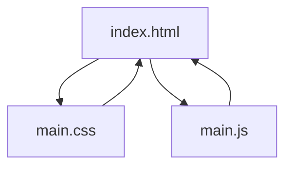
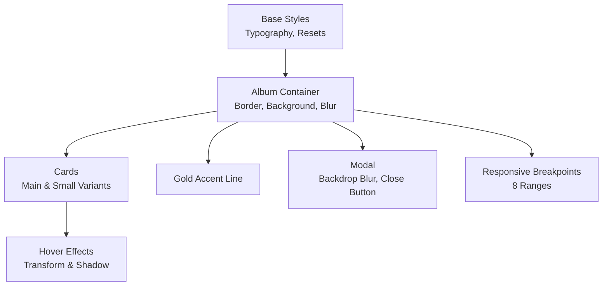
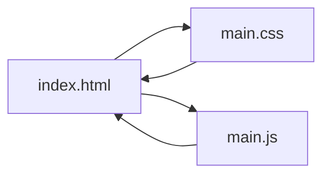

# Styling and Theme Customization

<cite>
**Referenced Files in This Document**
- [index.html](file://index.html)
- [main.css](file://main.css)
- [main.js](file://main.js)
</cite>

## Table of Contents
1. [Introduction](#introduction)
2. [Project Structure](#project-structure)
3. [Core Components](#core-components)
4. [Architecture Overview](#architecture-overview)
5. [Detailed Component Analysis](#detailed-component-analysis)
6. [Dependency Analysis](#dependency-analysis)
7. [Performance Considerations](#performance-considerations)
8. [Troubleshooting Guide](#troubleshooting-guide)
9. [Conclusion](#conclusion)
10. [Appendices](#appendices)

## Introduction
This document explains how to customize the styling and theme of the project, focusing on CSS variable modifications, color scheme changes, typography, spacing, and responsive breakpoints. It provides practical guidance for adjusting the existing gold-accent theme, modifying fonts, altering card layouts, and ensuring responsive design remains coherent across devices. Accessibility considerations for color contrast and performance best practices for CSS are included.

## Project Structure
The project consists of a single HTML page, a single stylesheet, and a minimal JavaScript module. Styling is centralized in the stylesheet, while interactivity (modal behavior, smooth scrolling, and image fade-in) is implemented in the script.

**Diagram sources**
- [index.html:1-101](file://index.html#L1-L101)
- [main.css:1-517](file://main.css#L1-L517)
- [main.js:1-83](file://main.js#L1-L83)

**Section sources**
- [index.html:1-101](file://index.html#L1-L101)
- [main.css:1-517](file://main.css#L1-L517)
- [main.js:1-83](file://main.js#L1-L83)

## Core Components
- Global base styles and typography: The base resets and font family are defined globally.
- Background and overlay: A YouTube video background with a vignette overlay creates the immersive backdrop.
- Container and layout: The album container defines the main content area with border, background, and blur effect.
- Card components: Two card variants (main and small) define the presentation of leadership and teacher entries.
- Modal: A fullscreen modal with backdrop blur and close controls.
- Responsive breakpoints: Eight responsive ranges cover large desktops, desktops, laptops, tablets, larger phones, smaller phones, extra-small phones, and landscape mobile orientation.

Key selectors and their roles:
- Body and global typography
- Album container and decorative border
- Cards and hover effects
- Gold accent line
- Modal and close button
- Responsive media queries

**Section sources**
- [main.css:1-517](file://main.css#L1-L517)

## Architecture Overview
The styling architecture is a single stylesheet with:
- Base styles for typography and layout
- Component-specific styles for cards, modal, and decorative elements
- A comprehensive set of eight media queries for responsive behavior

**Diagram sources**
- [main.css:1-517](file://main.css#L1-L517)

## Detailed Component Analysis

### Global Base Styles and Typography
- Font family is set globally for all elements.
- Box sizing is standardized to border-box for predictable layouts.
- Body establishes the dark background and gold text color, with padding and minimum height for full viewport coverage.

Customization tips:
- Change the global font family by editing the base font declaration.
- Adjust text colors by updating the body color property.
- Modify spacing by adjusting body padding and container padding.

**Section sources**
- [main.css:1-6](file://main.css#L1-L6)
- [main.css:43-49](file://main.css#L43-L49)

### Background and Video Overlay
- A fixed-position video background fills the viewport and is centered with transforms.
- A radial gradient overlay provides a vignette effect to draw focus to the content.
- The overlay sits above the video but below the content by z-index stacking.

Customization tips:
- Adjust overlay opacity or gradient stops to change the vignette intensity.
- Ensure the video element remains non-interactive by keeping pointer-events disabled.

**Section sources**
- [main.css:9-41](file://main.css#L9-L41)

### Album Container
- Centered content area with a thick double border in the gold accent color.
- Dark semi-transparent background with backdrop blur for depth.
- Max-width and padding scale across breakpoints.

Customization tips:
- Change the border thickness or style to alter the container’s prominence.
- Adjust the background opacity or blur radius to balance readability and aesthetics.
- Modify max-width and padding to fit different content densities.

**Section sources**
- [main.css:51-60](file://main.css#L51-L60)

### Heading and Year Badge
- Heading uses a large, shadowed gold color with generous letter spacing.
- Year badge is centered with white text and subtle shadow for readability.

Customization tips:
- Replace the gold color with another accent color by updating the heading and badge color properties.
- Adjust font size and letter spacing proportionally across breakpoints.

**Section sources**
- [main.css:62-76](file://main.css#L62-L76)

### Gold Accent Line
- A horizontal gradient line using the gold accent color for visual separation.

Customization tips:
- Change the gradient colors to match a new accent palette.
- Adjust margins to control spacing around the line.

**Section sources**
- [main.css:78-83](file://main.css#L78-L83)

### Card Components
- Base card styles include a gold border, dark background, overflow handling, transitions, and pointer cursor.
- Hover effect elevates cards slightly and adds a golden shadow.
- Image sizing differs between main and small cards to emphasize leadership vs. staff.

Customization tips:
- Replace the gold border with a different color or style.
- Adjust hover transform and shadow to fine-tune motion.
- Modify image heights to balance aspect ratios across breakpoints.

**Section sources**
- [main.css:86-103](file://main.css#L86-L103)
- [main.css:112-139](file://main.css#L112-L139)

### Leadership Grid (Top Section)
- Uses a responsive grid with automatic column sizing and gaps.
- Columns adapt from 1 to 4 depending on screen size.

Customization tips:
- Adjust the minmax parameters to change the column count and gutters.
- Modify the grid template for specific layouts on certain breakpoints.

**Section sources**
- [main.css:106-110](file://main.css#L106-L110)
- [main.css:224-227](file://main.css#L224-L227)
- [main.css:245-247](file://main.css#L245-L247)
- [main.css:260-262](file://main.css#L260-L262)
- [main.css:298-301](file://main.css#L298-L301)
- [main.css:348-351](file://main.css#L348-L351)
- [main.css:420](file://main.css#L420)

### Teachers Grid (Small Cards)
- Auto-fill grid with a minimum card width and adjustable gaps.
- Text labels inside small cards use the gold accent color.

Customization tips:
- Increase or decrease the minimum card width to control column density.
- Adjust gaps to improve readability on small screens.

**Section sources**
- [main.css:131-135](file://main.css#L131-L135)
- [main.css:141-147](file://main.css#L141-L147)
- [main.css:233-236](file://main.css#L233-L236)
- [main.css:268-271](file://main.css#L268-L271)
- [main.css:307-310](file://main.css#L307-L310)
- [main.css:369-372](file://main.css#L369-L372)
- [main.css:440-443](file://main.css#L440-L443)

### Modal
- Fullscreen overlay with backdrop blur and centered content.
- Close button with hover effect and transition.
- Image and caption styling inside the modal.

Customization tips:
- Adjust the overlay opacity or blur radius for different visual effects.
- Change the border and shadow of the modal image to complement the theme.
- Ensure the close button remains accessible and visible against the dark overlay.

**Section sources**
- [main.css:150-205](file://main.css#L150-L205)
- [main.css:178-190](file://main.css#L178-L190)

### JavaScript Interactions
- Opens the modal when any card is clicked, setting the image source and caption.
- Closes the modal on click-outside, escape key, or close button.
- Adds a smooth scroll behavior for anchor links.
- Fades in images on load for a polished UX.

Customization tips:
- Extend the caption logic to include additional metadata.
- Adjust smooth scroll behavior or disable it if preferred.

**Section sources**
- [main.js:1-83](file://main.js#L1-L83)

## Dependency Analysis
The stylesheet is self-contained and does not import external resources. The HTML references the stylesheet and script, and the script manipulates DOM elements defined in the HTML.

**Diagram sources**
- [index.html:1-101](file://index.html#L1-L101)
- [main.css:1-517](file://main.css#L1-L517)
- [main.js:1-83](file://main.js#L1-L83)

**Section sources**
- [index.html:1-101](file://index.html#L1-L101)
- [main.css:1-517](file://main.css#L1-L517)
- [main.js:1-83](file://main.js#L1-L83)

## Performance Considerations
- Minimize repaints and reflows by avoiding frequent layout-affecting changes in hover states.
- Prefer transform and opacity for animations to leverage GPU acceleration.
- Reduce blur intensity or avoid excessive backdrop blur on low-powered devices.
- Lazy-load images or defer non-critical CSS to improve initial load performance.
- Keep media queries focused and avoid redundant declarations.

[No sources needed since this section provides general guidance]

## Troubleshooting Guide
- Modal not opening/closing:
  - Verify the modal and card selectors match the HTML structure.
  - Ensure event listeners are attached after DOMContentLoaded.
- Images not fading in:
  - Confirm the image load events are firing and opacity transitions are applied.
- Hover effects not smooth:
  - Check that transitions are defined on the affected elements.
- Responsive layout issues:
  - Review breakpoint ranges and ensure min/max widths are correct.
  - Test on actual devices to confirm behavior.

**Section sources**
- [main.js:1-83](file://main.js#L1-L83)
- [main.css:94-97](file://main.css#L94-L97)

## Conclusion
The project’s styling system centers on a cohesive gold-accent theme with a dark background and responsive grids. Customization is straightforward: adjust colors, fonts, and spacing in the stylesheet, and fine-tune responsive breakpoints to suit your audience. Prioritize accessibility by validating color contrast and performance by optimizing animations and blur effects.

[No sources needed since this section summarizes without analyzing specific files]

## Appendices

### A. CSS Variable Modifications
To enable easy theming, consider introducing CSS custom properties at the root level for colors, fonts, and spacing. This allows centralized updates without scattered edits.

Recommended properties to define:
- Accent colors: primary, secondary, background, text
- Typography: font family, heading sizes, body sizes
- Spacing: container padding, card gaps, margins
- Borders: border width, border style
- Transitions: duration and easing for hover effects

Implementation approach:
- Define variables in a dedicated section near the top of the stylesheet.
- Replace hardcoded values with variables throughout the stylesheet.
- Maintain a consistent naming convention for easy maintenance.

[No sources needed since this section provides general guidance]

### B. Color Scheme Changes
Current gold accent palette:
- Primary gold: used for borders, shadows, and highlights
- Dark background: used for containers and modals
- Light text: used for headings and badges

To change the accent color:
- Replace all instances of the gold color with a new accent color.
- Ensure sufficient contrast against backgrounds and text.
- Update hover shadows and borders consistently.

Accessibility checklist:
- Contrast ratio between text and background meets WCAG guidelines.
- Avoid relying solely on color to convey information.

[No sources needed since this section provides general guidance]

### C. Font Family Modifications
Current global font:
- Serif font applied to all elements.

To change fonts:
- Update the base font family declaration.
- Adjust heading and body font sizes proportionally across breakpoints.
- Ensure legibility on small screens by testing font rendering.

[No sources needed since this section provides general guidance]

### D. Spacing and Layout Adjustments
Card layouts:
- Main cards and small cards use different image heights.
- Grids adapt columns and gaps across breakpoints.

To adjust spacing:
- Modify container padding and margins.
- Adjust card image heights and grid gaps.
- Fine-tune typography scales for each breakpoint.

[No sources needed since this section provides general guidance]

### E. Responsive Breakpoint Adjustments
Eight responsive ranges:
- Large Desktop (1920px+)
- Desktop (1200–1919px)
- Laptop (992–1199px)
- Tablet (768–991px)
- Mobile Large (576–767px)
- Mobile Small (≤575px)
- Extra Small Mobile (≤375px)
- Landscape Mobile (height ≤500px, landscape)

Guidelines for adjustment:
- Align breakpoints with device usage patterns and content needs.
- Test across real devices to validate perceived breakpoints.
- Keep min/max ranges exclusive to prevent overlap.

[No sources needed since this section provides general guidance]

### F. Maintaining Responsive Design
- Use relative units (em, rem, %) for scalable typography.
- Prefer CSS Grid and Flexbox for adaptive layouts.
- Test hover states on touch devices; consider disabling or simplifying hover effects on small screens.
- Ensure interactive elements remain accessible and tappable.

[No sources needed since this section provides general guidance]

### G. Accessibility Compliance
- Validate color contrast ratios for text and interactive elements.
- Provide sufficient spacing for touch targets.
- Ensure focus indicators are visible and usable.
- Test with assistive technologies and screen readers.

[No sources needed since this section provides general guidance]

### H. Browser Compatibility Best Practices
- Use widely supported CSS features; avoid experimental properties.
- Provide fallbacks for advanced features (e.g., backdrop-filter).
- Test across major browsers and versions.
- Validate media query support and polyfill if necessary.

[No sources needed since this section provides general guidance]