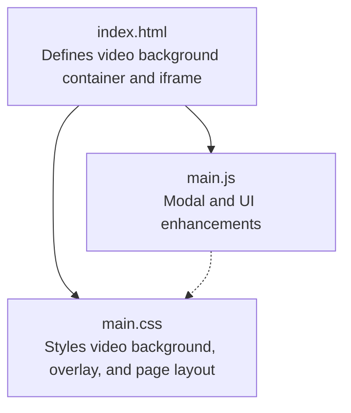
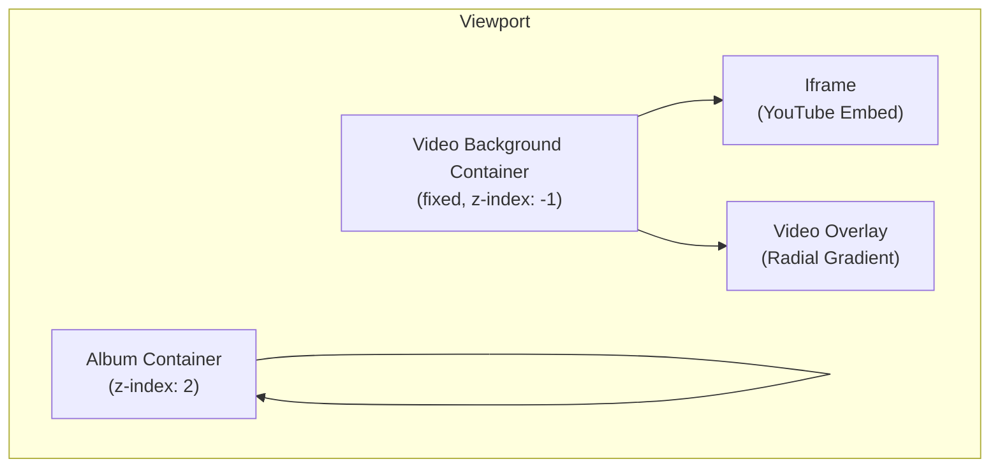
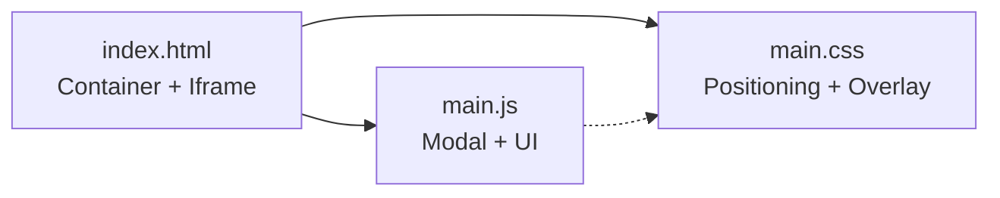

# Video Background Modification

<cite>
**Referenced Files in This Document**
- [index.html](file://index.html)
- [main.css](file://main.css)
- [main.js](file://main.js)
</cite>

## Table of Contents
1. [Introduction](#introduction)
2. [Project Structure](#project-structure)
3. [Core Components](#core-components)
4. [Architecture Overview](#architecture-overview)
5. [Detailed Component Analysis](#detailed-component-analysis)
6. [Dependency Analysis](#dependency-analysis)
7. [Performance Considerations](#performance-considerations)
8. [Troubleshooting Guide](#troubleshooting-guide)
9. [Conclusion](#conclusion)

## Introduction
This document provides comprehensive guidance for customizing the YouTube video background system implemented in the project. It focuses on:
- Changing the YouTube video ID in the iframe source attribute
- Configuring autoplay, mute, loop, and playlist parameters
- Modifying the video overlay effects (radial gradient and opacity)
- Managing fixed positioning and z-index layering
- Replacing the background video with alternatives
- Troubleshooting common embedding issues, autoplay policy compliance, and mobile compatibility
- Performance considerations for video loading and bandwidth optimization

## Project Structure
The project consists of three primary files:
- index.html: Contains the HTML structure with the YouTube video background container and iframe element
- main.css: Defines styles for the video background, overlay, and page layout
- main.js: Implements modal functionality and minor UI enhancements (unrelated to video background)

**Diagram sources**
- [index.html:10-20](file://index.html#L10-L20)
- [main.css:8-60](file://main.css#L8-L60)
- [main.js:1-83](file://main.js#L1-L83)

**Section sources**
- [index.html:1-107](file://index.html#L1-L107)
- [main.css:1-517](file://main.css#L1-L517)
- [main.js:1-83](file://main.js#L1-L83)

## Core Components
- Video background container: A fixed-positioned div that holds the iframe and overlay
- Iframe element: Embeds the YouTube video with configurable parameters
- Video overlay: A semi-transparent radial gradient overlay for vignette effect
- Page content container: Positioned above the video background using z-index

Key implementation locations:
- Video background container and iframe: [index.html:10-20](file://index.html#L10-L20)
- Overlay styling: [main.css:32-41](file://main.css#L32-L41)
- Page content z-index: [main.css:51-60](file://main.css#L51-L60)

**Section sources**
- [index.html:10-20](file://index.html#L10-L20)
- [main.css:8-60](file://main.css#L8-L60)

## Architecture Overview
The video background system uses a layered approach:
- Background layer: Fixed-positioned iframe covering the viewport
- Overlay layer: Semi-transparent radial gradient positioned above the iframe
- Content layer: Album container with higher z-index to ensure readability

**Diagram sources**
- [index.html:10-20](file://index.html#L10-L20)
- [main.css:8-60](file://main.css#L8-L60)

## Detailed Component Analysis

### YouTube Iframe Configuration
The iframe element defines the embedded video and its playback behavior. The source attribute contains the YouTube embed URL with query parameters controlling playback.

Key attributes and parameters:
- src: YouTube embed URL with video ID and parameters
- allow: Permissions for accelerometer, autoplay, clipboard, media, gyroscope, picture-in-picture, and web share
- referrerpolicy: Strict origin policy for cross-origin requests
- allowfullscreen: Enables fullscreen mode

Parameter breakdown:
- autoplay: Enables automatic playback
- mute: Mutes the video during autoplay
- loop: Loops the video continuously
- playlist: Specifies the playlist ID for continuous looping
- start: Starting time offset in seconds
- controls: Hides player controls
- showinfo: Hides video information
- rel: Disables related videos
- modestbranding: Reduces YouTube branding

Implementation reference:
- Iframe element and parameters: [index.html:13-18](file://index.html#L13-L18)

**Section sources**
- [index.html:13-18](file://index.html#L13-L18)

### Video Overlay Effects
The overlay creates a vignette effect using a radial gradient. It spans the full viewport and sits above the iframe but below the content.

Overlay characteristics:
- Position: Absolute covering the entire viewport
- Background: Radial gradient transitioning from light to dark
- Z-index: Positioned above the iframe but below the content
- Pointer events: Disabled to allow interaction with underlying video

Implementation reference:
- Overlay definition: [main.css:32-41](file://main.css#L32-L41)

**Section sources**
- [main.css:32-41](file://main.css#L32-L41)

### Fixed Positioning and Z-Index Management
Layering is achieved through fixed positioning and z-index values:
- Video background container: Fixed positioning with z-index set to -1
- Iframe: Positioned absolutely within the container
- Overlay: Positioned absolutely with z-index set to 1
- Album container: Relative positioning with z-index set to 2

Responsive considerations:
- Viewport sizing: Uses viewport units for width and height
- Transform centering: Centers the iframe using translate transforms
- Object fit: Ensures the video covers the container area

Implementation reference:
- Container and iframe styles: [main.css:8-30](file://main.css#L8-L30)
- Overlay and content z-index: [main.css:15, 40, 59](file://main.css#L15)

**Section sources**
- [main.css:8-30](file://main.css#L8-L30)
- [main.css:15, 40, 59](file://main.css#L15)

### Step-by-Step: Replace Background Video
Follow these steps to replace the current background video:

1. Extract the YouTube video ID from the URL
   - Example URL: https://www.youtube.com/watch?v=VIDEO_ID
   - Extracted ID: VIDEO_ID
   - Reference: [index.html:14](file://index.html#L14)

2. Construct the embed URL
   - Base: https://www.youtube.com/embed/
   - Append: VIDEO_ID
   - Reference: [index.html:14](file://index.html#L14)

3. Configure playback parameters
   - Autoplay: Add autoplay=1
   - Mute: Add mute=1
   - Loop: Add loop=1
   - Playlist: Add playlist=VIDEO_ID
   - Start: Add start=SECONDS
   - Controls: Add controls=0
   - Show info: Add showinfo=0
   - Related: Add rel=0
   - Modest branding: Add modestbranding=1
   - Reference: [index.html:14](file://index.html#L14)

4. Update the iframe src attribute
   - Modify the src value in the iframe element
   - Reference: [index.html:14](file://index.html#L14)

5. Verify overlay and layering
   - Ensure overlay remains visible above the video
   - Confirm content appears above the overlay
   - References: [main.css:32-41](file://main.css#L32-L41), [main.css:51-60](file://main.css#L51-L60)

6. Test responsiveness
   - Check layout on various screen sizes
   - Verify overlay and iframe scaling
   - References: [main.css:493-516](file://main.css#L493-L516)

**Section sources**
- [index.html:14](file://index.html#L14)
- [main.css:32-41](file://main.css#L32-L41)
- [main.css:51-60](file://main.css#L51-L60)
- [main.css:493-516](file://main.css#L493-L516)

### Parameter Configuration Guide
Autoplay, mute, loop, and playlist parameters are configured in the iframe src attribute:

- Autoplay
  - Purpose: Automatically starts video playback
  - Implementation: autoplay=1
  - Reference: [index.html:14](file://index.html#L14)

- Mute
  - Purpose: Mutes audio during autoplay
  - Implementation: mute=1
  - Reference: [index.html:14](file://index.html#L14)

- Loop
  - Purpose: Continuously loops the video
  - Implementation: loop=1
  - Reference: [index.html:14](file://index.html#L14)

- Playlist
  - Purpose: Specifies the playlist ID for continuous looping
  - Implementation: playlist=VIDEO_ID
  - Reference: [index.html:14](file://index.html#L14)

Additional parameters:
- Start: Controls the starting time offset
- Controls: Hides player controls
- Show info: Hides video information
- Related: Disables related videos
- Modest branding: Reduces YouTube branding

**Section sources**
- [index.html:14](file://index.html#L14)

### Overlay Customization
To modify the radial gradient and opacity:

1. Adjust the radial gradient colors and stops
   - Modify the color values and percentages in the background property
   - Reference: [main.css:39](file://main.css#L39)

2. Change overlay opacity
   - Adjust the alpha channel values in the color definitions
   - Reference: [main.css:39](file://main.css#L39)

3. Fine-tune overlay positioning and z-index
   - Ensure z-index remains above the iframe but below content
   - Reference: [main.css:40](file://main.css#L40)

4. Verify layering with content
   - Confirm album container maintains higher z-index
   - Reference: [main.css:59](file://main.css#L59)

**Section sources**
- [main.css:32-41](file://main.css#L32-L41)
- [main.css:39](file://main.css#L39)
- [main.css:40](file://main.css#L40)
- [main.css:59](file://main.css#L59)

## Dependency Analysis
The video background system relies on the following relationships:
- HTML structure defines the container and iframe
- CSS styles control positioning, sizing, and layering
- JavaScript handles unrelated UI interactions

**Diagram sources**
- [index.html:10-20](file://index.html#L10-L20)
- [main.css:8-60](file://main.css#L8-L60)
- [main.js:1-83](file://main.js#L1-L83)

**Section sources**
- [index.html:10-20](file://index.html#L10-L20)
- [main.css:8-60](file://main.css#L8-L60)
- [main.js:1-83](file://main.js#L1-L83)

## Performance Considerations
- Video loading optimization
  - Use muted autoplay to comply with browser policies
  - Reference: [index.html:14](file://index.html#L14)

- Bandwidth considerations
  - Choose appropriate video quality settings
  - Consider reducing resolution for mobile devices
  - Reference: [main.css:493-516](file://main.css#L493-L516)

- Rendering performance
  - Minimize DOM complexity around the video container
  - Use efficient CSS transforms for centering
  - Reference: [main.css:20-29](file://main.css#L20-L29)

- Memory management
  - Ensure proper cleanup of event listeners
  - Reference: [main.js:35-58](file://main.js#L35-L58)

[No sources needed since this section provides general guidance]

## Troubleshooting Guide

### Common Embedding Issues
- Video does not load
  - Verify the YouTube video ID is correct
  - Check network connectivity and browser permissions
  - Reference: [index.html:14](file://index.html#L14)

- Player controls appear unexpectedly
  - Ensure controls parameter is set to 0
  - Reference: [index.html:14](file://index.html#L14)

- Related videos show during playback
  - Set rel parameter to 0
  - Reference: [index.html:14](file://index.html#L14)

### Autoplay Policy Compliance
- Browser autoplay restrictions
  - Always use muted autoplay for background videos
  - Reference: [index.html:14](file://index.html#L14)

- User gesture requirements
  - Ensure video is muted to satisfy autoplay policies
  - Reference: [index.html:14](file://index.html#L14)

### Mobile Device Compatibility
- Orientation handling
  - Check landscape orientation adjustments
  - Reference: [main.css:493-516](file://main.css#L493-L516)

- Touch interactions
  - Disable pointer events on overlay for proper touch handling
  - Reference: [main.css:29](file://main.css#L29)

- Performance on low-end devices
  - Consider reducing video quality or disabling autoplay
  - Reference: [index.html:14](file://index.html#L14)

**Section sources**
- [index.html:14](file://index.html#L14)
- [main.css:29](file://main.css#L29)
- [main.css:493-516](file://main.css#L493-L516)

## Conclusion
The YouTube video background system is built around a clean separation of concerns:
- The iframe provides the embedded video content
- The overlay delivers the desired visual effect
- Layering is managed through fixed positioning and z-index values

By following the customization steps outlined above, you can:
- Replace the background video with any YouTube content
- Fine-tune playback behavior with autoplay, mute, loop, and playlist parameters
- Customize the overlay appearance while maintaining readability
- Ensure proper layering and responsive behavior across devices

The modular structure makes it straightforward to adapt the system for different video backgrounds while preserving the intended visual and functional outcomes.