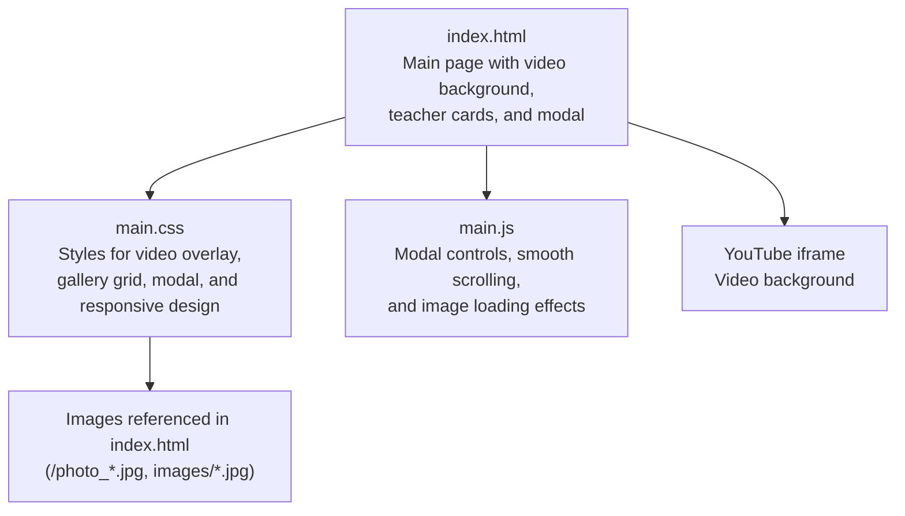
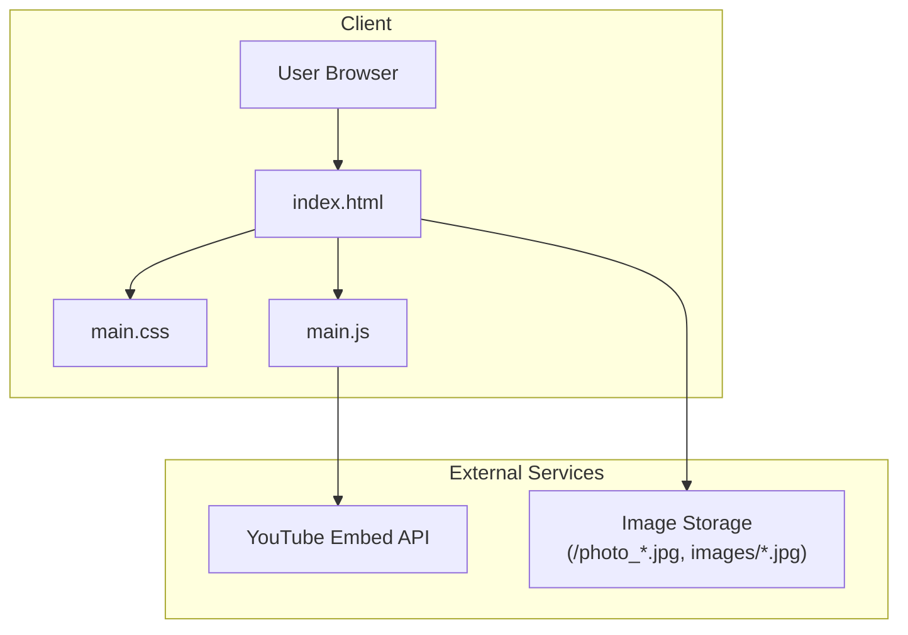
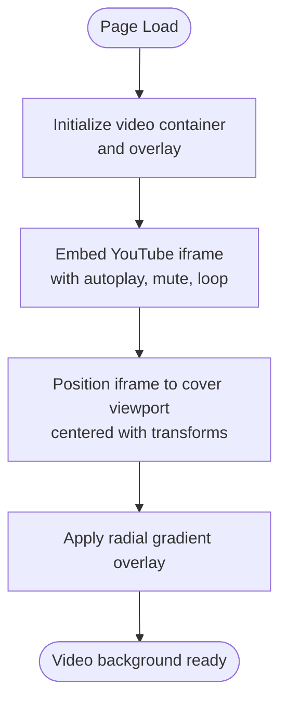
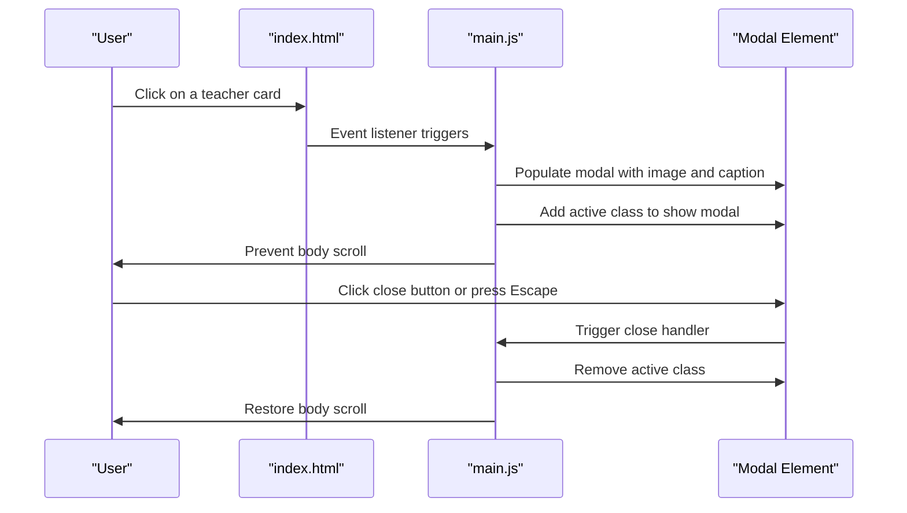
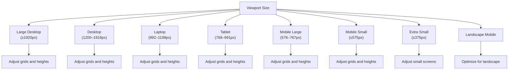
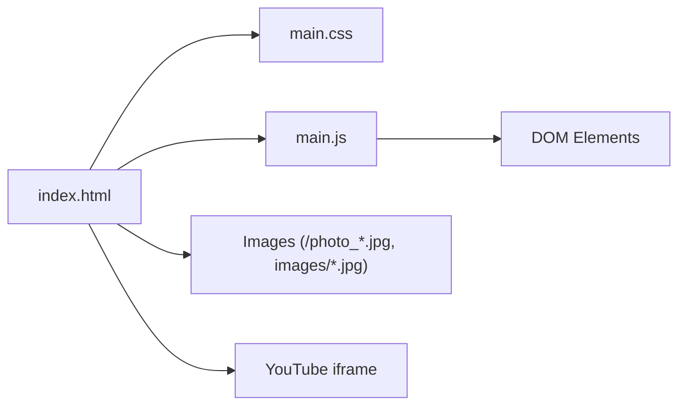

# Deployment and Maintenance

<cite>
**Referenced Files in This Document**
- [index.html](file://index.html)
- [main.css](file://main.css)
- [main.js](file://main.js)
</cite>

## Table of Contents
1. [Introduction](#introduction)
2. [Project Structure](#project-structure)
3. [Core Components](#core-components)
4. [Architecture Overview](#architecture-overview)
5. [Detailed Component Analysis](#detailed-component-analysis)
6. [Dependency Analysis](#dependency-analysis)
7. [Performance Considerations](#performance-considerations)
8. [Troubleshooting Guide](#troubleshooting-guide)
9. [Maintenance Procedures](#maintenance-procedures)
10. [Security Considerations](#security-considerations)
11. [Backup Strategies](#backup-strategies)
12. [Conclusion](#conclusion)

## Introduction
This document provides comprehensive deployment and maintenance guidance for the teacher directory project. It covers hosting options, asset management, update procedures, troubleshooting, performance monitoring, and security practices tailored to the current static implementation. The project consists of a single HTML page with embedded CSS and JavaScript, featuring a YouTube video background, a responsive teacher gallery, and a modal image viewer.

## Project Structure
The project is a minimal static website with three primary assets:
- index.html: The main page containing the layout, video background, teacher cards, and modal markup
- main.css: Styles for the video background overlay, gallery grid, modal presentation, and responsive breakpoints
- main.js: JavaScript for modal behavior, smooth scrolling, and image loading effects

**Diagram sources**
- [index.html:1-106](file://index.html#L1-L106)
- [main.css:1-517](file://main.css#L1-L517)
- [main.js:1-83](file://main.js#L1-L83)

**Section sources**
- [index.html:1-106](file://index.html#L1-L106)
- [main.css:1-517](file://main.css#L1-L517)
- [main.js:1-83](file://main.js#L1-L83)

## Core Components
- Video Background: A fixed-position YouTube embed with autoplay, mute, loop, and modest branding options, complemented by a radial gradient overlay for contrast.
- Teacher Gallery: Two-tier layout with leadership cards and a responsive grid of teacher thumbnails, each with hover effects and click-to-enlarge behavior.
- Modal Viewer: A fullscreen overlay that displays enlarged images with captions and keyboard/mouse controls.
- Responsive Design: Extensive media queries covering desktop, laptop, tablet, mobile, and landscape orientations.

Key implementation references:
- Video background container and iframe: [index.html:10-19](file://index.html#L10-L19)
- Overlay styling: [main.css:32-41](file://main.css#L32-L41)
- Gallery grid and card styles: [main.css:105-147](file://main.css#L105-L147)
- Modal container and controls: [index.html:95-101](file://index.html#L95-L101), [main.css:149-205](file://main.css#L149-L205)
- Responsive breakpoints: [main.css:207-516](file://main.css#L207-L516)

**Section sources**
- [index.html:10-19](file://index.html#L10-L19)
- [main.css:32-41](file://main.css#L32-L41)
- [main.css:105-147](file://main.css#L105-L147)
- [index.html:95-101](file://index.html#L95-L101)
- [main.css:149-205](file://main.css#L149-L205)
- [main.css:207-516](file://main.css#L207-L516)

## Architecture Overview
The application follows a client-side architecture with no server-side logic. Assets are served statically, and interactivity is handled by JavaScript.

**Diagram sources**
- [index.html:1-106](file://index.html#L1-L106)
- [main.css:1-517](file://main.css#L1-L517)
- [main.js:1-83](file://main.js#L1-L83)

## Detailed Component Analysis

### Video Background Component
The video background uses a YouTube iframe configured for autoplay, muted playback, looping, and a playlist containing the same video ID. The overlay creates a vignette effect to improve text readability.

**Diagram sources**
- [index.html:10-19](file://index.html#L10-L19)
- [main.css:8-41](file://main.css#L8-L41)

**Section sources**
- [index.html:10-19](file://index.html#L10-L19)
- [main.css:8-41](file://main.css#L8-L41)

### Teacher Gallery and Modal Interaction
The gallery displays leadership cards and teacher thumbnails. Clicking any card opens the modal with the selected image and caption, while Escape key and clicks outside the image close it.

**Diagram sources**
- [index.html:58-92](file://index.html#L58-L92)
- [main.js:9-58](file://main.js#L9-L58)

**Section sources**
- [index.html:58-92](file://index.html#L58-L92)
- [main.js:9-58](file://main.js#L9-L58)

### Responsive Design Implementation
The stylesheet defines breakpoints for large desktops, laptops, tablets, and various mobile sizes, adjusting grid layouts, typography, and spacing.

**Diagram sources**
- [main.css:207-516](file://main.css#L207-L516)

**Section sources**
- [main.css:207-516](file://main.css#L207-L516)

## Dependency Analysis
The project has minimal external dependencies:
- index.html depends on main.css and main.js
- main.js depends on DOM elements defined in index.html
- Images referenced in index.html are external assets (hosted under /photo_*.jpg and images/*.jpg)
- YouTube iframe is an external service dependency

**Diagram sources**
- [index.html:1-106](file://index.html#L1-L106)
- [main.css:1-517](file://main.css#L1-L517)
- [main.js:1-83](file://main.js#L1-L83)

**Section sources**
- [index.html:1-106](file://index.html#L1-L106)
- [main.css:1-517](file://main.css#L1-L517)
- [main.js:1-83](file://main.js#L1-L83)

## Performance Considerations
- Image Optimization: Replace placeholder images with appropriately sized JPEGs or modern formats (WebP) to reduce bandwidth and improve load times. Lazy-load offscreen images to minimize initial payload.
- Asset Minification: Minify CSS and JavaScript to reduce transfer size. Combine files where appropriate for production builds.
- CDN Integration: Serve static assets (CSS, JS, images) via a Content Delivery Network to improve global latency and caching.
- Video Background: The YouTube embed is efficient for autoplay and muted playback. Consider preloading only when necessary and disabling autoplay on mobile networks.
- Caching Headers: Configure long-term caching for immutable assets (CSS/JS) and shorter caching for HTML to balance freshness and performance.
- Core Web Vitals: Monitor Largest Contentful Paint (LCP), First Input Delay (FID), and Cumulative Layout Shift (CLS) to ensure optimal user experience.

[No sources needed since this section provides general guidance]

## Troubleshooting Guide

### Video Loading Problems
Symptoms: Video does not play or appears frozen.
- Verify the YouTube iframe URL parameters and ensure the video ID is correct.
- Confirm autoplay and muted attributes are present and allowed by browser policies.
- Test in different browsers to isolate autoplay restrictions.
- Check network connectivity and ad blockers that may interfere with embedded players.

**Section sources**
- [index.html:13-18](file://index.html#L13-L18)

### Modal Display Errors
Symptoms: Modal does not open, closes unexpectedly, or shows incorrect content.
- Ensure all DOM elements (modal container, close button, cards) exist and are correctly targeted by selectors.
- Confirm event listeners are attached after DOMContentLoaded.
- Validate that image sources and alt text are set before opening the modal.
- Check for CSS conflicts that might prevent the modal from displaying (z-index, visibility).

**Section sources**
- [index.html:95-101](file://index.html#L95-L101)
- [main.js:9-58](file://main.js#L9-L58)

### Responsive Design Inconsistencies
Symptoms: Layout breaks on specific screen sizes or orientations.
- Review media queries for the affected breakpoint and adjust grid columns, image heights, and typography.
- Test in landscape orientation for mobile devices and ensure the modal adapts to horizontal layouts.
- Validate that viewport meta tag is present and functioning.

**Section sources**
- [main.css:207-516](file://main.css#L207-L516)
- [index.html:4-6](file://index.html#L4-L6)

### Cross-Browser Compatibility
- Test across major browsers (Chrome, Firefox, Safari, Edge) and mobile browsers.
- Validate CSS Grid support and fallbacks for older browsers if needed.
- Ensure JavaScript polyfills are included for unsupported APIs.

[No sources needed since this section provides general guidance]

## Maintenance Procedures

### Adding New Teacher Profiles
Steps:
1. Prepare high-quality profile images in a consistent aspect ratio and size.
2. Place images in the appropriate directory (/photo_*.jpg or images/*.jpg).
3. Add a new card element to the teachers grid in index.html with the image source and name.
4. Optionally add leadership roles in the top section if applicable.
5. Preview locally and test modal behavior for the new card.

References:
- Teachers grid container: [index.html:58-92](file://index.html#L58-L92)
- Card structure: [index.html:59-91](file://index.html#L59-L91)

**Section sources**
- [index.html:58-92](file://index.html#L58-L92)
- [index.html:59-91](file://index.html#L59-L91)

### Updating Academic Year Information
Steps:
1. Locate the year badge element in index.html.
2. Modify the displayed academic year text.
3. Save and preview changes.

Reference:
- Year badge: [index.html:23](file://index.html#L23)

**Section sources**
- [index.html:23](file://index.html#L23)

### Modifying Video Background Content
Steps:
1. Obtain a new YouTube video ID.
2. Update the iframe src attribute in index.html with the new video ID.
3. Keep autoplay, mute, loop, and playlist parameters consistent.
4. Test the new video across devices and browsers.

Reference:
- Video iframe: [index.html:13-18](file://index.html#L13-L18)

**Section sources**
- [index.html:13-18](file://index.html#L13-L18)

### Monitoring Performance Metrics
- Lighthouse: Run audits to measure performance, accessibility, and SEO.
- Real User Monitoring (RUM): Track Core Web Vitals in production.
- CDN Reports: Monitor cache hit ratios and origin latency.
- Browser DevTools: Use Performance and Network panels for iterative improvements.

[No sources needed since this section provides general guidance]

## Security Considerations
- Input Sanitization: Since the project is static, sanitize any user-generated content before injecting it into the DOM. Use a library like DOMPurify to remove potentially malicious tags and attributes.
- XSS Prevention: Avoid inline event handlers and dynamic eval calls. Keep all interactive logic in separate JavaScript files.
- Content Security Policy (CSP): Implement a CSP header to restrict script sources and frame ancestors.
- HTTPS Enforcement: Serve all assets over HTTPS to prevent mixed content warnings and ensure secure connections.
- Third-Party Embeds: Trust only verified sources for YouTube videos and images. Validate URLs and consider using trusted CDN providers.

[No sources needed since this section provides general guidance]

## Backup Strategies
- Version Control: Commit all changes to a Git repository with meaningful commit messages.
- Asset Backups: Maintain copies of original teacher photos and thumbnails in a secure cloud storage service.
- Configuration Backups: Store index.html, main.css, and main.js in multiple locations (local, cloud, and offline).
- Rollback Plan: Keep previous versions of deployed assets to quickly revert changes if issues arise.

[No sources needed since this section provides general guidance]

## Conclusion
This guide outlines practical steps for deploying and maintaining the teacher directory project. By leveraging static hosting, optimizing assets, and following the update and troubleshooting procedures, you can ensure a reliable, performant, and secure experience. Regular maintenance, monitoring, and adherence to security best practices will help sustain the project over time.