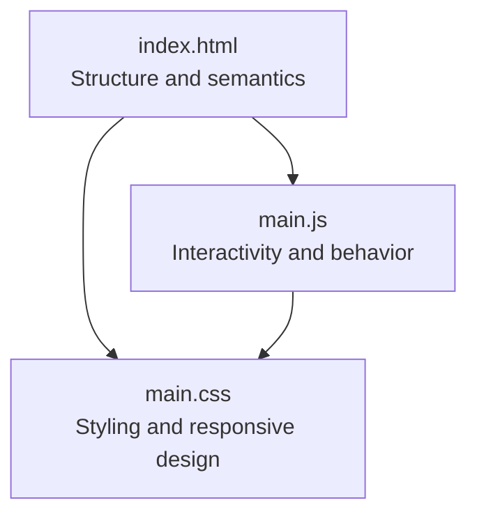
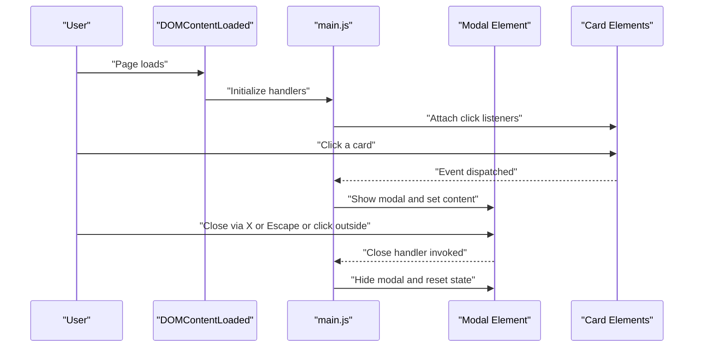
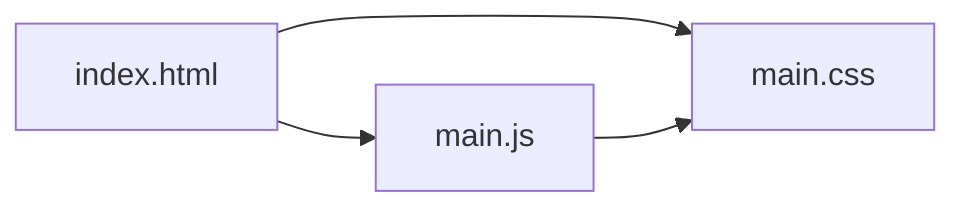

# Best Practices and Guidelines

<cite>
**Referenced Files in This Document**
- [index.html](file://index.html)
- [main.css](file://main.css)
- [main.js](file://main.js)
</cite>

## Table of Contents
1. [Introduction](#introduction)
2. [Project Structure](#project-structure)
3. [Core Components](#core-components)
4. [Architecture Overview](#architecture-overview)
5. [Detailed Component Analysis](#detailed-component-analysis)
6. [Dependency Analysis](#dependency-analysis)
7. [Performance Considerations](#performance-considerations)
8. [Troubleshooting Guide](#troubleshooting-guide)
9. [Conclusion](#conclusion)
10. [Appendices](#appendices)

## Introduction
This document provides best practices and guidelines for maintaining and extending the teacher directory project. It focuses on:
- HTML structure and semantics, accessibility, and maintainable class naming
- CSS organization, property ordering, selectors, and responsive design
- JavaScript patterns for event delegation, DOM efficiency, and memory management
- Cross-browser compatibility and testing strategies
- Code review and version control practices

The goal is to ensure new features preserve the existing grid system and breakpoints while keeping the codebase clean, accessible, and scalable.

## Project Structure
The project consists of three core files:
- index.html: Page structure, semantic elements, and interactive components
- main.css: Styles for layout, typography, modals, and responsive breakpoints
- main.js: Event-driven interactions, modal behavior, smooth scrolling, and image loading

**Diagram sources**
- [index.html:1-101](file://index.html#L1-L101)
- [main.css:1-517](file://main.css#L1-L517)
- [main.js:1-83](file://main.js#L1-L83)

**Section sources**
- [index.html:1-101](file://index.html#L1-L101)
- [main.css:1-517](file://main.css#L1-L517)
- [main.js:1-83](file://main.js#L1-L83)

## Core Components
- HTML page defines a header, a decorative video background, a main container, two grid sections (leadership and teachers), a gold-line separator, and a modal overlay for enlarged images.
- CSS establishes a consistent grid system for leadership and teacher cards, modal presentation, and extensive responsive breakpoints tailored to desktop, laptop, tablet, and mobile sizes.
- JavaScript handles modal open/close, escape key handling, click-outside-to-close, smooth scrolling anchors, and fade-in image loading.

Key implementation references:
- HTML structure and interactive elements: [index.html:10-96](file://index.html#L10-L96)
- CSS grid and modal styles: [main.css:85-206](file://main.css#L85-L206)
- Responsive media queries: [main.css:207-517](file://main.css#L207-L517)
- JavaScript modal and interactions: [main.js:2-82](file://main.js#L2-L82)

**Section sources**
- [index.html:10-96](file://index.html#L10-L96)
- [main.css:85-206](file://main.css#L85-L206)
- [main.css:207-517](file://main.css#L207-L517)
- [main.js:2-82](file://main.js#L2-L82)

## Architecture Overview
The front-end architecture follows a straightforward static site with a single-page model:
- index.html renders the page and mounts the modal
- main.css applies layout, transitions, and responsive behavior
- main.js initializes event listeners and manages stateless interactions

**Diagram sources**
- [main.js:2-58](file://main.js#L2-L58)
- [index.html:90-96](file://index.html#L90-L96)

## Detailed Component Analysis

### HTML Structure and Accessibility Best Practices
- Semantic markup: Use of headings, paragraphs, and structural containers improves readability and SEO.
- Alt attributes: Images include descriptive alt text for accessibility and SEO. Ensure alt text remains meaningful when images change.
- Maintainable class naming:
  - Use BEM-like naming for consistency (block__element--modifier). Current classes like .card, .main-card, .small-card, .modal, .modal-body align with this pattern.
  - Group related classes under logical blocks (e.g., .top-section for leadership grid, .teachers-grid for teacher grid).
- Image handling:
  - Prefer lazy loading for performance on larger pages.
  - Ensure fallbacks for missing images and robust error handling in scripts.

References:
- [index.html:16-87](file://index.html#L16-L87)
- [index.html:22-96](file://index.html#L22-L96)

**Section sources**
- [index.html:16-87](file://index.html#L16-L87)
- [index.html:22-96](file://index.html#L22-L96)

### CSS Best Practices
- Property ordering: Keep consistent ordering (positioning, display, box model, colors, typography, transitions, pseudo-elements) for readability and maintainability.
- Selector efficiency:
  - Prefer class selectors over deep descendant selectors to reduce specificity and improve performance.
  - Avoid overly broad selectors like universal or tag selectors when not necessary.
- CSS variable organization:
  - Centralize theme tokens (colors, spacing, typography scales) in a dedicated section for easy updates.
  - Example tokens to define: --color-gold, --color-dark-bg, --spacing-unit, --font-size-base, --border-width.
- Grid system:
  - Leadership grid uses repeat(auto-fit, minmax()) for flexibility; teacher grid uses repeat(auto-fill, minmax()) for density.
  - Preserve these patterns when adding new cards to maintain responsiveness.
- Modal and overlay:
  - Modal activation uses a class toggle; ensure consistent z-index stacking and backdrop behavior.
- Responsive design:
  - Breakpoints are defined for large desktop, desktop, laptop, tablet, large mobile, small mobile, and extra-small mobile.
  - Maintain the existing breakpoint tiers when introducing new components.

References:
- [main.css:1-6](file://main.css#L1-L6)
- [main.css:85-147](file://main.css#L85-L147)
- [main.css:149-206](file://main.css#L149-L206)
- [main.css:207-517](file://main.css#L207-L517)

**Section sources**
- [main.css:1-6](file://main.css#L1-L6)
- [main.css:85-147](file://main.css#L85-L147)
- [main.css:149-206](file://main.css#L149-L206)
- [main.css:207-517](file://main.css#L207-L517)

### JavaScript Best Practices
- Event delegation and performance:
  - Attach a single listener to the parent container for dynamic content when possible. The current implementation attaches listeners to each card; consider delegation for scalability.
- DOM manipulation efficiency:
  - Batch DOM reads/writes to minimize reflows.
  - Cache frequently accessed nodes (already done for modal, close button, cards).
- Memory management:
  - Remove event listeners when elements are removed or during cleanup.
  - Clear modal content on close to prevent memory leaks (already handled).
- Modal behavior:
  - Toggle visibility via a class and manage focus and scroll appropriately.
  - Escape key handling ensures keyboard accessibility.
- Smooth scrolling:
  - Use native smooth scrolling for anchor links to improve UX.
- Image loading:
  - Fade-in effect enhances perceived performance; ensure opacity resets on load.

References:
- [main.js:2-58](file://main.js#L2-L58)
- [main.js:61-71](file://main.js#L61-L71)
- [main.js:74-82](file://main.js#L74-L82)

**Section sources**
- [main.js:2-58](file://main.js#L2-L58)
- [main.js:61-71](file://main.js#L61-L71)
- [main.js:74-82](file://main.js#L74-L82)

### Responsive Design Maintenance
- Preserve the existing grid system:
  - Use repeat(auto-fit, minmax()) for leadership cards and repeat(auto-fill, minmax()) for teacher cards.
  - Adjust min-width values and gaps in media queries to fine-tune density per breakpoint.
- Breakpoint structure:
  - Maintain the established tiers: large desktop, desktop, laptop, tablet, large mobile, small mobile, extra-small mobile, and landscape orientation.
  - When adding new components, align widths and margins to these breakpoints.
- Video background and modal adjustments:
  - Ensure video scaling and modal layouts adapt to smaller screens and landscape orientations.

References:
- [main.css:106-135](file://main.css#L106-L135)
- [main.css:207-517](file://main.css#L207-L517)

**Section sources**
- [main.css:106-135](file://main.css#L106-L135)
- [main.css:207-517](file://main.css#L207-L517)

### Cross-Browser Compatibility and Testing Strategies
- Compatibility considerations:
  - CSS Grid is widely supported; ensure fallbacks for older browsers if needed.
  - Use vendor prefixes sparingly; modern browsers support standard properties.
  - Test modal behavior across browsers for Escape key handling and click-outside detection.
- Device and browser testing:
  - Test on desktop Chrome, Firefox, Safari, Edge; mobile Chrome and Safari.
  - Verify portrait and landscape modes for tablets and phones.
  - Validate image loading behavior and modal responsiveness across devices.
- Automated checks:
  - Lint HTML/CSS/JS with linters.
  - Use accessibility tools (axe, Lighthouse) to audit semantics and performance.

[No sources needed since this section provides general guidance]

### Code Review and Version Control Practices
- Code review guidelines:
  - Require reviews for any changes to HTML structure, CSS grid layouts, or JavaScript interactions.
  - Focus on accessibility, performance, and maintainability.
  - Ensure new features integrate cleanly with existing grid and breakpoint system.
- Version control practices:
  - Use feature branches and pull requests for new components.
  - Commit messages should describe what changed and why.
  - Keep commits atomic and focused.

[No sources needed since this section provides general guidance]

## Dependency Analysis
The project has minimal external dependencies. Internal dependencies:
- index.html depends on main.css for styling and main.js for interactivity.
- main.js depends on DOM elements defined in index.html and relies on CSS classes for modal behavior.

**Diagram sources**
- [index.html:7](file://index.html#L7)
- [index.html:98](file://index.html#L98)
- [main.js:1](file://main.js#L1)

**Section sources**
- [index.html:7](file://index.html#L7)
- [index.html:98](file://index.html#L98)
- [main.js:1](file://main.js#L1)

## Performance Considerations
- CSS performance:
  - Minimize heavy filters and transforms; the current blur and shadows are acceptable.
  - Use contain: layout or paint judiciously for large grids.
- JavaScript performance:
  - Prefer event delegation for large lists of cards.
  - Debounce or throttle resize-related logic if needed.
- Images:
  - Lazy-load images for long teacher lists.
  - Optimize image sizes and formats.

[No sources needed since this section provides general guidance]

## Troubleshooting Guide
- Modal does not open:
  - Verify card click handlers are attached after DOMContentLoaded.
  - Confirm modal class toggling and body overflow behavior.
- Modal does not close:
  - Check close button click handler and Escape key listener.
  - Ensure click-outside detection targets the modal element.
- Images not loading:
  - Confirm image paths and alt attributes.
  - Verify opacity transition and load event handling.
- Responsive issues:
  - Validate media query ranges and grid template columns.
  - Test on target breakpoints and adjust min-width/gap as needed.

**Section sources**
- [main.js:2-58](file://main.js#L2-L58)
- [main.js:74-82](file://main.js#L74-L82)
- [main.css:207-517](file://main.css#L207-L517)

## Conclusion
By adhering to the best practices outlined—semantic HTML, maintainable CSS organization, efficient JavaScript patterns, and disciplined responsive design—you can extend the teacher directory while preserving its visual and functional integrity. Focus on accessibility, performance, and maintainability to ensure long-term project health.

[No sources needed since this section summarizes without analyzing specific files]

## Appendices
- Quick checklist for new features:
  - Use BEM-style class names and group related classes logically.
  - Integrate with existing grid system and breakpoints.
  - Add alt attributes for all images.
  - Test modal behavior and keyboard navigation.
  - Audit performance and accessibility.

[No sources needed since this section provides general guidance]