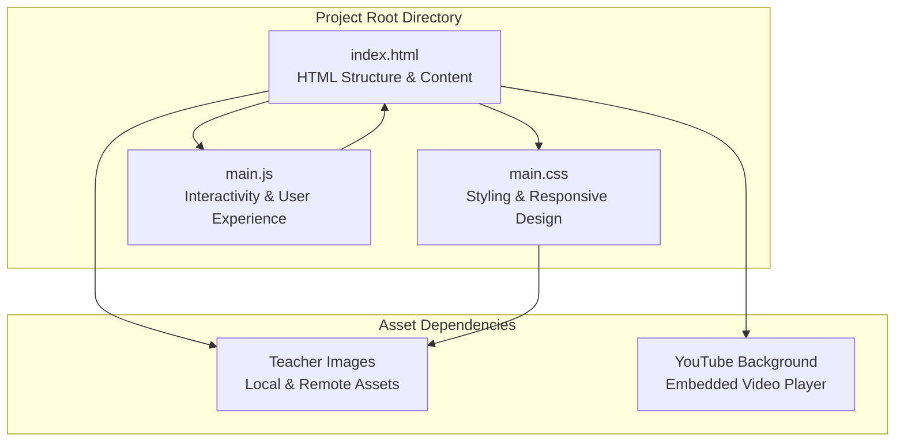
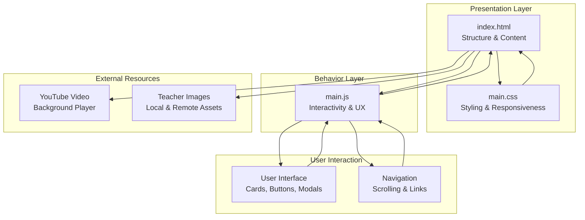
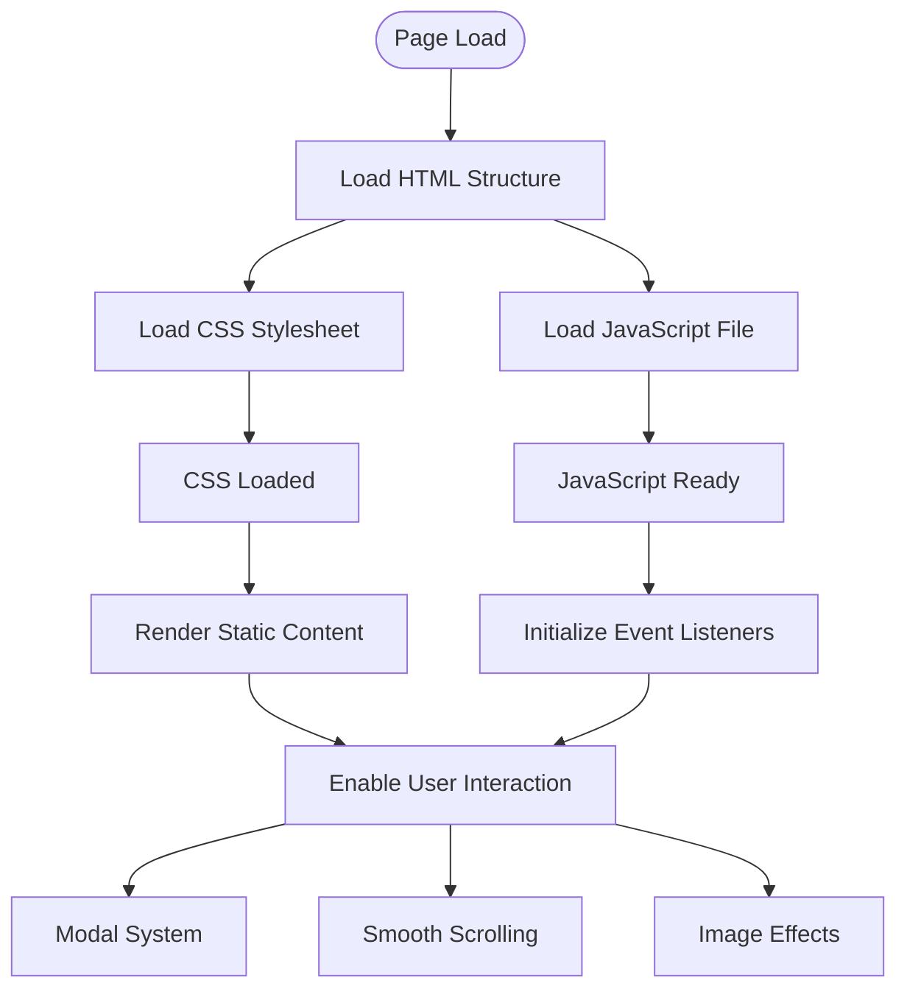
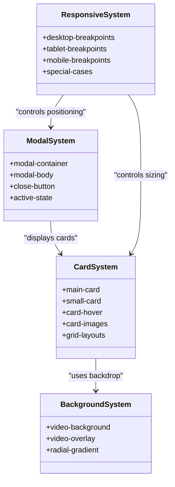
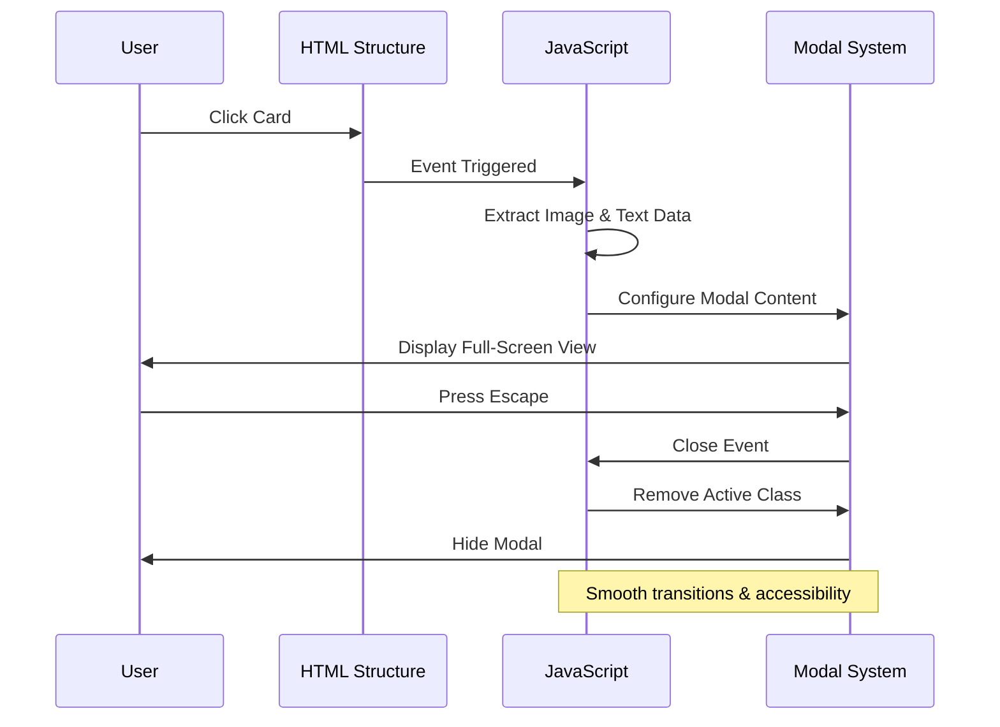
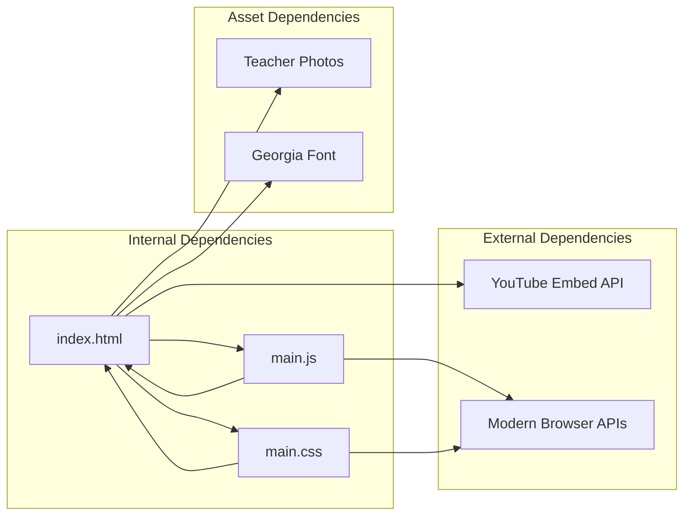

# Code Organization Principles

<cite>
**Referenced Files in This Document**
- [index.html](file://index.html)
- [main.css](file://main.css)
- [main.js](file://main.js)
</cite>

## Table of Contents
1. [Introduction](#introduction)
2. [Project Structure](#project-structure)
3. [Core Components](#core-components)
4. [Architecture Overview](#architecture-overview)
5. [Detailed Component Analysis](#detailed-component-analysis)
6. [Dependency Analysis](#dependency-analysis)
7. [Performance Considerations](#performance-considerations)
8. [Troubleshooting Guide](#troubleshooting-guide)
9. [Conclusion](#conclusion)

## Introduction

The teacher directory project demonstrates a clean separation of concerns architecture that maintains simplicity while delivering a robust user experience. This documentation explains how the project organizes its code into distinct layers: HTML for structure and content, CSS for presentation and responsiveness, and JavaScript for interactivity. The implementation follows modern web development best practices by embedding assets directly within the HTML file, creating a self-contained solution that's easy to deploy and maintain.

## Project Structure

The project follows a minimalistic file structure designed for maximum simplicity and maintainability. Each component serves a specific purpose and maintains clear boundaries with other components.

**Diagram sources**
- [index.html:1-106](file://index.html#L1-L106)
- [main.css:1-517](file://main.css#L1-L517)
- [main.js:1-83](file://main.js#L1-L83)

The structure consists of three primary files that work together to create a cohesive web application. Each file maintains its specific responsibility while communicating with external assets through well-defined interfaces.

**Section sources**
- [index.html:1-106](file://index.html#L1-L106)
- [main.css:1-517](file://main.css#L1-L517)
- [main.js:1-83](file://main.js#L1-L83)

## Core Components

### HTML Structure and Content (index.html)

The HTML file serves as the foundation of the application, containing all semantic markup and content structure. It establishes the page framework, defines the visual hierarchy, and provides the content that JavaScript will enhance.

Key structural elements include:
- **Video Background System**: Implements a YouTube video background with overlay effects
- **Album Container**: Main content wrapper with styling and layout constraints
- **Teacher Cards**: Two-tier grid system for displaying leadership and faculty members
- **Modal System**: Full-screen image viewer with caption support
- **Responsive Layout**: CSS Grid-based design that adapts to different screen sizes

The HTML maintains content separation by keeping all structural decisions in the markup while delegating presentation to CSS and behavior to JavaScript.

**Section sources**
- [index.html:1-106](file://index.html#L1-L106)

### CSS Styling and Responsive Design (main.css)

The CSS file handles all visual presentation and responsive behavior. It implements a comprehensive styling system that creates a cohesive visual identity while maintaining adaptability across devices.

Primary styling categories include:
- **Background System**: Video background with radial gradient overlays
- **Card Design System**: Consistent styling for both main and small cards
- **Grid Layouts**: Flexible grid systems for different content types
- **Modal Styling**: Full-screen modal with backdrop effects
- **Responsive Breakpoints**: Comprehensive media queries for all device sizes

The CSS follows a modular approach with clear section divisions for different functional areas, making maintenance straightforward and modifications predictable.

**Section sources**
- [main.css:1-517](file://main.css#L1-L517)

### JavaScript Interactivity (main.js)

The JavaScript file manages all user interactions and dynamic behavior. It implements a focused set of features that enhance the static HTML content without interfering with the underlying structure.

Core interactive features include:
- **Modal Functionality**: Image preview system with smooth transitions
- **Smooth Scrolling**: Enhanced navigation experience
- **Image Loading Effects**: Fade-in animations for improved perceived performance
- **Keyboard Navigation**: Escape key support for modal dismissal

The JavaScript maintains loose coupling with HTML through event delegation and DOM traversal, ensuring changes to structure don't break functionality.

**Section sources**
- [main.js:1-83](file://main.js#L1-L83)

## Architecture Overview

The project implements a layered architecture where each component has a clearly defined responsibility and communicates through well-established interfaces.

**Diagram sources**
- [index.html:1-106](file://index.html#L1-L106)
- [main.css:1-517](file://main.css#L1-L517)
- [main.js:1-83](file://main.js#L1-L83)

This architecture ensures that changes in one layer don't cascade into unrelated components, maintaining stability and predictability.

## Detailed Component Analysis

### HTML Structure Analysis

The HTML implementation demonstrates excellent separation of concerns through its semantic organization and content-first approach.

**Diagram sources**
- [index.html:1-106](file://index.html#L1-L106)

The HTML structure provides a solid foundation that remains stable regardless of styling or behavioral changes. The content hierarchy clearly separates leadership cards from faculty listings, enabling targeted styling and interaction patterns.

**Section sources**
- [index.html:21-92](file://index.html#L21-L92)

### CSS Architecture Analysis

The CSS implementation showcases a sophisticated approach to styling that maintains modularity while supporting complex responsive behavior.

**Diagram sources**
- [main.css:85-147](file://main.css#L85-L147)
- [main.css:149-205](file://main.css#L149-L205)
- [main.css:207-516](file://main.css#L207-L516)

The CSS follows a component-based architecture where each functional area maintains its own namespace and styling rules. This approach prevents conflicts and makes individual components easily replaceable.

**Section sources**
- [main.css:85-516](file://main.css#L85-L516)

### JavaScript Behavior Analysis

The JavaScript implementation focuses on enhancing user experience through targeted interactions that complement the static HTML structure.

**Diagram sources**
- [main.js:9-33](file://main.js#L9-L33)
- [main.js:47-58](file://main.js#L47-L58)

The JavaScript maintains a clean separation by focusing solely on user interaction patterns and DOM manipulation, leaving content and styling to their respective domains.

**Section sources**
- [main.js:1-83](file://main.js#L1-L83)

## Dependency Analysis

The project maintains minimal external dependencies while leveraging modern web standards for optimal performance and reliability.

**Diagram sources**
- [index.html:7](file://index.html#L7)
- [index.html:103](file://index.html#L103)
- [main.js:74](file://main.js#L74)

The dependency graph reveals a clean architecture with clear boundaries between internal components and external resources. This structure enables easy testing, debugging, and modification without affecting unrelated parts of the system.

**Section sources**
- [index.html:1-106](file://index.html#L1-L106)
- [main.js:1-83](file://main.js#L1-L83)

## Performance Considerations

The project architecture prioritizes performance through several key design decisions:

### Asset Loading Strategy
- **Single Request Pattern**: Each asset type loaded via one request per file
- **Lazy Loading**: Images implement fade-in effects for perceived performance
- **Minimal Dependencies**: No external frameworks or libraries

### Memory Management
- **Event Delegation**: Single event listeners manage multiple elements
- **DOM Caching**: Reusable element references prevent repeated queries
- **Cleanup Functions**: Proper modal cleanup prevents memory leaks

### Network Optimization
- **Efficient CSS**: Single stylesheet reduces HTTP requests
- **Optimized Images**: Responsive sizing prevents unnecessary bandwidth
- **Video Optimization**: YouTube embed with autoplay controls

## Troubleshooting Guide

### Common Issues and Solutions

**Issue**: Modal not appearing when clicking cards
- **Cause**: JavaScript not properly accessing card elements
- **Solution**: Verify card selectors match HTML structure
- **Prevention**: Use consistent class naming across components

**Issue**: Images not loading properly
- **Cause**: Incorrect image paths or missing fallbacks
- **Solution**: Check image URLs and implement error handling
- **Prevention**: Use relative paths and test across different environments

**Issue**: Responsive design not working
- **Cause**: Media query conflicts or missing viewport meta tag
- **Solution**: Verify viewport settings and media query order
- **Prevention**: Test across multiple device sizes during development

**Section sources**
- [main.js:9-33](file://main.js#L9-L33)
- [main.css:207-516](file://main.css#L207-L516)

## Conclusion

The teacher directory project exemplifies clean code organization principles through its strict separation of concerns and modular architecture. By maintaining clear boundaries between HTML structure, CSS styling, and JavaScript behavior, the project achieves remarkable simplicity while delivering robust functionality.

The embedded asset approach creates a self-contained solution that's easy to deploy, modify, and maintain. Each component can be changed independently without affecting others, ensuring long-term maintainability and reliability.

This architecture serves as an excellent model for small to medium-sized web projects seeking to balance simplicity with functionality while maintaining professional code quality standards.