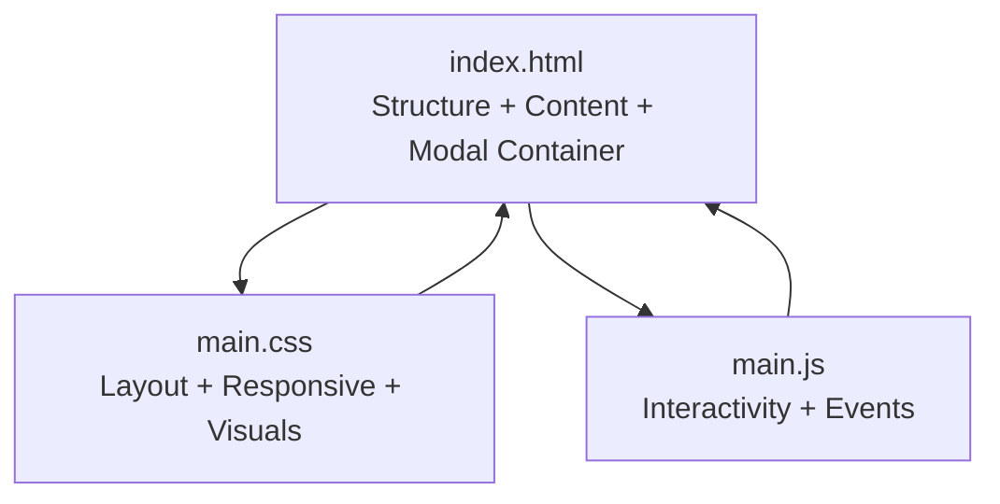
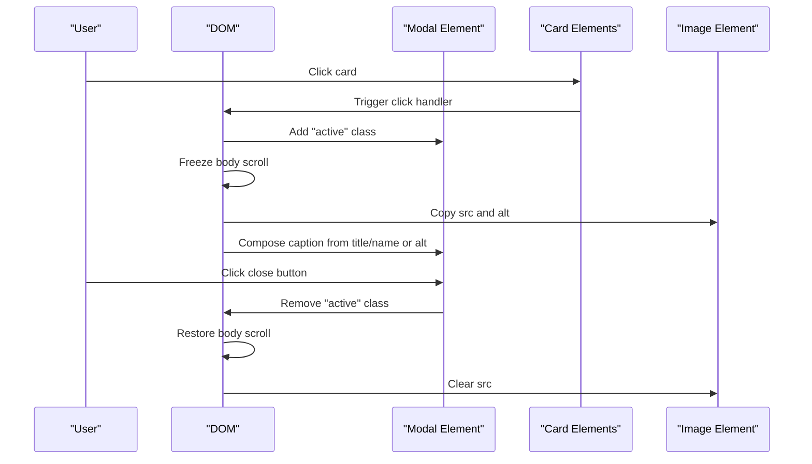
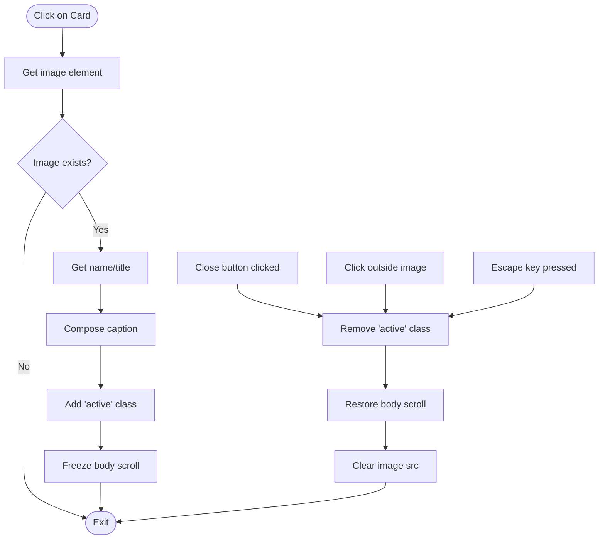
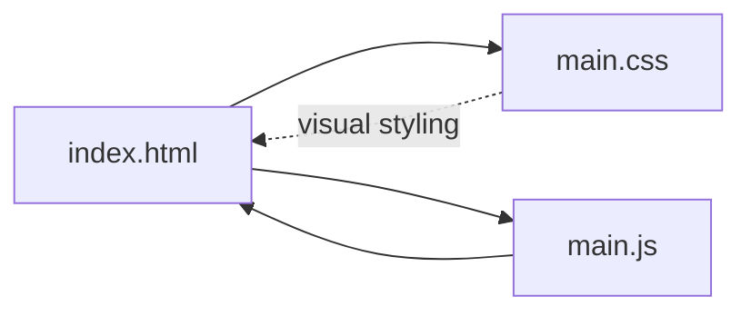

# Development Guide

<cite>
**Referenced Files in This Document**
- [index.html](file://index.html)
- [main.css](file://main.css)
- [main.js](file://main.js)
</cite>

## Table of Contents
1. [Introduction](#introduction)
2. [Project Structure](#project-structure)
3. [Core Components](#core-components)
4. [Architecture Overview](#architecture-overview)
5. [Detailed Component Analysis](#detailed-component-analysis)
6. [Dependency Analysis](#dependency-analysis)
7. [Performance Considerations](#performance-considerations)
8. [Testing and Debugging](#testing-and-debugging)
9. [Version Control and Deployment](#version-control-and-deployment)
10. [Troubleshooting Guide](#troubleshooting-guide)
11. [Conclusion](#conclusion)

## Introduction
This guide documents the teacher directory project’s code organization and development practices. It focuses on maintaining clean separation of concerns among HTML structure, CSS styling, and JavaScript functionality, while providing guidance for responsive design, modal behavior, event handling, testing, performance optimization, and deployment readiness.

## Project Structure
The project follows a minimal, static-file architecture with three primary artifacts:
- index.html: Defines the page structure, content, and modal container.
- main.css: Implements layout, responsive breakpoints, and visual styling.
- main.js: Adds interactive behaviors such as modal opening/closing, smooth scrolling, and image fade-in.

**Diagram sources**
- [index.html:1-106](file://index.html#L1-L106)
- [main.css:1-517](file://main.css#L1-L517)
- [main.js:1-83](file://main.js#L1-L83)

**Section sources**
- [index.html:1-106](file://index.html#L1-L106)
- [main.css:1-517](file://main.css#L1-L517)
- [main.js:1-83](file://main.js#L1-L83)

## Core Components
- HTML structure defines:
  - Page skeleton, header, year badge, two content sections (leadership and teachers), a gold line separator, and a modal overlay.
  - Image sources for leadership and teacher cards, including both absolute and relative paths.
- CSS controls:
  - Background video with overlay vignette effect.
  - Card grids for leadership and teacher sections with hover effects.
  - Modal presentation with backdrop blur and centered content.
  - Comprehensive responsive design across desktop, tablet, mobile, and landscape orientations.
- JavaScript manages:
  - Modal open/close via click, escape key, and click-outside.
  - Caption composition based on card type.
  - Smooth scrolling for anchor links.
  - Fade-in for images on load.

Best practices for modification:
- Keep HTML purely structural; avoid inline styles or scripts.
- Use CSS for visual effects and responsive behavior; avoid duplicating layout logic in JS.
- Centralize interactivity in main.js; reuse selectors and minimize DOM queries.

**Section sources**
- [index.html:10-101](file://index.html#L10-L101)
- [main.css:8-517](file://main.css#L8-L517)
- [main.js:1-83](file://main.js#L1-L83)

## Architecture Overview
The runtime interaction centers on the modal and image grid. The following sequence diagram maps the modal lifecycle and image captioning logic.

**Diagram sources**
- [main.js:9-58](file://main.js#L9-L58)
- [index.html:95-101](file://index.html#L95-L101)

## Detailed Component Analysis

### HTML Structure and Semantics
- Uses semantic containers for content sections and a dedicated modal element.
- Images are organized into two groups: leadership cards with descriptive alt text and teacher cards with name captions.
- The modal container holds an image and a caption, enabling consistent full-screen viewing.

Guidelines for extension:
- Preserve the modal container ID and class names to maintain JavaScript behavior.
- When adding new cards, mirror existing class patterns (.card, .main-card, .small-card) and ensure alt text remains descriptive.

**Section sources**
- [index.html:21-101](file://index.html#L21-L101)

### CSS Layout and Responsiveness
Key characteristics:
- Fixed-position video background with overlay vignette for focus.
- Two grid layouts:
  - Leadership section with auto-fit columns and fixed image heights.
  - Teachers grid with auto-fill columns and smaller images.
- Modal with backdrop blur and centered content; close button positioned absolutely.
- Extensive media queries covering large desktop, desktop, laptop, tablet, mobile, and landscape orientation.

Responsive design best practices:
- Maintain aspect ratios and image heights across breakpoints.
- Prefer CSS transforms and opacity for animations to leverage GPU acceleration.
- Avoid layout shifts by setting explicit heights for images and containers.

**Section sources**
- [main.css:8-517](file://main.css#L8-L517)

### JavaScript Interactivity
Behavior highlights:
- Event delegation across cards to open the modal.
- Dynamic caption construction based on card type (leadership vs. teacher).
- Escape key support and click-outside-to-close.
- Smooth scrolling for anchor navigation.
- Image fade-in on load with opacity transitions.

Event handling optimization:
- Attach a single listener per event type where possible.
- Use querySelectorAll once and cache results.
- Avoid unnecessary DOM writes inside tight loops.

**Section sources**
- [main.js:1-83](file://main.js#L1-L83)

### Modal Implementation Details

**Diagram sources**
- [main.js:9-58](file://main.js#L9-L58)
- [index.html:95-101](file://index.html#L95-L101)

## Dependency Analysis
The project exhibits low coupling and clear separation of concerns:
- HTML depends on CSS for styling and JS for behavior.
- CSS does not depend on JS.
- JS depends on HTML structure and CSS classes.

Potential risks:
- Tight coupling between JS selectors and HTML class names (e.g., modal IDs and card classes).
- Hardcoded image paths in HTML may break if assets are relocated.

Mitigation strategies:
- Use consistent naming conventions and document class dependencies.
- Centralize asset paths in a single configuration area if dynamic paths are needed.

**Diagram sources**
- [index.html:1-106](file://index.html#L1-L106)
- [main.css:1-517](file://main.css#L1-L517)
- [main.js:1-83](file://main.js#L1-L83)

**Section sources**
- [index.html:1-106](file://index.html#L1-L106)
- [main.css:1-517](file://main.css#L1-L517)
- [main.js:1-83](file://main.js#L1-L83)

## Performance Considerations
- Images:
  - Use compressed formats and appropriate resolutions for each breakpoint.
  - Lazy-load offscreen images to reduce initial payload.
  - Consider WebP or AVIF where supported.
- CSS:
  - Prefer transform and opacity for animations to utilize hardware acceleration.
  - Minimize reflows by batching DOM reads/writes.
- JavaScript:
  - Debounce resize handlers if adding new features.
  - Avoid frequent DOM queries; cache selectors.
  - Remove event listeners when elements are removed from the DOM.
- Video background:
  - Ensure autoplay/mute loop parameters are set to prevent audio interruptions.
  - Test performance impact on lower-end devices.

[No sources needed since this section provides general guidance]

## Testing and Debugging
Browser developer tools usage:
- Inspect elements to verify responsive breakpoints and modal activation.
- Use the Performance panel to profile JavaScript execution and identify bottlenecks.
- Use the Network tab to monitor image loads and optimize delivery.

JavaScript debugging techniques:
- Log event targets and captured elements to confirm selectors.
- Temporarily disable animations to isolate performance issues.
- Use breakpoints in click handlers to step through modal logic.

Responsive design testing methodologies:
- Test across device widths and simulate portrait/landscape modes.
- Verify modal layout and image scaling on small screens.
- Confirm that hover effects degrade gracefully on touch devices.

[No sources needed since this section provides general guidance]

## Version Control and Deployment
Version control strategies:
- Commit atomic changes: separate structural, styling, and behavioral updates.
- Use descriptive commit messages that explain “why” and “what” changed.
- Tag releases with semantic versioning when introducing breaking changes.

Code review guidelines:
- Review modal behavior for accessibility (keyboard navigation, screen reader labels).
- Verify responsive breakpoints match design specs.
- Ensure event handlers are efficient and free of memory leaks.

Deployment preparation checklist:
- Validate all image paths and ensure assets are deployed.
- Confirm modal functionality works without console errors.
- Run a final performance audit focusing on Largest Contentful Paint (LCP) and First Input Delay (FID).

[No sources needed since this section provides general guidance]

## Troubleshooting Guide
Common issues and remedies:
- Modal not closing:
  - Verify close button selector and click handler.
  - Ensure escape key listener is attached and not blocked by other handlers.
- Images not appearing:
  - Check image paths and server availability.
  - Confirm image load events trigger opacity change.
- Scroll not restored:
  - Ensure body scroll restoration occurs after modal closes.
- Responsive layout shifts:
  - Confirm image heights are set per breakpoint.
  - Avoid percentage-based margins that cause cumulative shifts.

**Section sources**
- [main.js:35-58](file://main.js#L35-L58)
- [main.css:207-517](file://main.css#L207-L517)

## Conclusion
By adhering to the separation of concerns, leveraging CSS for responsive behavior, and centralizing interactivity in JavaScript, the teacher directory remains maintainable and extensible. Following the testing, performance, and deployment practices outlined here ensures reliability across devices and browsers while preserving the project’s simplicity.