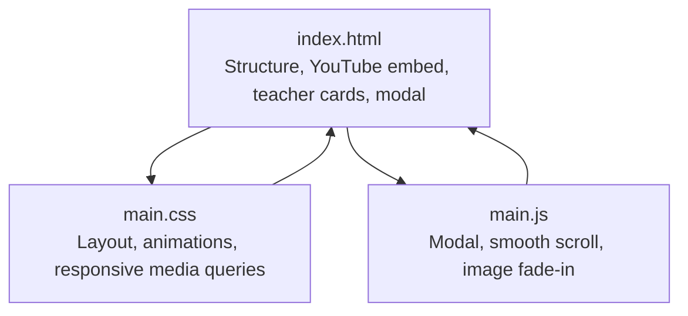
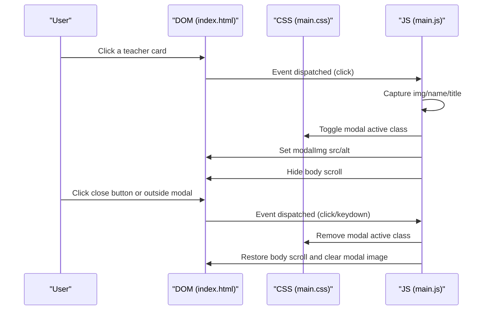
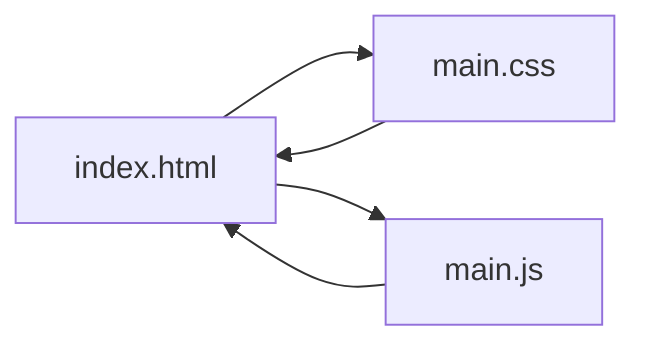

# Performance Optimization Tips

<cite>
**Referenced Files in This Document**
- [index.html](file://index.html)
- [main.css](file://main.css)
- [main.js](file://main.js)
</cite>

## Table of Contents
1. [Introduction](#introduction)
2. [Project Structure](#project-structure)
3. [Core Components](#core-components)
4. [Architecture Overview](#architecture-overview)
5. [Detailed Component Analysis](#detailed-component-analysis)
6. [Dependency Analysis](#dependency-analysis)
7. [Performance Considerations](#performance-considerations)
8. [Troubleshooting Guide](#troubleshooting-guide)
9. [Conclusion](#conclusion)
10. [Appendices](#appendices)

## Introduction
This document provides targeted performance optimization strategies for the teacher directory project. It focuses on:
- Image optimization for teacher photos (compression, formats, lazy loading)
- CSS animation optimization (hardware acceleration, transitions, layout thrashing)
- JavaScript performance (event listeners, DOM queries, memory leaks)
- YouTube embed optimization (autoplay, bandwidth, fallbacks)
- Metrics collection and monitoring
- Mobile performance (touch, battery impact)
- Improving Core Web Vitals

The guidance is grounded in the project’s HTML, CSS, and JavaScript files and aims to improve load speed, interactivity, and user experience across devices.

## Project Structure
The project is minimalistic and consists of:
- An HTML entry point that defines the page structure, YouTube background video, teacher cards, and modal
- A single CSS stylesheet for layout, animations, responsive breakpoints, and modal effects
- A single JavaScript module for modal behavior, smooth scrolling, and image fade-in

**Diagram sources**
- [index.html:1-107](file://index.html#L1-L107)
- [main.css:1-516](file://main.css#L1-L516)
- [main.js:1-83](file://main.js#L1-L83)

**Section sources**
- [index.html:1-107](file://index.html#L1-L107)
- [main.css:1-516](file://main.css#L1-L516)
- [main.js:1-83](file://main.js#L1-L83)

## Core Components
- HTML structure: Defines the YouTube background video, teacher cards, and modal container. Uses a grid-based layout for teacher photos and a modal overlay for zoomed views.
- CSS animations: Hover transforms and opacity transitions for cards and images; backdrop blur for modal; extensive responsive media queries.
- JavaScript: Event-driven modal open/close, Escape-key handling, smooth scrolling, and image fade-in on load.

Key performance-relevant areas:
- Image loading and presentation across multiple cards
- CSS transforms and transitions
- Event listener setup and modal lifecycle
- YouTube iframe autoplay and controls

**Section sources**
- [index.html:10-20](file://index.html#L10-L20)
- [index.html:26-93](file://index.html#L26-L93)
- [index.html:96-102](file://index.html#L96-L102)
- [main.css:84-102](file://main.css#L84-L102)
- [main.css:148-204](file://main.css#L148-L204)
- [main.js:2-82](file://main.js#L2-L82)

## Architecture Overview
The runtime flow centers on user interactions with teacher cards and the modal overlay. The YouTube background video is fixed and covers the viewport.

**Diagram sources**
- [index.html:26-93](file://index.html#L26-L93)
- [index.html:96-102](file://index.html#L96-L102)
- [main.js:2-82](file://main.js#L2-L82)
- [main.css:148-204](file://main.css#L148-L204)

## Detailed Component Analysis

### Image Optimization for Teacher Photos
Current state:
- Images are loaded directly via the src attribute on card images.
- No lazy loading attributes are present.
- CSS uses object-fit: cover to crop images to containers.

Recommended optimizations:
- Lazy loading: Add loading="lazy" to all img tags to defer offscreen images until near viewport.
- Modern formats: Prefer WebP or AVIF where supported; provide fallbacks for JPEG/PNG.
- Compression: Use lossless or lossy compression to reduce file sizes without sacrificing quality.
- Responsive sizing: Serve appropriately sized images; consider srcset with sizes for different DPRs.
- Preload critical images: Use preload for hero images if necessary.
- Placeholder/fade-in: Already using opacity transition on load; keep this to avoid FOIT/FOIC.

Impact:
- Reduces initial payload and improves First Contentful Paint (FCP).
- Decreases memory footprint and CPU usage on lower-end devices.

**Section sources**
- [index.html:28-93](file://index.html#L28-L93)
- [main.css:98-102](file://main.css#L98-L102)
- [main.js:73-81](file://main.js#L73-L81)

### CSS Animation Optimization
Current state:
- Transitions on hover for transform and box-shadow on cards.
- Opacity transition on images during load.
- Backdrop blur on modal overlay.

Optimization opportunities:
- Hardware acceleration: Use transform and opacity for GPU-accelerated animations; already mostly in place.
- Minimize layout thrashing: Avoid triggering layout in rapid succession; batch reads/writes.
- Reduce expensive filters: backdrop-filter can be heavy; consider alternatives like pseudo-element overlays if performance constrained.
- Transition duration: Keep durations short (already around 0.3s) to minimize jank.
- Avoid unnecessary repaints: Limit frequent property changes during animations.

Performance tips:
- Prefer transform and opacity over layout-affecting properties.
- Use will-change or transform3d for complex animations if needed.
- Defer non-critical animations until after initial paint.

**Section sources**
- [main.css:89-96](file://main.css#L89-L96)
- [main.css:177-182](file://main.css#L177-L182)
- [main.css:158](file://main.css#L158)

### JavaScript Performance Improvements
Current state:
- Event listeners attached to cards, close button, modal, and Escape key.
- Smooth scrolling for anchor links.
- Image fade-in on load.

Optimization opportunities:
- Event delegation: Instead of attaching N click listeners to cards, attach one to a parent container and delegate.
- Efficient DOM queries: Cache selectors (already done for modal elements) and reuse.
- Memory leaks: Ensure event listeners are removed when components unmount; currently modal removal clears src but does not remove listeners.
- Scroll behavior: Use passive listeners for wheel/scroll events if any are added later.
- Debounce/throttle: Not applicable here; smooth scroll is handled by native API.

Best practices:
- Use requestAnimationFrame for frame-aligned updates.
- Avoid synchronous layout queries inside loops.
- Unregister listeners on teardown.

**Section sources**
- [main.js:2-82](file://main.js#L2-L82)

### YouTube Embed Optimization
Current state:
- Fixed background video with autoplay, muted, loop, playlist, and modest controls.
- Overlay div behind the iframe to darken the video.

Optimization opportunities:
- Autoplay policy: Muted autoplay is allowed; keep mute enabled for mobile.
- Bandwidth: Consider lower resolution or shorter loop segments; preload=false on iframe.
- Fallback strategy: Provide static image fallback for users who cannot play video.
- IntersectionObserver: Pause/resume playback when off-screen to save bandwidth/battery.
- Controls: Disable controls to reduce DOM overhead; already disabled.

Performance tips:
- Use poster attribute on iframe for immediate visual feedback.
- Consider preloading only when user gestures occur.

**Section sources**
- [index.html:10-20](file://index.html#L10-L20)
- [main.css:9-30](file://main.css#L9-L30)

### Modal and Interaction Performance
Current state:
- Modal toggled via class; body scroll locked/unlocked.
- Close via button, outside click, or Escape key.

Optimization opportunities:
- Pointer events: Disable pointer-events on background during modal to reduce event cost.
- Scroll locking: Avoid mutating body styles; consider CSS-based overflow hidden on container.
- Close behavior: Ensure modal cleanup removes inline styles and resets focus.

**Section sources**
- [index.html:96-102](file://index.html#L96-L102)
- [main.js:35-58](file://main.js#L35-L58)
- [main.css:148-204](file://main.css#L148-L204)

## Dependency Analysis
High-level dependencies:
- HTML depends on CSS for layout and animations; JS for interactivity.
- CSS depends on HTML structure for selectors and modal classes.
- JS depends on DOM nodes defined in HTML and CSS classes.

**Diagram sources**
- [index.html:1-107](file://index.html#L1-L107)
- [main.css:1-516](file://main.css#L1-L516)
- [main.js:1-83](file://main.js#L1-L83)

**Section sources**
- [index.html:1-107](file://index.html#L1-L107)
- [main.css:1-516](file://main.css#L1-L516)
- [main.js:1-83](file://main.js#L1-L83)

## Performance Considerations

### Image Optimization Checklist
- Add loading="lazy" to all img tags.
- Convert to WebP/AVIF with JPEG/PNG fallbacks.
- Compress images and serve appropriately sized assets.
- Use srcset and sizes for responsive images.
- Keep image fade-in transition for perceived performance.

**Section sources**
- [index.html:28-93](file://index.html#L28-L93)
- [main.css:98-102](file://main.css#L98-L102)
- [main.js:73-81](file://main.js#L73-L81)

### CSS Animation Optimization Checklist
- Keep transform and opacity transitions; avoid layout-affecting properties.
- Minimize backdrop-filter usage; consider alternatives if heavy.
- Batch style reads/writes; avoid forced synchronous layouts.
- Keep transition durations short.

**Section sources**
- [main.css:89-96](file://main.css#L89-L96)
- [main.css:158](file://main.css#L158)

### JavaScript Performance Checklist
- Use event delegation for cards.
- Cache DOM queries; avoid repeated selects.
- Remove event listeners on modal close.
- Keep smooth scroll behavior; avoid heavy computations in handlers.

**Section sources**
- [main.js:2-82](file://main.js#L2-L82)

### YouTube Embed Optimization Checklist
- Keep autoplay muted; disable controls.
- Consider pause-on-scroll behavior with IntersectionObserver.
- Provide static fallback poster.
- Avoid unnecessary preload.

**Section sources**
- [index.html:10-20](file://index.html#L10-L20)
- [main.css:9-30](file://main.css#L9-L30)

### Metrics Collection and Monitoring
- Core Web Vitals: Measure LCP, FID, CLS using Web Vitals library or Chrome UX Report.
- Field data: Use RUM solutions (e.g., analytics SDKs) to track real-user metrics.
- Lab data: Lighthouse, PageSpeed Insights, WebPageTest for optimization guidance.
- Budgeting: Set budgets for main thread work and memory usage.

[No sources needed since this section provides general guidance]

### Mobile Performance Considerations
- Touch targets: Ensure buttons and cards are tappable (minimum ~44px).
- Battery impact: Avoid heavy animations; pause video when off-screen.
- Rendering: Prefer transform/opacity; limit blur and shadows on low-end devices.
- Network: Lazy-load images; compress assets; use adaptive bitrate where applicable.

**Section sources**
- [main.css:191-204](file://main.css#L191-L204)
- [main.js:35-58](file://main.js#L35-L58)

### Improving Core Web Vitals
- LCP: Optimize largest image, defer non-critical CSS/JS, lazy-load images.
- FID: Reduce long tasks; optimize main-thread work; use event delegation.
- CLS: Reserve space for images, avoid dynamic layout shifts; use aspect-ratio.

[No sources needed since this section provides general guidance]

## Troubleshooting Guide
Common issues and fixes:
- Modal not closing: Verify click-outside and Escape key handlers are attached and modal class toggles correctly.
- Images not fading in: Ensure load event fires and opacity transition is applied.
- Body scroll not restored: Confirm modal close routine clears inline styles and restores overflow.
- Video not playing: Confirm autoplay muted and network allows autoplay.

**Section sources**
- [main.js:35-58](file://main.js#L35-L58)
- [main.js:73-81](file://main.js#L73-L81)
- [index.html:10-20](file://index.html#L10-L20)

## Conclusion
By applying the outlined optimizations—lazy-loading images, leveraging modern formats, optimizing CSS transforms, refining JavaScript event handling, and tuning the YouTube embed—you can significantly improve the teacher directory’s performance. Focus on reducing main-thread work, minimizing layout thrashing, and delivering fast, smooth interactions across devices. Continuously monitor Core Web Vitals and iterate based on field data.

[No sources needed since this section summarizes without analyzing specific files]

## Appendices

### Quick Reference: Performance Actions
- Images: lazy loading, WebP/AVIF, compression, responsive sizing
- CSS: transform/opacity, minimal filters, short transitions
- JS: event delegation, cached queries, listener cleanup
- YouTube: muted autoplay, off-screen pause, fallback poster
- Metrics: Web Vitals, Lighthouse, RUM

[No sources needed since this section provides general guidance]