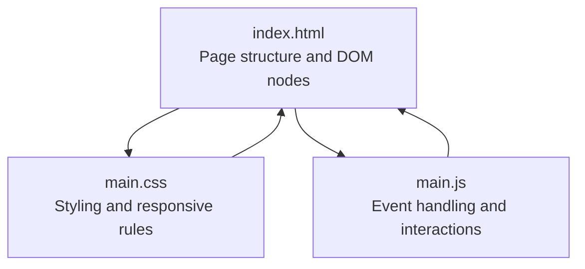
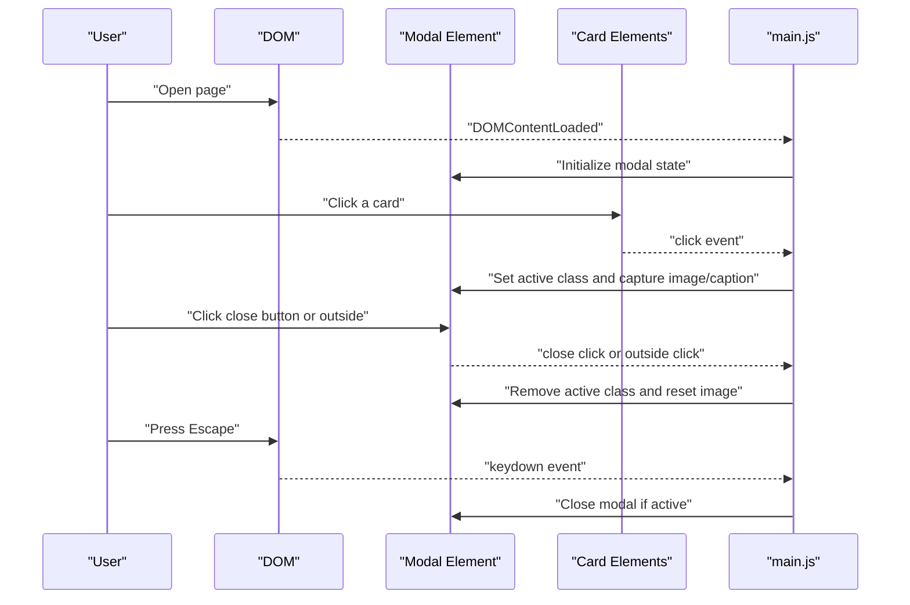
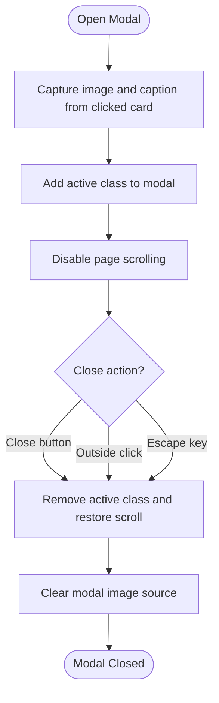
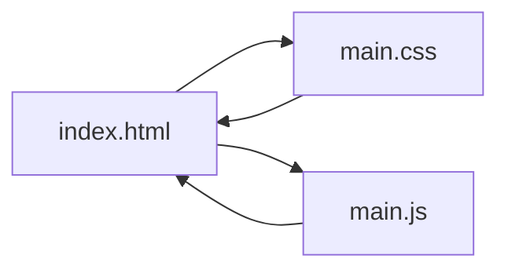

# Testing and Debugging Approaches

<cite>
**Referenced Files in This Document**
- [index.html](file://index.html)
- [main.css](file://main.css)
- [main.js](file://main.js)
</cite>

## Table of Contents
1. [Introduction](#introduction)
2. [Project Structure](#project-structure)
3. [Core Components](#core-components)
4. [Architecture Overview](#architecture-overview)
5. [Detailed Component Analysis](#detailed-component-analysis)
6. [Dependency Analysis](#dependency-analysis)
7. [Performance Considerations](#performance-considerations)
8. [Troubleshooting Guide](#troubleshooting-guide)
9. [Conclusion](#conclusion)

## Introduction
This document provides a comprehensive guide to testing and debugging methodologies for the teacher directory project. It focuses on practical techniques for inspecting HTML structure, debugging CSS layout issues, profiling JavaScript performance, validating responsive design across devices, and systematically diagnosing and resolving common issues such as image loading problems, modal display bugs, and responsive layout failures. The guidance is grounded in the actual codebase and aims to be accessible to developers with varying levels of experience.

## Project Structure
The project consists of three primary files:
- index.html: Defines the page structure, including the video background container, teacher cards, and modal markup.
- main.css: Implements styles for the video background overlay, card layouts, modal presentation, and responsive breakpoints.
- main.js: Adds interactivity for opening/closing the modal, smooth scrolling, and image fade-in behavior.

**Diagram sources**
- [index.html:1-107](file://index.html#L1-L107)
- [main.css:1-517](file://main.css#L1-L517)
- [main.js:1-83](file://main.js#L1-L83)

**Section sources**
- [index.html:1-107](file://index.html#L1-L107)
- [main.css:1-517](file://main.css#L1-L517)
- [main.js:1-83](file://main.js#L1-L83)

## Core Components
- Video background: A fixed-position container with an iframe-based YouTube player and a vignette overlay to enhance readability of content.
- Teacher cards: Two grid layouts—leadership cards and a general teachers grid—each with hover effects and image sizing.
- Modal system: A fullscreen overlay activated by clicking a card, displaying the selected image and caption, with close controls and escape key support.
- Responsive design: Media queries tailored to desktop, laptop, tablet, and mobile breakpoints, plus landscape orientation adjustments.

Key implementation references:
- Video background and overlay: [index.html:10-20](file://index.html#L10-L20), [main.css:8-41](file://main.css#L8-L41)
- Cards and grids: [index.html:26-93](file://index.html#L26-L93), [main.css:85-147](file://main.css#L85-L147), [main.css:106-135](file://main.css#L106-L135)
- Modal: [index.html:96-102](file://index.html#L96-L102), [main.css:149-205](file://main.css#L149-L205)
- Responsive media queries: [main.css:207-516](file://main.css#L207-L516)
- Modal logic and image loading: [main.js:9-58](file://main.js#L9-L58), [main.js:73-81](file://main.js#L73-L81)

**Section sources**
- [index.html:10-20](file://index.html#L10-L20)
- [main.css:8-41](file://main.css#L8-L41)
- [index.html:26-93](file://index.html#L26-L93)
- [main.css:85-147](file://main.css#L85-L147)
- [main.css:106-135](file://main.css#L106-L135)
- [index.html:96-102](file://index.html#L96-L102)
- [main.css:149-205](file://main.css#L149-L205)
- [main.css:207-516](file://main.css#L207-L516)
- [main.js:9-58](file://main.js#L9-L58)
- [main.js:73-81](file://main.js#L73-L81)

## Architecture Overview
The runtime architecture centers on DOM manipulation and event-driven interactions:
- DOMContentLoaded triggers initialization of modal and image handlers.
- Click events on cards open the modal and populate the image and caption.
- Clicking the close button or outside the modal closes it.
- Escape key support provides keyboard accessibility.
- Smooth scrolling targets anchors within the page.
- Images fade in upon load to improve perceived performance.

**Diagram sources**
- [main.js:2-58](file://main.js#L2-L58)
- [index.html:96-102](file://index.html#L96-L102)

**Section sources**
- [main.js:2-58](file://main.js#L2-L58)
- [index.html:96-102](file://index.html#L96-L102)

## Detailed Component Analysis

### Video Background System
- Purpose: Provide an immersive backdrop while maintaining readability of foreground content.
- Implementation highlights:
  - Fixed positioning with negative z-index ensures the video stays behind content.
  - Overlay creates a vignette effect to draw focus to the album container.
  - Iframe configured for autoplay, muted playback, looping, and restricted controls.
- Testing checklist:
  - Verify video fills viewport and remains centered.
  - Confirm overlay opacity and gradient produce readable text.
  - Validate pointer-events are disabled so the video does not interfere with UI interactions.
  - Test across devices to ensure aspect ratio and coverage remain consistent.

Common issues and resolutions:
- Video not covering viewport: Inspect min-width/min-height and transform centering.
- Controls flickering: Ensure controls are disabled via iframe attributes.
- Content obscured: Adjust z-index of overlay and album container.

**Section sources**
- [index.html:10-20](file://index.html#L10-L20)
- [main.css:8-41](file://main.css#L8-L41)

### Modal System
- Behavior:
  - Opens on card click, populating the modal image and caption.
  - Supports closing via close button, clicking outside the image, and pressing Escape.
  - Disables page scrolling while open and restores it on close.
- Testing strategies:
  - Click testing: Verify modal opens on card click, caption concatenation logic, and close actions.
  - Keyboard testing: Press Escape when modal is active and inactive to confirm behavior.
  - Outside click testing: Click areas around the image to ensure closure.
  - Responsiveness: Resize window and rotate devices to confirm modal layout and close button placement.
- Debugging tips:
  - Use DevTools Elements panel to inspect active class toggling.
  - Console logging can verify event listeners firing and modal state transitions.
  - If modal fails to close, check event delegation and target detection logic.

**Diagram sources**
- [main.js:9-58](file://main.js#L9-L58)
- [index.html:96-102](file://index.html#L96-L102)

**Section sources**
- [main.js:9-58](file://main.js#L9-L58)
- [index.html:96-102](file://index.html#L96-L102)

### Interactive Gallery Features
- Card interactions:
  - Hover effects elevate cards and add glow shadows.
  - Image sizing differs between leadership and general teacher cards.
- Testing strategies:
  - Hover testing: Verify elevation and shadow transitions on cards.
  - Grid responsiveness: Resize to confirm auto-fit/auto-fill behavior and gaps adjust appropriately.
  - Accessibility: Ensure sufficient contrast and focus visibility.
- Debugging tips:
  - Use DevTools Layout panel to inspect grid properties and gaps.
  - Validate min-height/max-width constraints for images.

**Section sources**
- [main.css:85-147](file://main.css#L85-L147)
- [main.css:106-135](file://main.css#L106-L135)

### Smooth Scrolling Anchors
- Behavior: Prevents default anchor navigation and smoothly scrolls to target elements.
- Testing strategies:
  - Click anchors to verify smooth scroll behavior.
  - Validate that targets exist and are visible within viewport.
- Debugging tips:
  - Inspect scrollIntoView options and target selectors.

**Section sources**
- [main.js:60-71](file://main.js#L60-L71)

### Image Loading and Fade-In
- Behavior: Images start invisible and fade in upon load to reduce perceived loading jank.
- Testing strategies:
  - Observe fade-in timing and ensure no flicker occurs.
  - Test with slow network conditions to validate loading states.
- Debugging tips:
  - Use Network panel to monitor image requests.
  - Check opacity transitions and load event binding.

**Section sources**
- [main.js:73-81](file://main.js#L73-L81)

## Dependency Analysis
The project exhibits minimal external dependencies. Internal dependencies are straightforward:
- HTML provides the DOM structure for modal and cards.
- CSS defines styling and responsive behavior.
- JavaScript manipulates DOM nodes and binds event listeners.

**Diagram sources**
- [index.html:1-107](file://index.html#L1-L107)
- [main.css:1-517](file://main.css#L1-L517)
- [main.js:1-83](file://main.js#L1-L83)

**Section sources**
- [index.html:1-107](file://index.html#L1-L107)
- [main.css:1-517](file://main.css#L1-L517)
- [main.js:1-83](file://main.js#L1-L83)

## Performance Considerations
- JavaScript performance:
  - Event delegation: The modal uses a single listener on the modal element for outside clicks, reducing overhead compared to per-card listeners.
  - Minimal DOM writes: Avoid layout thrashing by batching reads/writes and limiting reflows.
  - Transition performance: CSS transitions on cards and modal are lightweight; ensure GPU acceleration is not forced unnecessarily.
- CSS performance:
  - Grid layouts are efficient; avoid excessive repaints by changing transformable properties (e.g., transform and opacity).
  - Backdrop filters and blur effects can be expensive; test on lower-end devices and consider fallbacks if needed.
- Image performance:
  - Lazy loading can be considered for large galleries to reduce initial payload.
  - Optimize image sizes and formats to minimize bandwidth and decode time.
- Profiling techniques:
  - Use Chrome DevTools Performance panel to record interactions (opening modal, scrolling).
  - Use Memory panel to detect leaks during repeated modal open/close cycles.
  - Use Rendering panel to visualize paint rectangles and identify heavy redraws.

[No sources needed since this section provides general guidance]

## Troubleshooting Guide

### Browser Developer Tools Usage
- Inspecting HTML structure:
  - Use Elements panel to examine DOM nodes for modal, cards, and video background containers.
  - Toggle classes (e.g., active) to verify state changes.
- Debugging CSS layout issues:
  - Use Layout panel to inspect computed styles, margins, and grid properties.
  - Use Computed panel to verify final styles and overrides.
  - Use Rulers and Screenshot tools to validate spacing and alignment.
- Profiling JavaScript performance:
  - Use Performance panel to record interactions and analyze call stacks.
  - Use Profiles panel to identify long tasks and memory growth.
  - Use Network panel to verify resource loads and caching.

[No sources needed since this section provides general guidance]

### Responsive Design Testing
- Viewport simulation:
  - Use Device Toolbar in DevTools to simulate desktop, tablet, and mobile widths.
  - Manually resize the browser window to test fluid breakpoints.
- Mobile device testing:
  - Use remote device testing or browser’s device emulation mode.
  - Rotate devices to test landscape orientation adjustments.
- Cross-device compatibility:
  - Test on multiple browsers and OS versions.
  - Validate touch interactions and gesture support.

[No sources needed since this section provides general guidance]

### JavaScript Debugging Techniques
- Console logging:
  - Add targeted logs inside event handlers to trace execution flow.
  - Log event targets and modal state to diagnose unexpected closures.
- Breakpoint debugging:
  - Set breakpoints on modal open/close logic to inspect state changes.
  - Step through event handlers to catch edge cases (e.g., missing alt text).
- Event flow analysis:
  - Use console to log event propagation and bubbling behavior.
  - Verify event delegation and target detection for outside clicks.

[No sources needed since this section provides general guidance]

### Testing Strategies for Specific Features
- Modal system:
  - Unit-like tests: Simulate card clicks and assert modal state and content.
  - Integration tests: Verify close button, outside click, and Escape key behavior.
- Video background:
  - Visual checks: Confirm video covers viewport and overlay is visible.
  - Interaction checks: Ensure pointer-events do not interfere with UI.
- Interactive gallery:
  - Visual regression: Compare grid layouts across breakpoints.
  - Accessibility: Verify hover/focus states and keyboard navigation.

[No sources needed since this section provides general guidance]

### Common Issues and Resolutions
- Image loading problems:
  - Symptoms: Flicker or delayed appearance.
  - Resolution: Ensure load event is bound and opacity transition is applied.
  - References: [main.js:73-81](file://main.js#L73-L81)
- Modal display bugs:
  - Symptoms: Modal does not open or close unexpectedly.
  - Resolution: Verify event listeners and active class toggling.
  - References: [main.js:9-58](file://main.js#L9-L58), [index.html:96-102](file://index.html#L96-L102)
- Responsive layout failures:
  - Symptoms: Overlapping cards or misaligned modals on small screens.
  - Resolution: Inspect media queries and grid properties.
  - References: [main.css:207-516](file://main.css#L207-L516)

**Section sources**
- [main.js:73-81](file://main.js#L73-L81)
- [main.js:9-58](file://main.js#L9-L58)
- [index.html:96-102](file://index.html#L96-L102)
- [main.css:207-516](file://main.css#L207-L516)

## Conclusion
By combining structured inspection techniques, responsive testing workflows, and targeted JavaScript debugging, teams can efficiently identify and resolve issues in the teacher directory project. The modal system, video background, and interactive gallery rely on clean DOM interactions and CSS-driven layouts, making them amenable to systematic testing and iterative improvements. Applying the strategies outlined here will help maintain a robust, accessible, and performant user experience across devices and browsers.