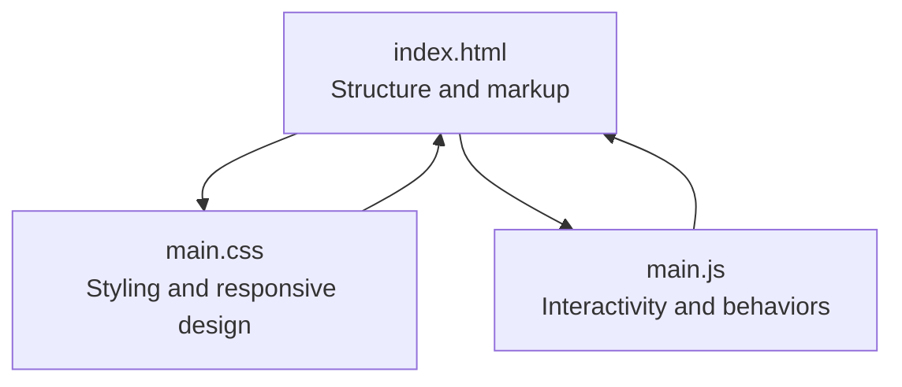
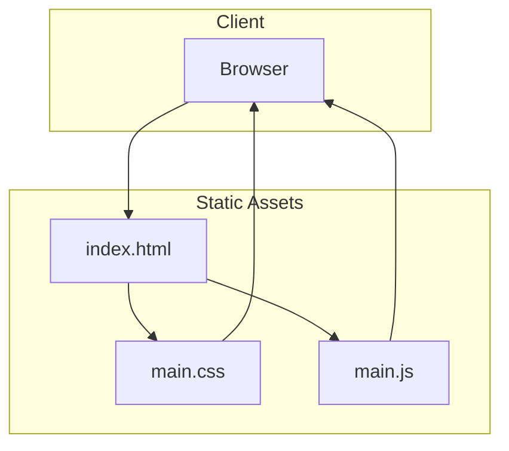
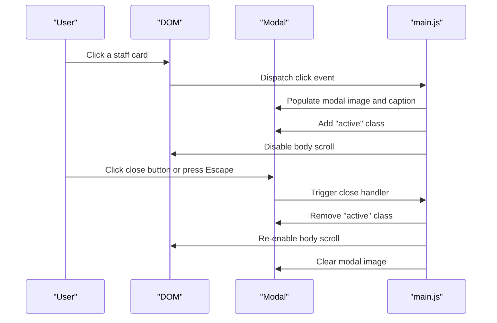
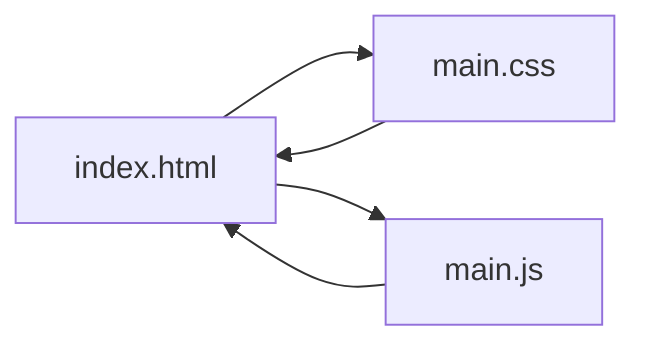

# Project Overview

<cite>
**Referenced Files in This Document**
- [index.html](file://index.html)
- [main.css](file://main.css)
- [main.js](file://main.js)
</cite>

## Table of Contents
1. [Introduction](#introduction)
2. [Project Structure](#project-structure)
3. [Core Components](#core-components)
4. [Architecture Overview](#architecture-overview)
5. [Detailed Component Analysis](#detailed-component-analysis)
6. [Dependency Analysis](#dependency-analysis)
7. [Performance Considerations](#performance-considerations)
8. [Troubleshooting Guide](#troubleshooting-guide)
9. [Conclusion](#conclusion)

## Introduction
This project is a responsive single-page application (SPA) that serves as an educational institution staff directory for teachers. It presents leadership and faculty in an elegant, visually immersive layout with a YouTube video background and a modal-based photo gallery. The site is built using a minimal three-file architecture: a static HTML page, a stylesheet for presentation, and a vanilla JavaScript module for interactivity. It emphasizes accessibility, responsiveness across devices, and a polished user experience without external frameworks.

## Project Structure
The project follows a straightforward three-file architecture:
- index.html: Defines the page structure, including the video background, staff cards, and modal container.
- main.css: Provides all visual styling, responsive breakpoints, and modal effects.
- main.js: Implements interactive behaviors such as modal opening/closing, smooth scrolling, and image fade-in.

**Diagram sources**
- [index.html:1-106](file://index.html#L1-L106)
- [main.css:1-517](file://main.css#L1-L517)
- [main.js:1-83](file://main.js#L1-L83)

**Section sources**
- [index.html:1-106](file://index.html#L1-L106)
- [main.css:1-517](file://main.css#L1-L517)
- [main.js:1-83](file://main.js#L1-L83)

## Core Components
- Video background: A fixed-position YouTube embed with autoplay, mute, loop, and modest branding controls, overlaid with a vignette effect to enhance readability of content.
- Staff album container: A bordered, semi-transparent backdrop that hosts two sections:
  - Top section: Leadership cards (e.g., principal, deputy principal, head teacher, subject lead) with larger images and descriptive info.
  - Teachers grid: A responsive grid of smaller cards representing faculty members.
- Modal gallery: A full-screen overlay activated by clicking any staff card, displaying the selected image with a dynamic caption and a close button.

Key implementation characteristics:
- Pure vanilla JavaScript for DOM manipulation and event handling.
- CSS Grid and Flexbox for layout and responsive adaptation.
- Minimal media queries tailored to desktop, laptop, tablet, and mobile form factors, plus landscape orientation adjustments.

**Section sources**
- [index.html:10-93](file://index.html#L10-L93)
- [main.css:8-41](file://main.css#L8-L41)
- [main.css:106-147](file://main.css#L106-L147)
- [main.css:149-205](file://main.css#L149-L205)
- [main.js:1-83](file://main.js#L1-L83)

## Architecture Overview
The SPA architecture centers on a single HTML document with embedded assets and inline styles. The JavaScript module initializes after the DOM is ready and binds events to cards, modal, and navigation anchors. The CSS defines the visual layer and responsive behavior, while the HTML provides the semantic structure.

**Diagram sources**
- [index.html:1-106](file://index.html#L1-L106)
- [main.css:1-517](file://main.css#L1-L517)
- [main.js:1-83](file://main.js#L1-L83)

## Detailed Component Analysis

### HTML Structure and Semantics
- Video background container: Fixed-position element hosting an iframe with autoplay and loop parameters. The overlay creates a dark vignette to improve contrast against the video.
- Album container: Centered content area with a decorative border and glass-morphism backdrop to ensure text readability over the video.
- Cards: Two distinct layouts:
  - Main cards: Larger images with descriptive info blocks for leadership roles.
  - Small cards: Compact thumbnails for the general teaching staff.
- Modal: A hidden overlay with a close button and a centered image/caption area.

Implementation highlights:
- Semantic use of headings, paragraphs, and alt attributes for accessibility.
- Responsive image sizing via CSS height rules and object-fit for consistent cropping.

**Section sources**
- [index.html:10-19](file://index.html#L10-L19)
- [index.html:21-92](file://index.html#L21-L92)
- [index.html:95-101](file://index.html#L95-L101)

### CSS Styling and Responsive Design
- Base styles: Reset margins/padding, set a serif font family, and establish global colors aligned with a gold/black theme.
- Video background: Full viewport coverage with transform-based centering and pointer-events disabled to allow interaction with page content.
- Album container: Max-width constraint, thick double border, translucent dark background, and blur effect for depth.
- Card system: Hover animations, transitions, and consistent spacing; separate styles for main and small cards.
- Modal: Full-screen overlay with backdrop blur, centered content, and responsive typography and borders.
- Responsive breakpoints: Extensive media queries covering large desktops, laptops, tablets, and multiple mobile sizes, including landscape orientation adjustments.

Responsive design principles:
- Grid-based layouts adapt columns and gaps across breakpoints.
- Typography scales smoothly from extra-small to large screens.
- Image heights adjust proportionally to maintain visual balance.
- Modal layout switches to a horizontal arrangement on narrow landscapes for optimal viewing.

**Section sources**
- [main.css:1-6](file://main.css#L1-L6)
- [main.css:8-41](file://main.css#L8-L41)
- [main.css:51-60](file://main.css#L51-L60)
- [main.css:86-97](file://main.css#L86-L97)
- [main.css:106-147](file://main.css#L106-L147)
- [main.css:149-205](file://main.css#L149-L205)
- [main.css:207-517](file://main.css#L207-L517)

### JavaScript Functionality and Interactions
- Modal system:
  - Opens on card click, populating the modal image and caption based on the clicked card’s content.
  - Closes via the close button, clicking outside the image, or pressing the Escape key.
  - Disables body scrolling while open and restores it upon closing.
- Smooth scrolling: Anchors with href="#" scroll smoothly to target sections.
- Image loading: Fades images in upon load to reduce perceived latency.

Implementation approach:
- Event delegation through forEach iteration over cards.
- Utility function for consistent modal closure and cleanup.
- Lightweight DOM queries and minimal state management.

**Diagram sources**
- [main.js:9-58](file://main.js#L9-L58)

**Section sources**
- [main.js:1-83](file://main.js#L1-L83)

### Three-File Architecture Pattern
- index.html: Static structure with embedded assets and semantic markup.
- main.css: Comprehensive styling and responsive behavior.
- main.js: Minimal interactivity with clear separation of concerns.

Benefits:
- Predictable build process with no bundling required.
- Easy deployment to static hosts.
- Fast iteration cycles during development.

**Section sources**
- [index.html:1-106](file://index.html#L1-L106)
- [main.css:1-517](file://main.css#L1-L517)
- [main.js:1-83](file://main.js#L1-L83)

### YouTube Embed Background Configuration
The video background is configured via the YouTube iframe embed parameters:
- Autoplay enabled with muted audio for seamless looping.
- Loop playlist mode using the same video ID.
- Disabled controls, info, related videos, and branding for an immersive experience.
- Overlay vignette ensures text remains readable over the video.

Customization options:
- Change the video ID in the iframe src to switch the background.
- Adjust the overlay color or opacity for different contrast levels.
- Modify the iframe positioning and scaling rules if needed.

**Section sources**
- [index.html:13-18](file://index.html#L13-L18)
- [main.css:33-41](file://main.css#L33-L41)

### Practical Usage Patterns

#### Adding New Teacher Profiles
Steps:
1. Duplicate an existing card structure within the appropriate section (leadership or teachers grid).
2. Replace the image source and alt text with the new teacher’s photo.
3. Update the name and role text inside the card.
4. Ensure the card retains the ".card" class and either ".main-card" or ".small-card" depending on placement.

Validation tips:
- Confirm the image loads and maintains aspect ratio.
- Verify hover and focus states render correctly.
- Test modal behavior for the new card.

**Section sources**
- [index.html:26-54](file://index.html#L26-L54)
- [index.html:58-92](file://index.html#L58-L92)

#### Customizing the Video Background
Steps:
1. Obtain a YouTube video ID for the desired background.
2. Replace the video ID in the iframe src attribute.
3. Optionally adjust the overlay opacity or gradient for improved readability.
4. Test across devices and orientations to ensure the video covers the viewport.

**Section sources**
- [index.html:13-18](file://index.html#L13-L18)
- [main.css:33-41](file://main.css#L33-L41)

## Dependency Analysis
The project exhibits low coupling and high cohesion:
- HTML depends on CSS for presentation and JS for behavior.
- CSS is self-contained with no external imports.
- JavaScript depends on DOM APIs and the HTML structure.

**Diagram sources**
- [index.html:1-106](file://index.html#L1-L106)
- [main.css:1-517](file://main.css#L1-L517)
- [main.js:1-83](file://main.js#L1-L83)

**Section sources**
- [index.html:1-106](file://index.html#L1-L106)
- [main.css:1-517](file://main.css#L1-L517)
- [main.js:1-83](file://main.js#L1-L83)

## Performance Considerations
- Video background: The YouTube embed is muted and autoplayed; ensure the video is appropriately sized and consider lazy-loading offscreen images.
- CSS Grid and Flexbox: Efficient layout rendering; avoid excessive repaints by minimizing frequent style recalculations.
- JavaScript: Event listeners are attached once on DOMContentLoaded; keep modal operations lightweight.
- Images: Fade-in on load reduces perceived flicker; preloading critical images can improve perceived performance.

## Troubleshooting Guide
Common issues and resolutions:
- Modal does not open:
  - Ensure cards have the ".card" class and images present.
  - Verify the modal element exists and the close button selector is correct.
- Modal does not close:
  - Check that the close handler removes the "active" class and restores body scroll.
  - Confirm Escape key listener is attached and not blocked by other handlers.
- Video background not visible:
  - Confirm the iframe src includes the correct video ID and autoplay/mute parameters.
  - Verify the overlay is not overly dark for your chosen video.
- Responsiveness issues:
  - Review media queries for the targeted breakpoint and adjust grid template columns or image heights as needed.

**Section sources**
- [main.js:9-58](file://main.js#L9-L58)
- [index.html:13-18](file://index.html#L13-L18)
- [main.css:207-517](file://main.css#L207-L517)

## Conclusion
This project demonstrates a clean, efficient approach to building a responsive teacher directory with a modern visual identity. Its three-file architecture keeps complexity low while delivering robust interactivity and a polished user experience. The combination of a YouTube video background, thoughtful CSS Grid layouts, and a modal interaction system provides an engaging platform for showcasing school staff. The codebase is accessible to beginners yet offers sufficient depth for experienced developers to extend and customize.