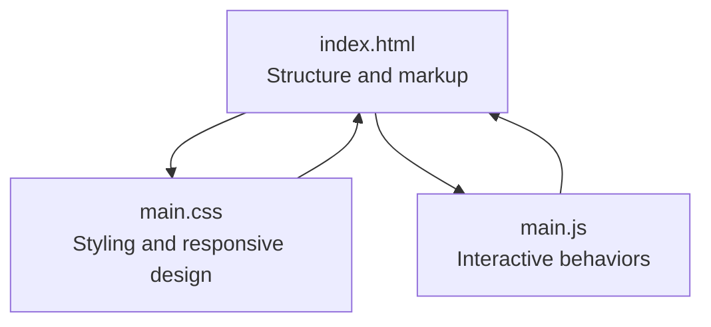
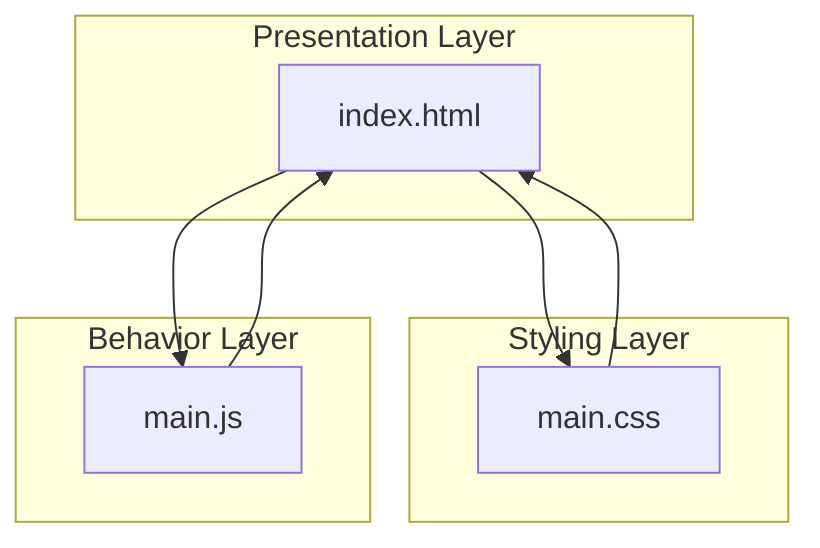
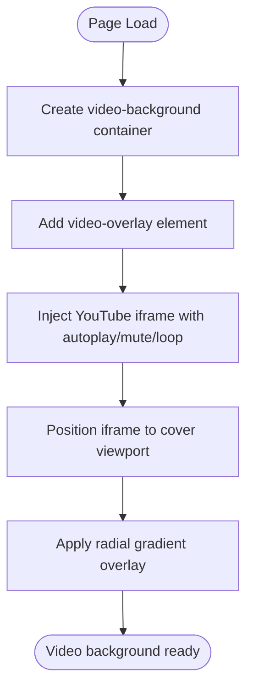
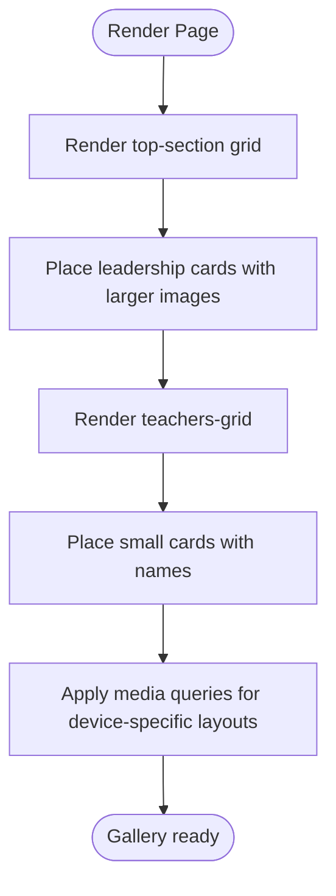
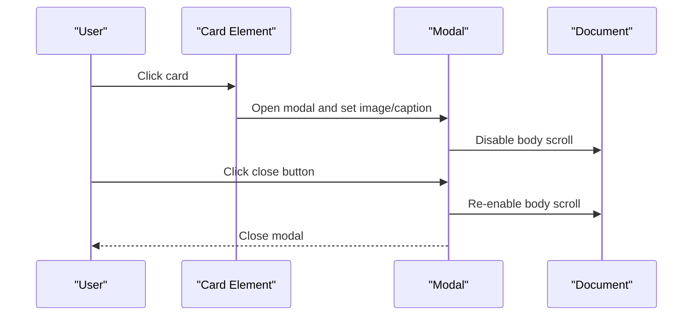
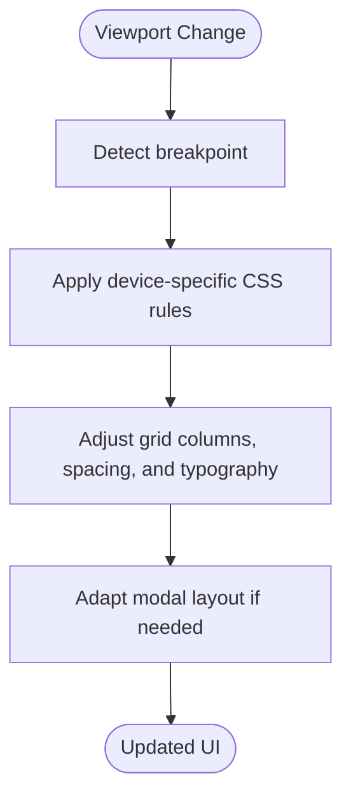
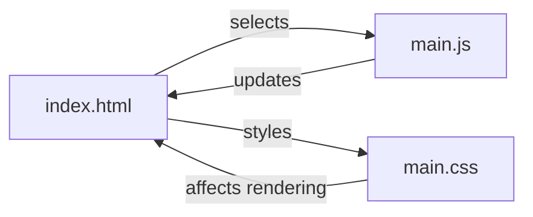

# Technical Architecture

<cite>
**Referenced Files in This Document**
- [index.html](file://index.html)
- [main.css](file://main.css)
- [main.js](file://main.js)
</cite>

## Table of Contents
1. [Introduction](#introduction)
2. [Project Structure](#project-structure)
3. [Core Components](#core-components)
4. [Architecture Overview](#architecture-overview)
5. [Detailed Component Analysis](#detailed-component-analysis)
6. [Dependency Analysis](#dependency-analysis)
7. [Performance Considerations](#performance-considerations)
8. [Accessibility and Cross-Browser Compatibility](#accessibility-and-cross-browser-compatibility)
9. [Infrastructure and Deployment](#infrastructure-and-deployment)
10. [Troubleshooting Guide](#troubleshooting-guide)
11. [Conclusion](#conclusion)

## Introduction
This document describes the technical architecture of the Vinetttka teacher directory system, a single-page application built with embedded assets. The system combines a YouTube video background, a responsive teacher gallery, and a modal viewer. It is implemented using pure vanilla JavaScript, CSS Grid-based layouts, and minimal HTML structure. The design emphasizes modularity, responsiveness, and performance while maintaining simplicity and framework-free operation.

## Project Structure
The application consists of three primary artifacts:
- index.html: Defines the page structure, including the video background container, teacher gallery, and modal overlay.
- main.css: Provides styling for the video background, gallery grid, modal, and responsive breakpoints.
- main.js: Implements interactive behaviors such as modal opening/closing, smooth scrolling, and image fade-in on load.

**Diagram sources**
- [index.html:1-106](file://index.html#L1-L106)
- [main.css:1-517](file://main.css#L1-L517)
- [main.js:1-83](file://main.js#L1-L83)

**Section sources**
- [index.html:1-106](file://index.html#L1-L106)
- [main.css:1-517](file://main.css#L1-L517)
- [main.js:1-83](file://main.js#L1-L83)

## Core Components
- Video background system: A fixed-position container with an iframe embedding a looping YouTube video and a vignette overlay to enhance readability of foreground content.
- Teacher gallery: Two distinct grid areas:
  - Top section: Leadership cards with larger images and descriptive info.
  - Teachers grid: A responsive grid of smaller cards displaying teacher names.
- Modal viewer: A full-screen overlay activated by clicking any gallery card, showing the selected image and caption, with controls to close via button, click-outside, or Escape key.

Key implementation patterns:
- Pure vanilla JavaScript for DOM manipulation and event handling.
- CSS Grid for flexible, responsive layouts.
- Minimal HTML structure with embedded assets and straightforward semantics.

**Section sources**
- [index.html:10-19](file://index.html#L10-L19)
- [index.html:25-92](file://index.html#L25-L92)
- [index.html:95-101](file://index.html#L95-L101)
- [main.css:8-41](file://main.css#L8-L41)
- [main.css:106-147](file://main.css#L106-L147)
- [main.css:131-135](file://main.css#L131-L135)
- [main.css:150-205](file://main.css#L150-L205)
- [main.js:1-83](file://main.js#L1-L83)

## Architecture Overview
The system follows a modular, layered architecture:
- Presentation layer: index.html defines the DOM structure.
- Styling layer: main.css encapsulates visual design and responsive behavior.
- Behavior layer: main.js manages interactivity and dynamic updates.

**Diagram sources**
- [index.html:1-106](file://index.html#L1-L106)
- [main.css:1-517](file://main.css#L1-L517)
- [main.js:1-83](file://main.js#L1-L83)

## Detailed Component Analysis

### Video Background System
The video background is implemented as a fixed-position container holding an iframe with autoplay, muted playback, loop, and modest branding options. A radial gradient overlay darkens the background to improve contrast for text and cards.

**Diagram sources**
- [index.html:10-19](file://index.html#L10-L19)
- [main.css:8-41](file://main.css#L8-L41)

**Section sources**
- [index.html:10-19](file://index.html#L10-L19)
- [main.css:8-41](file://main.css#L8-L41)

### Teacher Gallery
The gallery comprises two sections:
- Top section: Leadership cards arranged in a responsive grid with larger images and descriptive info blocks.
- Teachers grid: A responsive grid of smaller cards with teacher names beneath images.

Responsive behavior:
- Uses CSS Grid with auto-fit/auto-fill and minmax constraints to adapt to screen sizes.
- Extensive media queries adjust grid columns, spacing, and typography across desktop, laptop, tablet, and mobile breakpoints.

**Diagram sources**
- [index.html:25-92](file://index.html#L25-L92)
- [main.css:106-147](file://main.css#L106-L147)
- [main.css:131-135](file://main.css#L131-L135)

**Section sources**
- [index.html:25-92](file://index.html#L25-L92)
- [main.css:106-147](file://main.css#L106-L147)
- [main.css:131-135](file://main.css#L131-L135)

### Modal Viewer
The modal is a full-screen overlay activated by clicking any gallery card. It displays the selected image and caption, and supports closing via button, click-outside, or Escape key. Smooth scrolling is disabled while the modal is open.

**Diagram sources**
- [index.html:95-101](file://index.html#L95-L101)
- [main.js:9-58](file://main.js#L9-L58)

**Section sources**
- [index.html:95-101](file://index.html#L95-L101)
- [main.js:9-58](file://main.js#L9-L58)

### Responsive Design Adaptations
The system applies a comprehensive set of media queries to adapt:
- Container padding and border widths
- Typography scaling and letter-spacing
- Grid column counts and gaps
- Card image heights
- Modal layout adjustments (including horizontal layout on narrow screens)

**Diagram sources**
- [main.css:207-516](file://main.css#L207-L516)

**Section sources**
- [main.css:207-516](file://main.css#L207-L516)

## Dependency Analysis
The system exhibits low coupling and high cohesion:
- HTML provides structural anchors for JavaScript selectors.
- CSS encapsulates presentation and responsive behavior.
- JavaScript depends on DOM nodes defined in HTML and styled by CSS.

**Diagram sources**
- [index.html:1-106](file://index.html#L1-L106)
- [main.css:1-517](file://main.css#L1-L517)
- [main.js:1-83](file://main.js#L1-L83)

**Section sources**
- [index.html:1-106](file://index.html#L1-L106)
- [main.css:1-517](file://main.css#L1-L517)
- [main.js:1-83](file://main.js#L1-L83)

## Performance Considerations
- Image loading: Images fade in upon load to reduce perceived flicker and improve UX.
- Modal behavior: Disabling body scroll prevents layout thrashing during modal display.
- Video background: Autoplay and muted playback enable seamless looping without user interaction.
- CSS Grid: Efficient layout calculations minimize reflows across breakpoints.
- Asset delivery: Hosting static assets locally reduces network latency and improves reliability.

[No sources needed since this section provides general guidance]

## Accessibility and Cross-Browser Compatibility
- Semantic HTML: Headings, paragraphs, and images use appropriate tags for assistive technologies.
- Keyboard navigation: Escape key support closes the modal.
- Focus management: No focus traps are introduced; ensure future enhancements consider focus visibility.
- Cross-browser compatibility: Vanilla JavaScript and widely supported CSS Grid ensure broad browser coverage.
- Color contrast: Foreground text and overlays are designed for readability against the video background.

[No sources needed since this section provides general guidance]

## Infrastructure and Deployment
Hosting model:
- Static site: The application is self-contained with embedded assets and can be hosted on any static web server or CDN.

Scalability considerations:
- Adding more teacher profiles: Extend the teachers grid with new card elements; CSS Grid will automatically adapt.
- Media assets: Place images under a dedicated directory and update image URLs accordingly.
- Performance: Preload critical images and consider lazy-loading for large galleries.

Deployment topology options:
- Single static host: Serve index.html, main.css, main.js, and images from a single origin.
- CDN distribution: Distribute assets globally for improved latency.
- Edge computing: Use edge locations for reduced latency in targeted regions.

[No sources needed since this section provides general guidance]

## Troubleshooting Guide
Common issues and resolutions:
- Modal does not open: Verify card selectors and event listeners are attached after DOMContentLoaded.
- Images not fading in: Ensure image load events fire and opacity transitions are applied.
- Modal not closing: Confirm click-outside and Escape key handlers are registered and closeModal resets state.
- Video background not covering viewport: Check iframe positioning and overlay z-index.

**Section sources**
- [main.js:9-58](file://main.js#L9-L58)
- [main.js:73-82](file://main.js#L73-L82)
- [main.css:8-41](file://main.css#L8-L41)

## Conclusion
The Vinetttka teacher directory system demonstrates a clean, modular architecture leveraging pure vanilla JavaScript, CSS Grid, and a minimal HTML structure. The video background, responsive gallery, and modal viewer integrate seamlessly to deliver a visually engaging and accessible experience across devices. The design prioritizes simplicity, performance, and scalability, enabling straightforward maintenance and extension.